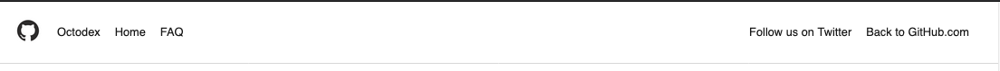

GitHub has a great mascot called Octocat. Octocat even has its own gallery of variations, created by GitHub itself and fans, called [Octodex](https://octodex.github.com).

You can use all the tools you have at your disposal to get the job done. Use your browser's Developer Tools to inspect their site to find the exact font sizes and padding amounts.

## Objectives

- Build on your knowledge of HTML & CSS
- Implement, from scratch, a given design
- Understand HTML/CSS Layout
- Be able to place elements on a page where you want them.
- Use flexbox and grid techniques layout pages.
- Work with media queries to build a responsive page.

## Requirements

- You should strive to implement the overall structure as close as possible. Focus on the relative layout, not on pixel perfection. For instance, having the header on one line with part of the nav on the left and part of the nav on right is more important than matching the weight of the text in the header.

For example, this header would qualify as "good enough":



### Setup

```shell
app-app --alpha Octodex
```

### Explorer Mode

- [ ] Use `app-app` with `alpha` and name your project `Octodex`
- [ ] Feel free to start with this [template HTML](https://raw.githubusercontent.com/suncoast-devs/octodex-template/master/public/index.html)
- [ ] Recreate the page as closely as you possibly can. Use the same fonts, sizes, and colors. Use your browser's developers tool to determine the colors and fonts.
- [ ] Select _some_ Octocats to use on your page (`12` to `16` or so). Your layout should be flexible but doesn't need to _perfectly_ responsive.
  - Don't bother downloading details of the Octocat, we've [made a site]((https://sdg-octodex.herokuapp.com/) that will give you all the data you need.
- [ ] Use CSS _media queries_ to resize the Octocat containers to look great as the screen changes size. Even though the site has a desktop, laptop, tablet, and mobile display, for explorer mode only worry about desktop and mobile.
- [ ] Deploy your site.
- **TIP** Reminder to breakdown the layout into smaller chunks that are easier to style

## Adventure Mode

- [ ] Add a tablet display to accommodate a tablet screen size
- [ ] Add a laptop display to accommodate a tablet screen size.
- [ ] For the responsiveness of your cats, if you used flexbox for explorer mode, now use grids, if you grids, now use flexbox.

## Epic Mode

- [ ] Go back to one past homework and make it responsive.
- [ ] Use this [API](https://sdg-octodex.herokuapp.com/) to make your website data-driven. HINT: fetch, javascript and document.createElement. This is a big jump, but I think you can handle it.

## Additional Resources

- [ ] Watch [this video](https://www.youtube.com/watch?v=2KL-z9A56SQ) to work more with media queries
