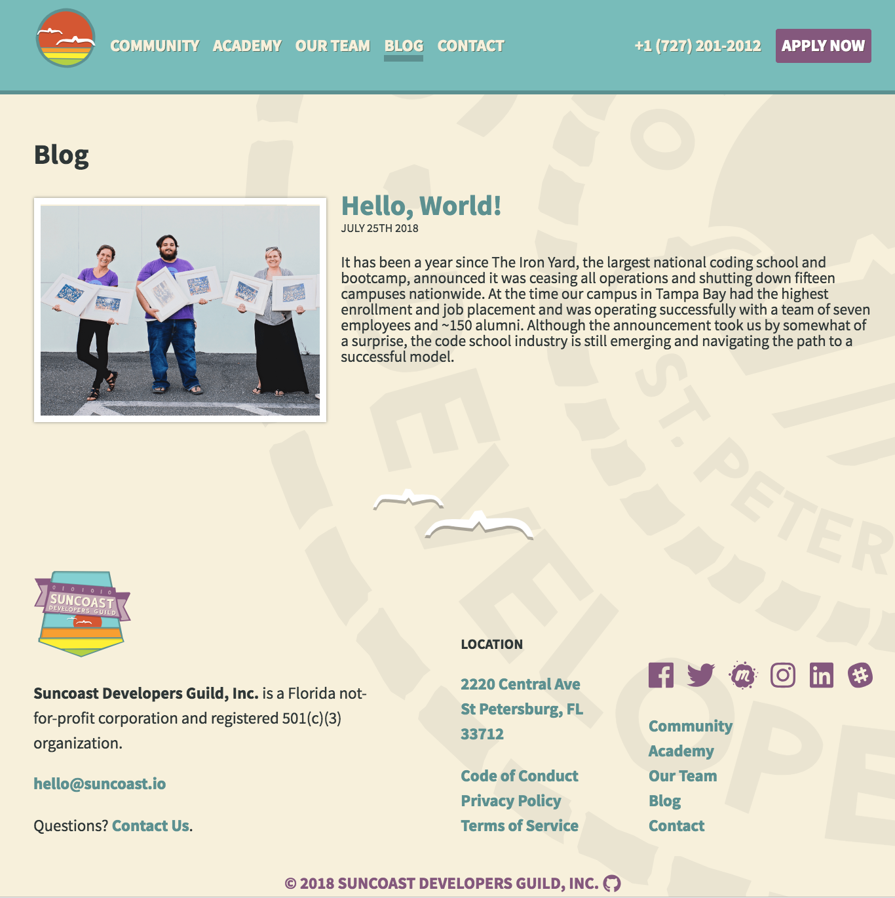

## Benefits of Blogging

- Express yourself
- Share your journey, passion, and knowledge
- Refine your writing and typing skills
- Build your network and reach a new audience
- Gain visibility and showcase yourself as a developer

## Pick a Platform

- Free Platforms
  - Medium
  - Tumblr
  - Blogger
- Self-hosting
  - Handrolled

“To be successful as a blogger there is really just one requirement: a passion for your topic.” - theblogstarter.com

## Share it far and wide

[Access the slide presentation](./assets/blogging.pdf)
