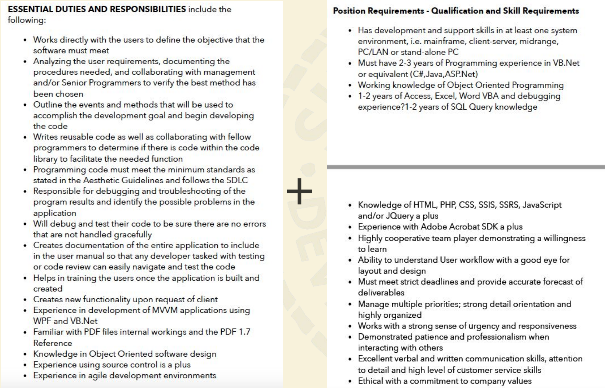
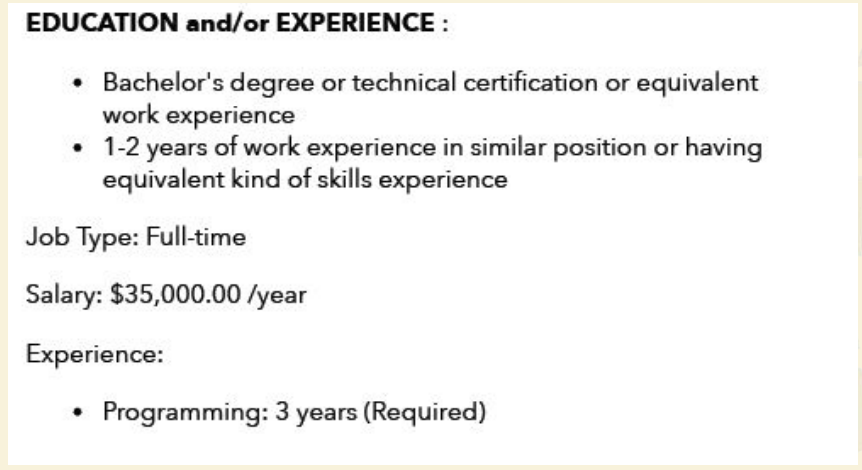
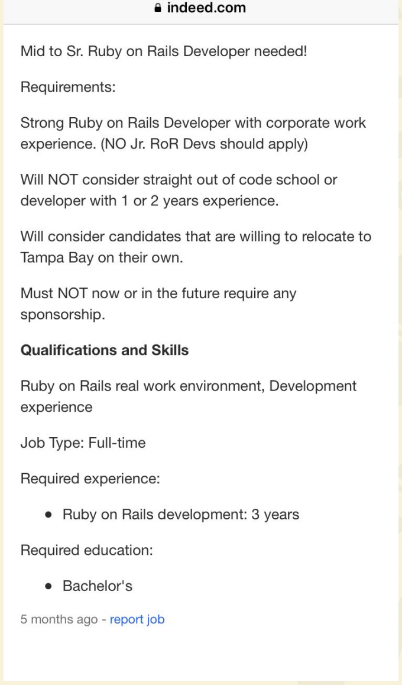

# Decoding Job Descriptions

## Why are we here?

- Build your confidence when looking and applying
  for jobs by going through actual job postings and
  understand which you are qualified for and
  actually want
- Conclude by taking a dive into what employers
  want and going through job postings you may be
  struggling with

## Actual jobs = job description?

## Variables of a good job description? Variables of a bad description?

## Should we take take job descriptions verbatim?

## Have you played the Keyword Game?

## = Keyword Game

## WHY?

## What’s the opposite of the Keyword Game?

## Vague

## WHY?

## Do your HW!

- Find the narrative and does it speak to you?
- Dig a bit more into their work, code, and team
  - LI, GitHub, FB, Twitter, Meetups, and community
- Put time into the application process
- Reciprocal interview

## What do employers want?

- Proof of work
- Ability to learn and grow
- Individual and team projects
- What value do you bring to their story

[Access the slide presentation](./assets/decoding-job-descriptions.pdf)
