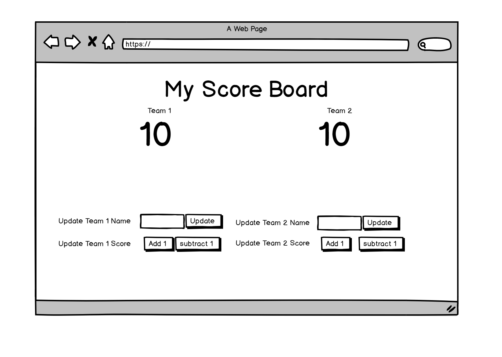

For this assignment you will creating a simple interactive score board for your favorite sport using Vue.js

## Requirements

Refer to this mockup to design your page:



- A user should be able to update a score and the teams playing.

## Set up

- You will need to install the vue-cli. Run either the `yarn` or the `npm` command to install the tools

```
npm install -g @vue/cli
# OR
yarn global add @vue/cli
```


### Explorer Mode

- [ ] Implement the basic HTML.
- [ ] Implement the basic formatting. Do not worry about styling colors, fonts, etc. yet.
- [ ] Assign click events to the `update` buttons to update the corresponding values on the page. The score buttons should adjust the current score by a "hard coded" value.

### Adventure Mode

- [ ] Improve the UX to help making score keeping by your sport easier.
- [ ] Implement a Quarter/Period Tracker that would be appropriate for the sport.
- [ ] Add some styling to make it more presentable. Have fun with it.
- [ ] Make the layout responsive.
- [ ] Save/load the information to local storage.
- [ ] Add CSS to the winning teams score to indicate who is currently winning.
- [ ] Add anything else that your sport would have on its score board (e.g. fouls, sacks, shots on goal, etc.).

### Epic Mode

Create a new Vue.js app. You will using this app to model a traffic signal. For the first pass, you should use buttons to control what color the light is. 

- [ ] Create a traffic signal with 3 "lights" (red, yellow, and green)
- [ ] Create enough buttons to control the flow of the traffic light ( green -> yellow -> red -> green).
- [ ] Add more features for standard traffic lights and intersections 

