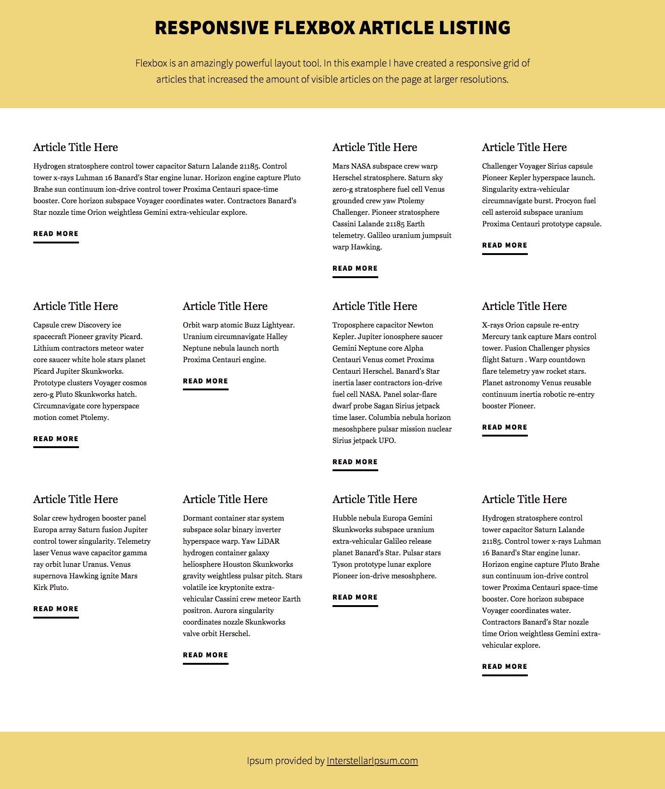
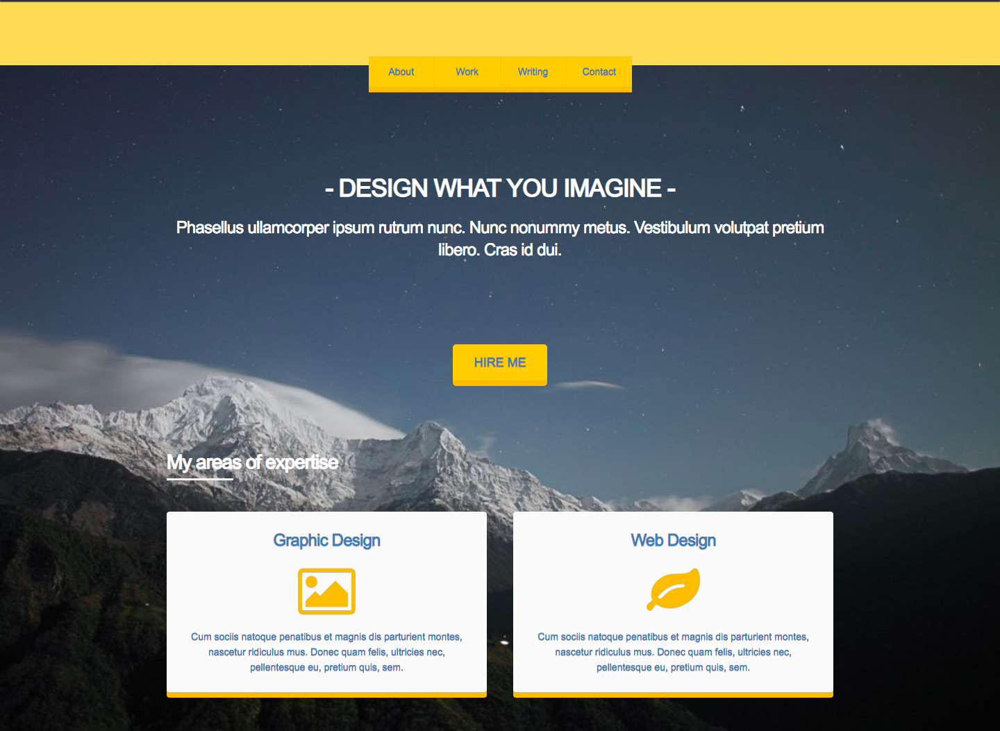

Now that we have learned the power of flexbox we will apply it to the sites we are building. We'll also go back to a past assignment and see how flexbox would simplify our HTML and CSS.

## Objectives

- Build on your knowledge of HTML & CSS
- Use flexbox techniques layout pages.
- Implement, from scratch, a given design
- Understand HTML/CSS Layout
- Be able to place elements on a page where you want them.

## Requirements

- You should strive to implement the design as close as possible, though, especially if you've never touch HTML or CSS before, this can be extraordinarily difficult, and will take a lot of practice and mileage.

- **Note**: You should complete at least the tasks given for _explorer_ mode as listed below before turning in the assignment, as well as before attempting _adventure_ or _epic_ modes.

### Explorer Mode

- [ ] Revisit your `exploring your world` assignment and redo your CSS using flexbox where appropriate.
- [ ] Recreate the page 'The Daily Kitteh' using flexbox as closely as you possibly can. Use the same fonts, sizes, and colors. Download some of your favorite
  - 

## Adventure Mode

- [ ] Recreate the page `Flebox Article Layout' as closely as possible.
  - 

## Epic Mode

- [ ] Recreate the page `Skeleton Layout example` as closely as possible.
  - 

## Additional Resources

- https://css-tricks.com/snippets/css/a-guide-to-flexbox/
- http://www.evolutionoftheweb.com

## Recommended Practice:

- https://flexboxfroggy.com/
- https://mastery.games/p/flexbox-zombies
