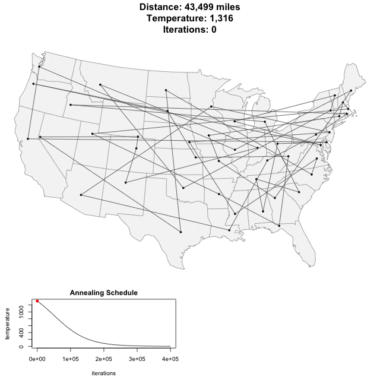

theme: Huerta, 5

# [fit] Algorithms, not Al Gore's Rhythm


---

# Algorithms

Like any good presentation, let us give the boring definition.

---

# Definition (1/3)

    Self-contained step-by-step
    set of operations to be
    performed.

---

# Definition (2/3)

    Algorithms perform calculations,
    data processing, and/or
    automated reasoning tasks.

---

# Definition (3/3)

    An algorithm is an effective
    method that can be expressed
    within a finite amount of
    space and time and in a
    well-defined formal language
    for calculating a function.

---


^ WHAAAAAT?

---

# [fit] We use them in life all the time

---

# [fit] Examples

---


^ Giving specific directions to someone on how to drive from place to place

^ Going to come back to directions later.

---

#### http://bit.ly/1tsqopI


^ Followed, created or modified a recipe for cooking

---

#### http://bit.ly/1Pp7bZY


^ "Place Tab A into Slot B"

---


^ Draw two circles

^ Draw the rest of the damn owl

---

# [fit] More formal

^ These are casual examples of algorithms we use or create all the time

^ Time to bring back that horror of high school math: Geometry

---


^ Formal construction for bisecting the angle

---

# [fit] Euclid's Algorithm for Computing the Greatest Common Divisor (GCD)

[.column]

    English: Given two numbers, A and B,
    what is the largest number that
    evenly divides **both** numbers

[.column]

```ruby
while (A != B) {

 if (A > B)
   A = A - B
 else
   B = B - A

}

return A
```

---

# Euclid's Algorithm for GCD

[.column]

`A = 210, B = 45`

[.column]

```ruby
while (A != B) {

 if (A > B)
   A = A - B
 else
   B = B - A

}

return A
```

---

# Euclid's Algorithm for GCD

[.column]

`A = 210, B = 45`

[.column]

[.code-highlight: 1]

```ruby
while (A != B) {

 if (A > B)
   A = A - B
 else
   B = B - A

}

return A
```

---

# Euclid's Algorithm for GCD

[.column]

`A = 210, B = 45` <br/> `A > B (210 > 45)`

[.column]

[.code-highlight: 3]

```ruby
while (A != B) {

 if (A > B)
   A = A - B
 else
   B = B - A

}

return A
```

---

# Euclid's Algorithm for GCD

[.column]

[.code-highlight: 4]

`A = 210, B = 45` <br/> `A > B (210 > 45)` <br/> `A = 210 - 45` <br/> `A = 165`

[.column]

[.code-highlight: 1]

```ruby
while (A != B) {

 if (A > B)
   A = A - B
 else
   B = B - A

}

return A
```

---

# Euclid's Algorithm for GCD

[.column]

`A = 165, B = 45`

[.column]

[.code-highlight: 1]

```ruby
while (A != B) {

 if (A > B)
   A = A - B
 else
   B = B - A

}

return A
```

---

# Euclid's Algorithm for GCD

[.column]

`A = 165, B = 45` <br/> `A > B (165 > 45)`

[.column]

[.code-highlight: 3]

```ruby
while (A != B) {

 if (A > B)
   A = A - B
 else
   B = B - A

}

return A
```

---

# Euclid's Algorithm for GCD

[.column]

`A = 165, B = 45` <br/> `A > B (165 > 45)` <br/> `A = 165 - 45` <br/> `A = 120`

[.column]

[.code-highlight: 4]

```ruby
while (A != B) {

 if (A > B)
   A = A - B
 else
   B = B - A

}

return A
```

---

# Euclid's Algorithm for GCD

[.column]

`A = 120, B = 45`

[.column]

[.code-highlight: 1]

```ruby
while (A != B) {

 if (A > B)
   A = A - B
 else
   B = B - A

}

return A
```

---

# Euclid's Algorithm for GCD

[.column]

`A = 120, B = 45` <br/> `A > B (120 > 45)`

[.column]

[.code-highlight: 3]

```ruby
while (A != B) {

 if (A > B)
   A = A - B
 else
   B = B - A

}

return A
```

---

# Euclid's Algorithm for GCD

[.column]

`A = 120, B = 45` <br/> `A > B (120 > 45)` <br/> `A = 120 - 45` <br/> `A = 75`

[.column]

[.code-highlight: 4]

```ruby
while (A != B) {

 if (A > B)
   A = A - B
 else
   B = B - A

}

return A
```

---

# Euclid's Algorithm for GCD

[.column]

`A = 75, B = 45`

[.column]

[.code-highlight: 1]

```ruby
while (A != B) {

 if (A > B)
   A = A - B
 else
   B = B - A

}

return A
```

---

# Euclid's Algorithm for GCD

[.column]

`A = 75, B = 45` <br/> `A > B (75 > 45)`

[.column]

[.code-highlight: 3]

```ruby
while (A != B) {

 if (A > B)
   A = A - B
 else
   B = B - A

}

return A
```

---

# Euclid's Algorithm for GCD

[.column]

`A = 75, B = 45` <br/> `A > B (75 > 45)` <br/> `A = 75 - 45` <br/> `A = 30`

[.column]

[.code-highlight: 4]

```ruby
while (A != B) {

 if (A > B)
   A = A - B
 else
   B = B - A

}

return A
```

---

# Euclid's Algorithm for GCD

[.column]

`A = 30, B = 45`

[.column]

[.code-highlight: 1]

```ruby
while (A != B) {

 if (A > B)
   A = A - B
 else
   B = B - A

}

return A
```

---

# Euclid's Algorithm for GCD

[.column]

`A = 30, B = 45` <br/> `else ... since it isn't true that (30 > 45)` <br/>
`B = 45 - 30` <br/> `B = 15`

[.column]

[.code-highlight: 3, 5]

```ruby
while (A != B) {

 if (A > B)
   A = A - B
 else
   B = B - A

}

return A
```

---

# Euclid's Algorithm for GCD

[.column]

`A = 30, B = 45` <br/> `else ... since it isn't true that (30 > 45)` <br/> `B = 45 - 30` <br/> `B = 15`

[.column]

[.code-highlight: 6]

```ruby
while (A != B) {

 if (A > B)
   A = A - B
 else
   B = B - A

}

return A
```

---

# Euclid's Algorithm for GCD

[.column]

`A = 30, B = 15`

[.column]

[.code-highlight: 1]

```ruby
while (A != B) {

 if (A > B)
   A = A - B
 else
   B = B - A

}

return A
```

---

# Euclid's Algorithm for GCD

[.column]

`A = 30, B = 15` <br/> `A > B (30 > 15)`

[.column]

[.code-highlight: 3]

```ruby
while (A != B) {

 if (A > B)
   A = A - B
 else
   B = B - A

}

return A
```

---

# Euclid's Algorithm for GCD

[.column]

`A = 30, B = 15` <br/> `A > B (30 > 15)` <br/> `A = 30 - 15` <br/> `A = 15`

[.column]

[.code-highlight: 4]

```ruby
while (A != B) {

 if (A > B)
   A = A - B
 else
   B = B - A

}

return A
```

---

# Euclid's Algorithm for GCD

[.column]

`A = 15, B = 15`

[.column]

[.code-highlight: 1]

```ruby
while (A != B) {

 if (A > B)
   A = A - B
 else
   B = B - A

}

return A
```

---

# Euclid's Algorithm for GCD

[.column]

`A = 15, B = 15` <br/>`done with *while*` <br/>`since A == B`<br/>`GCD = 15`

[.column]

[.code-highlight: 10]

```ruby
while (A != B) {

 if (A > B)
   A = A - B
 else
   B = B - A

}

return A
```

---

# [fit] Must be precise and complete

---

# [fit] "Make a PB&J Sandwich."

Example [video](https://www.youtube.com/watch?v=cDA3_5982h8) of a family
practicing this.

^ Give a couple of example tries

^ Show that nearly every step we think is precise could be more precise

^ Suggest people try at home

---

# [fit] This is the :key: to mastering programming

---


^ When starting with algorithms, the more detail we include, even to the point where it may seem silly, the better developers we will be.

---

    1. Read the problem completely twice.
    2. Solve the problem manually with several sets of sample data.
    3. Optimize the manual steps.
    4. Write the manual steps as comments or pseudo-code.
    5. Replace the comments or pseudo-code with real code.
    6. Optimize the real code.

^ https://simpleprogrammer.com/2011/01/08/solving-problems-breaking-it-down/

---

# Read the problem completely twice.

    - Most important!
    - Can you explain it (simply) to someone else?

---

# Solve the problem manually

    - Programming is automation
    - Solve the problem manually
    - Maybe even on pen and paper
    - Or use physical objects
    - Practice!

---

# Optimize the manual solution

    - Can you remove any steps?

---

# Write pseudo-code or comments

    - Open an editor and write the manual steps in English

---

# Replace comments with real code

    - Replace each individual step with code

---

# PEDAC

- Created by [`Launch School`](https://launchschool.com/)
- Generalized process for creating algorithms:
  - **P**　 roblem
  - **E**　 xamples
  - **D**　 ata (structures)
  - **A**　 lgorithm
  - **C**　 ode

---

# Example

<br/>

## [fit] Reverse a string (word)

^ Our goal is to be able to reverse any string (word) ^ How would we break this
down into tiny steps

---

# `P`roblem

Given a word, which is just a sequence of letters, make a new word with the same sequence of letters in reverse order.

---

# `E`xamples

|         |         |
| ------- | ------- |
| zebra   | arbez   |
| word    | drow    |
| rotator | rotator |

^
`File.read("/usr/share/dict/words").split("\n").filter { |word| word.reverse == word }.sort_by(&:length)`

---

# `D`ata (structures)

- `string`
- loops

---

# `A` lgorithm ...

Start by using a specific example...

    1. Write “Zebra” down.
    2. Create a new empty word.
    3. Start at the last letter in the word (the "a" from Zebra)
    4. Put the current letter at the end of the new word
    5. If there is a previous letter,
       make the previous letter the current letter
       and start back at 4.
    6. When there are no more letters in the word, our
       new word is the answer.

---

# Pseudo code

    1. NewWord = ""
    2. Loop backwards through word to reverse
    3.   NewWord += CurrentLetter
    4. Return NewWord

---

# Code (Ruby)

```ruby
word = "Zebra"

new_word = ""
word.chars.reverse_each do |letter|
  new_word += letter
end

new_word # => "arbeZ"
```

---

# Sorting!

---

# [fit] Simplest Sorting EVAR

---

# Bubble sort


^
https://www.flickr.com/photos/shannonlofthus/4670090955/in/photolist-87Frkz-WHY5B-8mahpK-hN6juM-r7AJpA-ajYWaD-6zd2fV-nhgRbE-86k6Pf-38z42x-indd8g-o92k4j-btkhTp-8as94X-gdM5mg-nuoPxX-8ibJQ1-h2paWu-rqZ7-2wtUmq-7LYqqC-7yGiBn-2VD8P9-bWUbbw-6dXEed-ayCXtz-9VZvt5-ah6cUm-7aNK5e-dM9tRD-bytmvQ-fdgM3t-fMGVce-oDBmtB-fpCiAy-9GxMTc-iALYdC-9gcyYE-e5xtKs-xYMme-5TBqfJ-etJxvL-9TRW6k-4ZPTPC-9JtZ4F-96g9Ms-anRjkS-cqPJ9b-aqFvbJ-85xV3n

---

> For each two adjacent elements

<br/>

> Exchange them if out of order

<br/>

> Repeat until the array is sorted.

---

# Break it down

    1. Assume the array is sorted

    2. Go through each pair of elements
       - If the first of the pair is larger than the second of the pair
         - Swap the two elements
         - Remember that the array isn't sorted

    3. When done with all the elements, if we
       still believe the array is sorted, STOP

    4. Otherwise, go back to step 1

---

^ explain ... in range

^ explain each_cons

```ruby
array = [7,1,2,9,4,5]

def bubble_sort(array)
  loop do
    # Assume the list is sorted
    sorted = true

    # Go through the indexes of the array in pairs
    (0...array.length).each_cons(2) do |first, second|

      # if the first is larger
      if array[first] > array[second]
        # Swap
        array[first], array[second] = array[second], array[first]

        # Remember array isn't sorted
        sorted = false
      end

    end

    # If array is sorted, stop
    break if sorted

    # end of loop/do go back to the first step
  end
end
```

---


- https://github.com/AIRTucha/SortVis

---

### A moment of zen


^
https://www.flickr.com/photos/91604813@N03/8439070389/in/photolist-dRJrBB-s4K1VU-p6DwNY-dRQ271-csLT6L-s5HH9C-53sRLW-p6GeRy-edcCWC-nWCE27-nv6aQE-anoGck-anoFKK-7ius6w-sntwEE-nHEyJ7-anrLr1-ay5Dmf-eijpgL-eimZwd-eidF5v-ekmQMh-anrBX9-dRJrCg-anxCHQ-53oCGD-ay2W6B-54vk5W-anuNNk-anoDX8-anrKnG-dH8fwH-qanAxd-ay5DCW-8VRU3W-poMWLN-ekmnqN-fy8aDK-G78Jjz-anrJWw-anrKLb-anoYUR-5oUwi3-eidEGz-eijpkb-g4cW9M-ein3Yy-eidEQV-b6uVeB-a6v8Lx

^ Moment of zen

---

# [fit] Algorithm Complexity

^ How do we know how "good" our algorithm is?

---

# [fit] Measuring Time and Space


---

# Measure

|           |                                   |
| --------- | --------------------------------- |
| **time**  | the number of operations required |
| **space** | the amount of memory required     |

---

|              |                                                                             |
| ------------ | --------------------------------------------------------------------------- |
| Best case    | If the data is perfect for _this_ algorithm, how fast are we?               |
| Worst case   | If the data is terrible for _this_ algorithm, how slow are we?              |
| Average case | Considering all possible inputs, what is the average speed of the algorithm |

---

# What are we measuring?

When we speak of algorithm complexity, what are we measuring?

- Operations
- Comparisons
- Increments

^ TODO: Maybe mention Turing Machine here?

---

# Example: Searching

---


^ Binary search: we half the amount of comparisons we need to do each time we
make a decision. This is worst case log(n)

^ The linear search has to compare every element until it finds it. Worst case
is O(n)

---

# [fit] Big O notation

---

> `O(1)`

> `O(log n)`

> `O(n)`

> `O(n log n)`

> `O(n^2)`

> `O(2^n)`

- These grow at a different rate based on how `n` changes

---

> `O(1)`

    Takes a constant amount of time regardless of input size

    Example: looking up an index in an array
             looking up a key in a hash/dictionary (most cases)

---

> `O(n)`

    If n doubles, the algorithm takes twice as long

    Example: linear search animation

---

> `O(n^2)`

    If n doubles, the algorithm takes FOUR times as long

    Example: bubble sort!

---

> `O(2^n)`

    If n doubles, the algorithm takes many times as long

    e.g., if n grows from 20 to 40, O(2^n) grows by over a MILLION times

    Example: Tower of Hanoi

---

# Tower of Hanoi

    The Tower of Hanoi is a mathematical game or puzzle.

    It consists of three rods and several disks
    of different sizes, which can slide onto any rod.

    The puzzle starts with the disks in a neat stack
    in ascending order of size on one rod, the smallest
    at the top, thus making a conical shape.

---

# Tower of Hanoi

    The objective of the puzzle is to move the entire

    stack to another rod, obeying simple rules

---

# Tower of Hanoi

    1. Only one disk can be moved at a time.

    2. Each move consists of taking the upper disk
       from one of the stacks and placing it on top
       of another stack i.e. a disk can only be
       moved if it is the uppermost disk on a stack.

    3. No disk may be placed on top of a smaller disk.

---

# [fit] Tower of Hanoi

# $$ 2^n $$

---

# [fit] To understand recursion you

# [fit] must first understand recursion

---

# [fit] Tower of Hanoi Recursively

    Move all but the bottom disk to the
    "spare" peg (using this exact algorithm)

    Move the bottom disk to the "destination"
    peg (this is a simple move)

    Move all the disks from the "spare" peg to
    the "destination" peg (using this exact
    algorithm)

---

# [fit] Tower of Hanoi

## 

# Tower of Hanoi

<br/>

# If we could move a **disk per second** how long would this take?

---

| Disks | Time                 |
| ----- | -------------------- |
| _1_   | **a second**         |
| _8_   | **4 minutes**        |
| _12_  | **about 1 hour**     |
| _17_  | **1 day and a half** |

---

| Disks | Time        |               |
| ----- | ----------- | ------------- |
| _21_  | **24 days** | About a month |

---

| Disks | Time         |              |
| ----- | ------------ | ------------ |
| _25_  | **388 days** | About a year |

---

| Disks | Time               |                             |
| ----- | ------------------ | --------------------------- |
| _31_  | **about 68 years** | About an (average) lifetime |

---

| Disks | Time                     |                    |
| ----- | ------------------------ | ------------------ |
| _35_  | ... **over 1,089 years** | About a millennium |

---

| Disks | Time                   |          |
| ----- | ---------------------- | -------- |
| _50_  | **35.7 million years** | :scream: |

---

| Disks | Time                           |                               |
| ----- | ------------------------------ | ----------------------------- |
| _59_  | **More than 13 billion years** | Estimated age of the universe |

---

# [fit] Complexity

---


---

## Salesperson


^ Imagine you are a traveling salesperson.

---


^ What is the best route for the salesperson to visit each city only once,
returning to the starting city at the end?

---

# [fit] Could you find it by hand?

---

# [fit] Probably, for a small number of cities!

---

# 1 Billion Computations per second

| Cities | Time               |
| ------ | ------------------ |
| 2      | less than a minute |
| 3      | less than a minute |
| 4      | less than a minute |
| 14     | 1 minute           |
| 16     | about 6 hours      |

---

# 1 Billion Computations per second

| Cities | Time              |
| ------ | ----------------- |
| 18     | 2 months          |
| 19     | almost 4 years    |
| 21     | about 1,620 years |

---



^ Upwards of 400,000 iterations for about 50 cities

---

# The TSP has several applications

    planning


    logistics


    manufacturing of microchips


    DNA sequencing

---

# [fit] For More info

# [fit] http://bit.ly/XUXLXWX

---

# [fit] Wrap It Up


^ Let's wrap this up

---

# [fit] Algorithms Matter

---

# [fit] Understanding Complexity Matters

---

## Understanding How to Break Problems Down Effectively **REALLY Matters**

---

# Being a Developer

    1. Understanding the problem
    2. Break it down into small steps
    3. Break it into even smaller steps
    4. Translate this to code
    5. Appreciate the complexity

---

# How to practice?

    exercism.io


    codewars.com


    CoderNight meetup
    (http://meetup.com/CoderNight)

---

# [fit] Thank You

---

# [fit] Questions?
