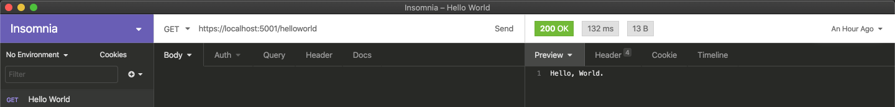

In this lesson we will build our own API which will send and receive information
over HTTP and the web. We will see structures of how to organize our code, the
purpose and benefit of placing our code in _controllers_ and learn how to
utilize databases to store data to feed our API,

## Introducing a New .NET Template

In other lessons we have used `dotnet new sdg-console` to create our application
that run in the terminal. Now we will be using a different template, one that
configures our code to interact with HTTP clients.

```shell
dotnet new sdg-api -o BasicAPI
```

You will notice more files in this project than we are familiar with from our
`console` template.

```
appsettings.Development.json
appsettings.json
BasicAPI.csproj
Program.cs
Startup.cs
Properties/launchSettings.json
```

Let's review the new files we see

### appsettings.json and appsettings.Development.json

These files configure certain features such as logging (we'll talk more about
logging later) and which hosts (computers) are allowed to connect.

### Startup.cs

This file controls the startup of the part of our system that handles receiving
requests from clients and sending results. Lets walk through the code and
discuss all the important pieces.

In the code below we've taken the included `Startup.cs` and added documentation
about each line and it's purpose.

> NOTE: You won't have to edit this code often, but you may update it as we add
> new libraries and capabilities to our system.

```csharp
namespace BasicApi
{
    public class Startup
    {
        // When the system starts up, we will be given a configuration variable.
        // we will save this in a property named `Configuration`
        public Startup(IConfiguration configuration)
        {
            Configuration = configuration;
        }

        // Where we store our program's configuration
        public IConfiguration Configuration { get; }

        // This method gets called by the runtime. Use this method to add services to the container.
        public void ConfigureServices(IServiceCollection services)
        {
            // Our application will use controllers
            services.AddControllers();
        }

        // This method gets called by the runtime. Use this method to configure the HTTP request pipeline.
        public void Configure(IApplicationBuilder app, IWebHostEnvironment env)
        {
            // If we are in development
            if (env.IsDevelopment())
            {
                // Use a friendly error page that helps the developer.
                // We wouldn't want this in production since it might
                // give away code secrets.
                app.UseDeveloperExceptionPage();
            }

            // Ensure any un-encrypted (http) requests are redirected to secure (https)
            app.UseHttpsRedirection();

            // Use routing to determine which endpoints are handled by which controllers and methods
            app.UseRouting();

            // Enable the use of user authorization if we want to use that.
            app.UseAuthorization();

            // Hook up our endpoints (URLs) to the controllers and methods that handle them.
            app.UseEndpoints(endpoints =>
            {
                endpoints.MapControllers();
            });
        }
    }
}
```

### Properties/launchSettings.json

This file configures how our application is started in different environments
and by different web hosts. This file will also not be updated often by us. We
might update it if we need to support a different hosting environment.

## Writing our first API

The simplest of all applications is the `Hello, World` app. Let's make an API
that if you send a `GET` to `/helloworld` we will get back the text
`Hello, World.`

Here is one of the first conventions we are going to see for building APIs. When
we are building an endpoint, in this case `/helloworld` we are going to make a
special class containing code to handle those requests. That class is known as a
`Controller`. The purpose of a `Controller` is to indicate to .NET which `URL`s
this code handles and which combination of URL and VERB should be handled by
what method.

Think of the `Controller` like a traffic officer. When requests come in, .NET
looks to the controllers to tell it which direction to send the request, to
which method the request should go to. We are going to refer this as `Routing`

Since this endpoint is `/helloworld` we are going to create a file
`Controllers/HelloWorldController.cs`. Inside that file we will define this
code:

```
namespace BasicApi.Controllers
{
    [ApiController]
    [Route("[controller]")]
    public class HelloWorldController : ControllerBase
    {
        [HttpGet]
        public string SayHello()
        {
            return "Hello, World.";
        }
    }
}
```

Quite a lot of this code will look familiar, but there are some new ideas.

The first we see is that our controller is a child class, that is, it has a
parent class of `ControllerBase`. This is because much of the common code is
created for us and implemented in the `ControllerBase`. All of our controller
code will have `ControllerBase` as a parent.

Next up are two attributes on our controller. `[ApiController]` tells .NET that
this class is a controller and should be considered when looking for controllers
to handle web requests.

Next is `[Route("[controller]")]`. This attribute tells the _routing_ system
which URLs this code handles. Remember that we said we were following a
convention, that `/helloworld` should be handled by the HelloWorldController?
Inside the `"...."` is the first part of the URL. We could have written
`Route("/helloworld")]`, however we named the controller `HelloWorldController`
and the `[controller]` part of that route means: _Take the name of this
controller, remove the Controller from the name and use the rest as the part of
the URL._ So `[Route("[controller]")]` on `PeopleController` would indicate the
URLs all start with `/people` and if this was the `CarsController` the URLs
would all start with `/cars`.

We are going to use this convention as much as possible across our code.

The next attribute is `[HttpGet]` in front of our `SayHello` method. This
attribute says that if we receive a `GET` request (and no other part of the URL
beyond `/helloworld`) this is the method to call when we receive `GET` on
`/helloworld`.

Notice that the **NAME** of the method does not matter to the _routing_ but it
will have meaning to us. We'll review some conventions to follow later.

## Implementing the endpoing handling method

```csharp
public string SayHello()
{
    return "Hello, World.";
}
```

In creating our API handling method we say that we are returning a `string` and
then just `return "Hello, World.";` as the content to send back. Pretty simple!
We'll be increasing the complexity of these methods, but things don't get too
complicated.

## Running out API

So with all of that if we run our code with `dotnet watch run` we will see that
dotnet is running our application and suggests a starting URL for us.

```
watch : Started
info: Microsoft.Hosting.Lifetime[0]
      Now listening on: https://localhost:5001
info: Microsoft.Hosting.Lifetime[0]
      Now listening on: http://localhost:5000
info: Microsoft.Hosting.Lifetime[0]
      Application started. Press Ctrl+C to shut down.
info: Microsoft.Hosting.Lifetime[0]
      Hosting environment: Development
info: Microsoft.Hosting.Lifetime[0]
```

Notice that we can use `http://localhost:5000` or `https://localhost:5001`. If
we use `http://localhost:5000` we will be redirected to the `https` version.

If you open the `Insomnia` API testing tool, create a new request, and send a
`GET` request to `https://localhost:5001`. You will see something like this:



If we peek at the `Header` tab you will see the `Content-Type` is `text/plain`.
This is because our API method is just returning a simple string, which .NET
will represent as `text/plain`.

## Making our response more dynamic.

If we want to see different data coming back for each request, lets include the
current date and time in the greeting.

We change the implemention of the method to:

```csharp
[HttpGet]
public string SayHello()
{
    return $"Hello, World. It is currently {DateTime.Now}";
}
```

Now the string being returned is dynamic. Each time the _router_ receives a
request to `/helloworld` and `GET` it runs our `SayHello` method, makes a new
string this time containing the current date and time, and returns that to our
client.

Try your request in `Insomnia` again and we'll see a different string returned
each time.

## Accepting input

When we were review APIs we said that APIs need to handle a few questions, the
first was:

- What is the input that needs to be sent?

We also said that one way we can send information to an API is via the idea of
`query parameters` in our URL. These are parts of the URL after a `?` and are
key-value pairs separated by `=` signs.

Lets modify our code so that we require a name and we use that name in our
greeting. Our requests will now look like `/helloworld?who=Sandy`.

To indicate that we want to look at the query parameters and look for a key
named `who` we simply add an argument to our method and name it `who`. We make
it a `string` so we will receive the text value of the key-value pair, `Sandy`
in our example.

```csharp
[HttpGet]
public string SayHello(string who)
{
    return $"Hello, {who}. It is currently {DateTime.Now}";
}
```

If you use the URL `https://localhost:5001/helloworld?who=Paula` you will
receive back the message `Hello, Paula. It is currently 4/28/2020 10:15:30 PM`
(except you'll see the current time).

What if we left out the query parameter and just sent
`https://localhost:5001/helloworld`. In this case there won't be any `who` to
supply, so .NET will fill that value with the default value for the type, in
this case `null`. We can handle that case and put back our default text of
`World` so we see `Hello, World`.

```csharp
[HttpGet]
public string SayHello(string who)
{
    string whoOrWorld;

    if (who == null)
    {
      whoOrWorld = "World";
    } else {
      whoOrWorld = who;
    }

    return $"Hello, {whoOrWorld}. It is currently {DateTime.Now}";
}
```

Now our code is more resilient and will handle the case where the user does not
specify a `who`.

## Taking it up a notch

The other way we discussed giving information to an API was as part of the URL
itself.

Lets make an API for rolling die. We will start with making and endpoint
`/dice`. To follow our convention we will make a `DiceController.cs` file (e.g.
the `dice` from `/dice` is converted to CamelCase and we tack on `Controller`)
and inside we define a `DiceController` class.

```csharp
using System;
using Microsoft.AspNetCore.Mvc;

namespace BasicApi.Controllers
{
    [ApiController]
    [Route("[controller]")]
    public class DiceController : ControllerBase
    {
    }
}
```

Now we will define our method to handle the `GET`. However, we want to specify
the number of sides our die has within the URL. That is a request to `/dice/6`
would roll a 6-sided die and return us a random number. However if we sent a
`GET` to `/dice/20` we'd be rolling a 20-sided die.

Somehow we must tell the _route_ part of `[HttpGet]` that we'd like to have part
of the URL be _variable_ and tell it what we want to call that specific part of
the URL. In this case a good name for that part is `sides`.

We can modify the `[HttpGet]` with parenthesis to specify additional parts of
the URL beyond the `/dice` base. However if we use `{}` we can tell .NET that
we'd match anything and whatever is supplied in the URL we want to name it. In
this case we specify our attribute as `HttpGet("{sides}")`. We read this as "In
the `/dice` endpoint here is the method to handle GET requests that look like
/dice/6 and /dice/20 and dice/99999, but we refer to the 6, 20, or 99999 as
`sides`"

Just like for query parameters, we define a method argument to receive this
data. We name it the same as what we wrote inside `{}`, in this case `sides`.
Previously we used `string` as the type. Here, however, we want this to be a
number so we can define `sides` as `int`. Since we are also returning a number,
we define the return type is `int`. We'll name our method `Roll`

```csharp
[HttpGet("{sides}")]
public int Roll(int sides)
{
```

Next we need a way to generate random numbers. Luckily `C#` gives us a class
that does exactly that, `Random`. First we make a variable that can generate
random numbers: `var randomNumberGenerator = new Random();` and to get a number
from it we call `randomNumberGenerator.Next(SOMENUMBER)`. This will give us a
number between 0 and what we give as SOMENUMBER. It will return as low as `0`
but to just one _smaller_ than `SOMENUMBER`. So if we want a number between `1`
and the number of sides we use
`var roll = randomNumberGenerator.Next(sides) + 1`

```csharp
using System;
using Microsoft.AspNetCore.Mvc;

namespace BasicApi.Controllers
{
    [ApiController]
    [Route("[controller]")]
    public class DiceController : ControllerBase
    {
        [HttpGet("{sides}")]
        public int Roll(int sides)
        {
            var randomNumberGenerator = new Random();

            var roll = randomNumberGenerator.Next(sides) + 1;

            return roll;
        }
    }
}
```

Give it a try. Use `Insomnia` to visit `https://localhost:5001/dice/6` and see
what you roll! It should be a random die roll between `1` and `6`

There will be another change if you look over at the `Header` tab. The
`Content-Type` has changed. We are now returning `application/json`. This is
because the return type is more complicated than a simple `string` and .NET is
automatically converting our output to JSON for us.

Lets return some more complex data. Lets roll many die.

## Rolling more than one die.

Let's combine the URL pattern with a query parameter of the number of die we
wish to roll. So our URL will look like `/dice/6?count=4` to roll `4` die with
`6` sides.

First lets add the query parameter to our arguments:
`public int Roll(int sides, int count)` and since we will be returning more than
one value we will change our return type. Since we are returning a collection of
integers, we'll return a `List<int>`. In our method we will create a new `List`
and then populate many random rolls of the die. Finally we will return the list
of rolls.

```csharp
using System;
using System.Collections.Generic;
using Microsoft.AspNetCore.Mvc;

namespace BasicApi.Controllers
{
    [ApiController]
    [Route("[controller]")]
    public class DiceController : ControllerBase
    {
        [HttpGet("{sides}")]
        // int sides -- comes from {sides} in the HttpGet
        // int count -- comes from a query parameter
        public List<int> Roll(int sides, int count)
        {
            // Make a new list to store our integer rolls
            var rolls = new List<int>();

            // Make a random number generator
            var randomNumberGenerator = new Random();

            // Loop _count_ times
            for (var rollNumber = 0; rollNumber < count; rollNumber++)
            {
                // Grab a random roll between 1 and sides
                var roll = randomNumberGenerator.Next(sides) + 1;

                // Add that roll to the list
                rolls.Add(roll);
            }

            // Return the list
            return rolls;
        }
    }
}
```

Using the url `/dice/4?count=6` we will see a result like this:


The result is a JSON formatted array of four random numbers representing our die
rolls. Try generating more rolls by increasing the `count=` or alter the number
of sides of the die.

What happens if no `count` is given? If for instance you use
`https://localhost:5001/dice/20`? Oops, we get back an empty array. Luckily `C#`
allows us to specify a default value for an argument if it is not supplied.

```csharp
public List<int> Roll(int sides, int count = 1)`
```

By changing this we now default to rolling a single die if a value is not
supplied.

## Conclusion

- We have written our fist API controller.
- We have written a handler for a GET request.
- We have allowed input to be supplied with a query parameter.
- We have allowed input to be supplied with a URL parameter.
- We have returned JSON data, both a single number and an array of numbers
