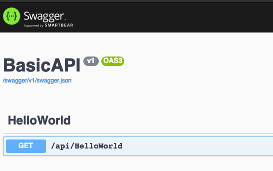
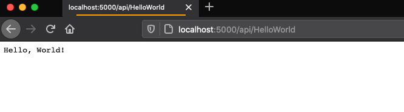
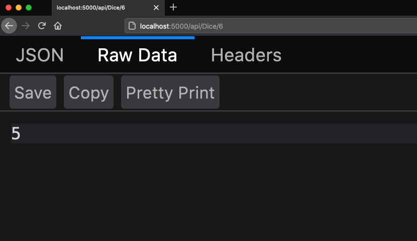
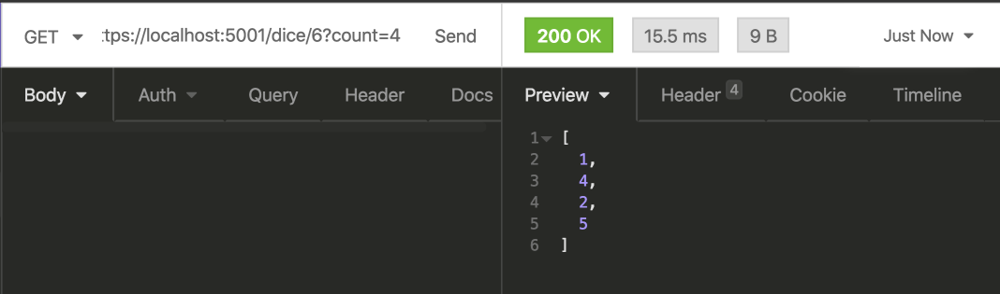

theme: Next,1

# [fit] Building API Servers

---

# API Servers are one of the fundamental ways we build full stack applications

---

# Roles of the API Sever

- Present a consistent, well thought out, series of API Endpoints (URLs) to allow interaction with data.
- Interact with all the necessary datasources. Primarly, but not limited to, databases.
- Provide authentication to ensure users are who they say they are.
- Provide authorization to ensure users are restricted based on their roles.

---

# Our API Servers will be HTTP based

- Just as we have for API Clients our main mode of communication will be HTTP.
- We will be using existing `dotnet` libraries to provide HTTP services.

---

# Introducing ASP.NET

The existing library we are going to use is named `ASP.NET` and provides services to:

- Read incoming HTTP requests from clients.
- "Route" them based on the URL to the right bit of code to run to "handle" the request.
- Serialize and Deserialize JSON information.
- Provide for generating the correct headers including status codes.

---

# A different mode of coding

In the applications we have written to date our code runs _linearly_ from a `Program.cs` file.

For an API Server there is no `Main` application and no linear code.

The API Server "waits" for a connection from a client and then calls our code.

In this way our entire program becomes _asynchronous_ and broken into small methods that handle a specific URL

---

# Introducing a new .NET template

So far we have used `sdg-console` to create our application. For today's lecture we will use one that configures our code to interact with HTTP clients.

```shell
dotnet new sdg-api -o BasicAPI
```

---

# FILES! FILES EVERYWHERE!

In this template there are many files. We'll look at a few of them to review what they do.

---

```
appsettings.Development.json
appsettings.json
BasicAPI.csproj
Program.cs
Startup.cs
Controllers/
Models/
```

---

# appsetings.json and appsetings.Develoment.json

These files configure certain features such as logging (we'll talk more about logging later) and which hosts (computers) are allowed to connect.

---

# Startup.cs

This file controls the startup of the part of our system that handles receiving requests from clients and sending results. Lets walk through the code and discuss all the important pieces.

---

# Program.cs

We still have a familiar `Program.cs` but in this case the file is filled with code that we will not be editing.

This code exists to startup the API Server, connect it to the listing _port_ and begin accepting requests from clients.

---

# So where does our code go?

The main place we write code in an API Server is in a `Controller`

---

# Introducing MVC

- `M` - Model
- `V` - View
- `C` - Controller

---

# Introducing MVC

- `M` - Model -- Our data
- `V` - View -- How our data is serialized and deserialized
- `C` - Controller -- Code that is a "traffic cop" that sits between the view and the model.

---

# MVC

```
+--------+                       +------------+          +--------+
| Client | ====> Request  ====>  | Controller | ======>  | Models |
+--------+                       +------------+          +--------+
                                                            |
                                                            |
                                                            |
+--------+        +------+       +------------+             |
| Client | <====  | View | <==== | Controller | <===========+
+--------+        +------+       +------------+
```

---

# Let's build our first API Controller!

Luckily we have a handy tool we can use to build out the template of a new controller for us!

> NOTE: This should be run on _ONE LINE_. It is split here for readability

```shell
dotnet aspnet-codegenerator controller
       -api -name HelloWorldController --relativeFolderPath Controllers
```

---

# Breaking down the command

```
       Name of the tool
       |
       |                    What to generate
       |                    |
       v                    v
dotnet aspnet-codegenerator controller

       Request an API style controller
       |
       |     Name of the controller
       |     |
       |     |                         What folder to place the generated controller code
       |     |                         |
       v     v                         v
       -api -name HelloWorldController --relativeFolderPath Controllers
```

---

# What does it generate?

```csharp
namespace BasicAPI.Controllers
{
    [Route("api/[controller]")]
    [ApiController]
    public class HelloWorldController : ControllerBase
    {
    }
}
```

---

# Breaking it down

---

# Namespace

```csharp
namespace BasicAPI.Controllers
```

We keep our various code in `namespaces` to organize our code. By placing code in various namespaces we can avoid an issue when two classes might need the same name.

It also gives us a hint as to the purpose of the code defined within.

---

# Annotations

This annotation tells `ASP.NET` that this class is a "Controller".

When our applicaiton starts up `ASP.NET` will look for all the controllers that can possibly handle a request.

```csharp
[ApiController]
```

---

# Annotations

This annotation tells `ASP.NET` what the URL is that the controller should handle.

The text within the `()` tells the path of the URL.

There is a shortcut. `[controller]` means: _"Take the name of the class without Controller and put it here"_

Thus this controller will respond to all requests that start with `api/HelloWorld`

```csharp
[Route("api/[controller]")]
```

---

# The Controller class

This is the class in which we will write the code to handle various requests.

By inheriting from `ControllerBase` we get all the abilities of an `ASP.NET` controller.

We will see some of those abilities soon.

```
public class HelloWorldController : ControllerBase
{
}
```

---

# Handling our first request!

The simplest thing we can possbily do is the equivalent of the first `C#` program we wrote.

`Hello World`

We will make our controller, when it receives a `GET` request at `api/HelloWorld` just say "Hello, World." to us.

---

# Our first request handler!

```csharp
[HttpGet]
public string SayHello()
{
    return "Hello, World.";
}
```

Most of this code looks familiar.

- We are defining a public method that returns a `string`
- It is named `SayHello`
- It's work is to simply return the string `"Hello, World."`

---

# Annotations to indicate the specifics of the URL

```csharp
[HttpGet]
```

In this case we annotate the method to say "If the request is a GET, and is the base URL of api/HelloWorld" then please call this code to handle the request.

---

# The return value becomes the response!

In this case we told `ASP.NET` that this code returns a simple string and that will become the response of our request!

---

# Let's run this and see it work

```shell
dotnet watch run
```

---

# What do we see?

```
watch : Started
Hosting environment: Development
Content root path: /Users/gstark/tmp/BasicAPI
Now listening on: http://localhost:5000
Now listening on: https://localhost:5001
Application started. Press Ctrl+C to shut down.
```

Well this is different!

Our app is not going to interact with the console anymore. _Goodby Console.WriteLine_

Instead our app is telling us that it is running a **Server** and we can see it on the URL `http://localhost:5000`

---

# localhost?

`localhost` is the special DNS name that always means "My local computer"

And in this case the `:5000` means we are going to speak to the service running on `Port 5000` which is where our code is awaiting requests

---

# Fire up FireFox

Start Firefox and visit `http://localhost:5000` in our browser.

We will see `Swagger` an API documentation system show us that we have _one_ URL that our code knows how to handle!

Look! It is `/api/HelloWorld`

Let's put that in our browser.



---



---

# [fit] Change the message and refresh!

---

## Making our response more dynamic.

If we want to see different data coming back for each request, lets include the current date and time in the greeting.

We change the implementation of the method to:

```csharp
[HttpGet]
public string SayHello()
{
    return $"Hello, World. It is currently {DateTime.Now}";
}
```

---

## Accepting input

We know that we can send information to an API with `query parameters`

These are parts of the URL after a `?` and are key-value pairs separated by `=` signs.

Our requests will now look like

```
/api/HelloWorld?who=Sandy
```

---

## Adding query parameters

We said calling APIs are a little like calling methods.

To add a query parameter, we add an `argument` to the method with the same name as the query parameter and with the needed data type.

In this case:

- Query parameter name: `who`
- Query parameter type: `string`

---

```csharp
[HttpGet]
public string SayHello(string who)
{
    return $"Hello, {who}. It is currently {DateTime.Now}";
}
```

---

# Example

If you use the URL `https://localhost:5001/helloworld?who=Paula` you will receive back the message

```
Hello, Paula. It is currently 4/28/2020 10:15:30 PM
```

(except you'll see the current time)

---

# What if we didn't send a query parameter?

In this case there won't be any `who` to process so `C#` will make that variable `null`

Let's add code to handle that case:

---

```csharp
[HttpGet]
public string SayHello(string who)
{
    string whoOrWorld;

    if (who == null)
    {
      whoOrWorld = "World";
    } else {
      whoOrWorld = who;
    }

    return $"Hello, {whoOrWorld}. It is currently {DateTime.Now}";
}
```

---

# Taking it up a notch!

The other way we discussed giving information to an API was as part of the URL itself.

Lets make an API for rolling die

We will start with making and endpoint `/dice`.

To follow our convention we will make a `DiceController.cs` file (e.g. the `dice` from `/dice` is converted to CamelCase and we tack on `Controller`) and inside we define a `DiceController` class.

---

# Generator!

```shell
dotnet aspnet-codegenerator controller -name DiceController -api --relativeFolderPath Controllers
```

---

# Define a handler for `GET`

```csharp
[HttpGet("{sides}")]
public int Roll(int sides)
{
```

In this case we are telling the controller that there is information **INSIDE** the URL itself.

The `("{sides}")` means

> Right after the end of the URL comes some important information. Whatever is there please put in an argument named sides

---

# Sample URLs

```
/api/Dice/6
/api/Dice/8
/api/Dice/12
/api/Dice/20
```

---

# Finish the code to roll!

```csharp
[HttpGet("{sides}")]
public int Roll(int sides)
{
    // Make a random number generator
    var randomNumberGenerator = new Random();

    // Next(sides) would make a number between 0 and just less than sides
    // so return that number plus one. Making the range from 1 to a number
    // INCLUDING the value of sides.
    var roll = randomNumberGenerator.Next(sides) + 1;

    return roll;
}
```

---

# Return value

But wait, this time we are returning an `int` -- what are we going to get in the browser?

---

# `http://localhost:5000/api/Dice/6`

---

# [fit] JSON!



---

# Rolling multiple die!

Let's combine the URL pattern with a query parameter of the number of die we wish to roll. So our URL will look like `/dice/6?count=4` to roll `4` die with `6` sides.

---

# Add the query parameter

First lets add the query parameter to our arguments:

```csharp
public int Roll(int sides, int count)
```

---

# Change the return type

Since we will be returning more than one value we will change our return type.

Since we are returning a collection of integers, we'll return a `List<int>`.

In our method we will create a new `List` and then populate many random rolls of the die. of rolls.

---

```csharp
[HttpGet("{sides}")]
// int sides -- comes from {sides} in the HttpGet
// int count -- comes from a query parameter
public List<int> Roll(int sides, int count)
{
```

---

# Finish the code

In our method we will create a new `List` and then populate many random rolls of the die.

Finally, we will return the list of rolls.

---

```csharp
[HttpGet("{sides}")]
// int sides -- comes from {sides} in the HttpGet
// int count -- comes from a query parameter
public List<int> Roll(int sides, int count)
{
    // Make a new list to store our integer rolls
    var rolls = new List<int>();

    // Make a random number generator
    var randomNumberGenerator = new Random();

    // Loop _count_ times
    for (var rollNumber = 0; rollNumber < count; rollNumber++)
    {
        // Grab a random roll between 1 and sides
        var roll = randomNumberGenerator.Next(sides) + 1;

        // Add that roll to the list
        rolls.Add(roll);
    }

    // Return the list
    return rolls;
}
```

---

# `/dice/6?count=4`



---

The result is a JSON formatted array of four random numbers representing our die rolls.

Let's try generating more rolls by increasing the `count=` or alter the number of sides of the die.

---

# What if we don't provide a count?

What happens if no `count` is given?

If for instance you use `https://localhost:5001/api/Dice/20`?

Oops, we get back an empty array.

Luckily `C#` allows us to specify a default value for an argument if it is not supplied.

---

```csharp
public List<int> Roll(int sides, int count = 1)
```

By changing this we now default to rolling a single die if a value is not supplied.

---

## Conclusion

- We have written our fist API controller.
- We have written a handler for a GET request.
- We have allowed input to be supplied with a query parameter.
- We have allowed input to be supplied with a URL parameter.
- We have returned JSON data, both a single number and an array of numbers
