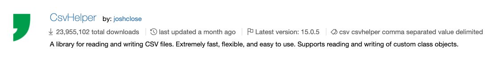

theme: Next,1

<!-- prettier-ignore-start -->


# [fit] Reading and Writing Files

---
# [fit] Persistance

---

So far we have seen how to input, manage, and output data in our programs.

However, this data is only stored in the computer's memory and thus when we stop our programs all of this information is lost.


---

# [fit] Many choices

- Files
- Remote API
- Database

---

# [fit] What is a "file"?

A sequence of characters (really more accurately **`bytes`**)

Similar to how a **`string`** is also just a sequence of characters.

---

# [fit] Like a string but BIGGER

Our **`strings`** have typically been fairly small.

Files can be quite large.

Files should be able to store more than one thing.

This requires structure.

---

# [fit] Information needs structure

Often called the _file format_.

[.column]

Many to choose from
- `CSV`
- `JSON`
- `XML`
- `XLS`
- `INI`
- `YAML`
- `TOML`
- `PropertyList`

[.column]

We will start with **`CSV`**

---

# [fit] `CSV` - Comma Separated Value

Familiar if you have used a spreadsheet app like Excel, or Numbers.

The structure of a simple CSV file looks similar to this:

<br/>

```
"Elon Musk",42,120000
"Grace Hopper",100,240000
```

---

# [fit] First Row (aka Header)

The CSV file also allows us to have a first row (aka header) that describes the data for any human and computer reader.

<br/>

```
"Name","Department","Salary"
"Elon Musk",42,120000
"Grace Hopper",100,24000
```

---

# [fit] Number Tracker

Console app to keep track of a list of numbers

---

# [fit] Using 3rd Party Libraries

We don't have to write the code for processing **`CSV``**

But it also doesn't come _"out of the box"_ from **`C#`** or **`.NET`**

---

# [fit] Enter _packages_ to the rescue

---

# [fit] Nuget

Packages for **`C#`** and **`.NET`** are cataloged at `nuget.org`.

There is a *LOT* there.

Not all of it quality.

Not all of it appropriate to our needs.

Have a discerning eye.

---

# [fit] CSV library we are going to use

<br/>

# [fit] CsvHelper



---

# [fit] Adding to our project

Run this from the same place you'd run `dotnet run`

<br/>

```shell
dotnet add package CsvHelper
```

---

# [fit] Adding code to save the list of numbers

But first...

Tell the code where to write the data.

## `StreamWriter`

`StreamWriter` accepts data and sends it to a destination.

Process data in small pieces, a flow, like water running in a stream.

---

```csharp
//               A new stream of information to WRITE
//                |
//                |               Name of file to write to
//                |               |
//                |               |
//                v               v
var fileWriter = new StreamWriter("numbers.csv");
```

---

# [fit] Using the stream

Now that we have a way to send information to a file, we need some code that knows how to write in the CSV format.

## Enter `CsvWriter`

```csharp
//                  A new stream of CSV data
//                  |
//                  |         The stream to write to
//                  |         |
//                  |         |           Rules about formatting
//                  |         |           |
//                  |         |           |
//                  v         v           v
var csvWriter = new CsvWriter(fileWriter, CultureInfo.InvariantCulture);
```

---

# [fit] Write out the numbers!

```csharp
//
//  Where to write
//  |
//  |                     What data to write
//  |                     |
//  v                     v
   csvWriter.WriteRecords(numbers);

//
//  Tell the object that writes to the file
//  |
//  |         That we are done and close
//  |         |
//  v         v
   fileWriter.Close();
```

---

This is how the information flows through this code:

<br/>

```
numbers
   |
   |
   ---> csvWriter.WriteRecords
                |
                |
                ---> fileWriter
                         |
                         |
                         ---> `numbers.csv`
```

---

If the user entered a sequence of numbers: `1`, `42`, `99`, `3`, and `17` our `numbers.csv` would look like this:

<br/>

```
1
42
99
3
17
```

---

# [fit] Load 'em up

---

Now lets read this information from the file at the beginning of the code.

Just as we have a `StreamWriter` we also have a `StreamReader` we can use to load data.

<br/>

```csharp
var fileReader = new StreamReader("numbers.csv");
```

---

And as we have a `CsvWriter` we also have a `CsvReader` we can use to read the CSV data.

```csharp
var csvReader = new CsvReader(fileReader, CultureInfo.InvariantCulture);

// Tell the reader not to interpret the first
// row as a "header" since it is just the
// first number.
csvReader.Configuration.HasHeaderRecord = false;
```

---

Finally, instead of `WriteRecords` we have a way to `ReadRecords`.

<br/>

```csharp
var numbers = csvReader.GetRecords<int>().ToList();
fileReader.Close();
```

<br/>

> NOTE: You must also add `using System.Linq` to be able to use `ToList`

---

# [fit] Handling the case where there is no file


---

# Algorithm:

- Detect if there is no file.
- If there is a file, use a StreamReader pointing to the file
- If there isn't a file, use a StringReader with an empty string

---

```csharp
// Generic reader that can be a StreamReader *OR* a StringReader
TextReader reader;

// If the file exists
if (File.Exists("numbers.csv"))
{
  // Assign a StreamReader to read from the file
  reader = new StreamReader("numbers.csv");
}
else
{
  // Assign a StringReader to read from an empty string
  reader = new StringReader("");
}
```

---

# Alternate algorithm:

- Create an empty list of numbers.
- If there is a file, use StreamReader + CsvReader to *replace* the contents of the list

---

<!-- prettier-ignore-end -->
