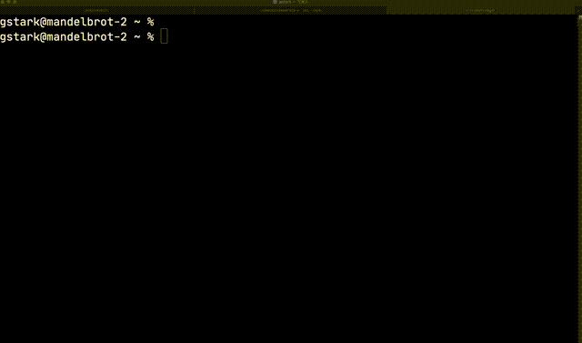

## Learning Objectives

- The student will be able to create a new `C#` project and run the code.
- The student will understand the `dotnet new` command.

Before we can start writing code in `C#` we must have a directory and a project
to contain our code. This project will tell our computer how to organize our
code, how to make the code ready to run (known as `compiling`) and finally how
to run our code.

## TL;DR

Too Long; Didn't Read

Skip to the end for a short animation of the process in action

## Before getting started

Ensure you have [setup your environment](/lessons/cs-environment-setup)
including a step on selecting and creating a location to keep your projects.

## The `dotnet` command

We will be using the `dotnet` command frequently. This command has many ways to
use it and we'll discover those in various other lessons. To get started with a
`C#` project we'll use the `dotnet` command to make a `new` project. The
simplest program we can write will interact with the user by what we call the
`console.` On Mac OS or Linux the `console` will be our `terminal/shell` and on
Windows this will be our `Powershell` window.

## Starting in the right place

Before we can create a new project we must first change the working directory of
our shell into the directory where we'll keep our code. We suggest you use a
folder named `sdg` or `code` or something else that will remind you this is
where your projects are. You'll also want to keep this directory in your home
folder, your `Desktop`, or your `Documents` folder. You will find instructions
in [the setup lesson](/lessons/cs-environment-setup) on how to create these.

### Running `dotnet new sdg-console` to make a new console application

Now that we have created a directory to contain our application we can use the
`dotnet` app to create the project:

- If your folder is named `sdg` and you keep it in your _home directory_

```shell-session
cd ~/sdg
```

- **OR** if your folder is named `sdg` and you keep it in your _Documents_
  folder.

```shell-session
cd ~/Documents/sdg
```

- **OR** if your folder is named `sdg` and you keep it in your _Desktop_ folder.

```shell-session
cd ~/Desktop/sdg
```

Now that we are in the correct location we can run this command to generate our
first new project.

```shell-session
dotnet new sdg-console -o OurDotnetApp
```

## dotnet new may prompt you during setup

When you run this command you will be prompted with a question:

```shell
Processing post-creation actions...
Template is configured to run the following action:
Description: Creates a github repository for you
Manual instructions:
Actual command: bash -c "git init; hub create; git add .; git commit -m 'Initial Commit'; git push -u origin master"
Do you want to run this action (Y|N)?
```

This question is asking if you want to create a Github code repository for this
application. If you are creating a project for an assignment or you wish to keep
a record of this code, answer with a `Y` and you will see:

```shell
Running command 'bash -c "git init; hub create; git add .; git commit -m 'Initial Commit'; git push -u origin master"'...
Command succeeded.
```

This command has a few parts. The following is an example breakdown of the
command.

```shell
# dotnet command
# |
# |
# |      Option to say we are making a new project
# |      |
# |      |
# |      |   Name of the template to use for this project.
# |      |   We will be using several different templates along the way
# |      |   |
# |      |   |           Option to tell dotnet what directory to create to store our project
# |      |   |           |
# |      |   |           |
# |      |   |           |  Name of the directory to put our project
# |      |   |           |  |
# |      |   |           |  |
# v      v   v           v  v
  dotnet new sdg-console -o OurDotnetApp
```

Our project is created along with a Github repository if we wish.

The project is in a directory with the same name we provided after the `-o` in
our original command. Now we will make that directory our current directory by
using the `cd` command:

```shell
cd OurDotnetApp
```

### What files make up our project?

The `dotnet new sdg-console` command generates a new project for us from a
_template_. In this case we are using the `console` template. Each template we
use with the `dotnet new` command will generate a different set of startup files
for us. These files give us a place to start as well as configure our tools so
we can get started writing code.

Let's see what startup files appear in our folder:

> NOTE: You can do this one of two ways. **1:** You can start your editor with:
> `code .` **2:** You can use the command line tool `ls` to list the contents of
> the folder.

```
.
├── Program.cs
└── OurDotnetApp.csproj
```

We may also see an `obj` folder but we will ignore that for a moment.

#### Project File (.csproj)

There are two files in our folder. The first, `OurDotnetApp.csproj` is a file
that `dotnet` wrote for us. It contains details about the project itself such as
which version of `dotnet` our program needs. For the most part, we are _not
going to modify this file_

#### Code (Program.cs)

The second file, `Program.cs` is where we will start writing our `C#` code. The
`.cs` file extension indicates to our code editor as well as the `dotnet` tool
that this code is written in the `c-sharp` (or `cs`) language.

## Let's run our code!

The template `Program.cs` simply prints out the phrase `Welcome to C#`.

To get `dotnet` to run our program and see if the phrase appears on our screen
we will use the `dotnet run` command.

```shell-session
dotnet run
```

We should see the following output on the screen if our program ran correctly:

```
Welcome to C#
```

Now as we change our code and add more functionality we can return to our
terminal/Powershell and run `dotnet run` again to see our new code in action.

## Watch our code and automatically run it.

If you find yourself in a cycle of:

- Change code
- Run `dotnet run`
- See output
- Repeat

you can use an alternative to `dotnet run` named `dotnet watch run`. By using
this version of the command we are telling `dotnet` to watch our code for any
changes and to re-run our code as soon as it sees any.

With this option our terminal/Powershell will look like:

```shell-session
$ dotnet watch run
watch : Started
Welcome to C#!
watch : Exited
watch : Waiting for a file to change before restarting dotnet...
```

Now our working cycle can be:

- Change code
- See output
- Repeat

This leaves us in our code editor more often and allows us to focus.

# Congratulations

We are all setup to begin writing programs in `C#` and `.NET`!

# Demonstration


