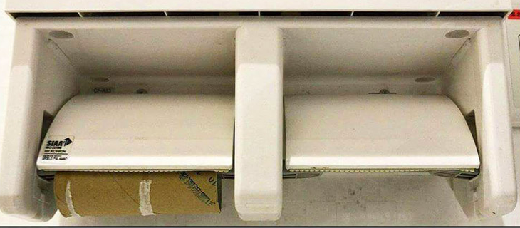

In addition to the other value types we've discussed, integers, strings, etc.
there is another type we should mention.

This is the `null` value. A value of `null` means the absence of a value.
Normally we don't directly write the `null` value when programming but it is
sometimes returned by methods we use in order to indicate the lack of a result.

> Key point: `null` represents the lack of a value.

## null versus zero

