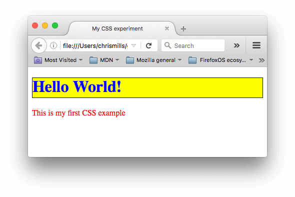

theme: Next, 1


# [fit] Web Fundamentals

---


# [fit] Intro to CSS

---

# [fit]CSS

CSS is a language for specifying how documents are presented to users — how they are styled, laid out, etc.

---

# CSS affects HTML

In order to use CSS we must first define our HTML content. This is often why developers lay out the HTML contents of a page/app before writing their CSS.

---

# CSS affects HTML

CSS uses the structure and attributes of our HTML to identify elements on the page to apply style to. This is also why the _semantics_ of the page are so important.

---

# Example



```html
<!DOCTYPE html>
<html>
  <head>
    <meta charset="utf-8" />
    <title>My CSS experiment</title>
    <link rel="stylesheet" href="style.css" />
  </head>
  <body>
    <h1>Hello World!</h1>
    <p>This is my first CSS example</p>
  </body>
</html>
```

```css
h1 {
  color: blue;
  background-color: yellow;
  border: 1px solid black;
}

p {
  color: red;
}
```

^ Show this code in an app-app

---

# Vocabulary

Before we dive into the tech details of CSS, we need some vocabulary:

- Properties: Human-readable identifiers that indicate which stylistic features you want to change.

- Values: Indicates how you want to change those stylistic features

---

# Vocabulary

A property paired with a value is called a **CSS declaration**. CSS declarations are put within **CSS Declaration Blocks**. And finally, CSS declaration blocks are paired with selectors to produce **CSS Rulesets** (or CSS Rules).

---

# Declaration


^ There are more than 300 different properties in CSS and nearly an infinite number of different values. Not all pairs of properties and values are allowed; each property has a specific list of valid values defined for it.

---

# Declaration Block


^ Declarations are grouped in blocks, with each set of declarations being wrapped by an opening curly brace, { and a closing one }.

---

# [fit] Selectors + Declaration Block = Ruleset


^ selector — a pattern that matches some elements on the page.

---

# Example Again


```html
<!DOCTYPE html>
<html>
  <head>
    <meta charset="utf-8" />
    <title>My CSS experiment</title>
    <link rel="stylesheet" href="style.css" />
  </head>
  <body>
    <h1>Hello World!</h1>
    <p>This is my first CSS example</p>
  </body>
</html>
```

```css
h1 {
  color: blue;
  background-color: yellow;
  border: 1px solid black;
}

p {
  color: red;
}
```

^ Point out the various declarations, blocks, and selectors

---

# Shorthand (for the lazy developer)

- Some properties like `font`, `background`, `padding`, `border`, and `margin` allow for shorthand.
- They allow multiple properties in a single line

---

# Shorthand example

This

```css
p {
  padding: 10px 15px 15px 5px;
}
```

is the same as:

```css
p {
  padding-top: 10px;
  padding-right: 15px;
  padding-bottom: 15px;
  padding-left: 5px;
}
```

---

[.autoscale: true]

# Selectors

Selectors follow a syntax that allows us to target specific sets of elements on the page.

#### Simple selectors

#### Attribute selectors

#### Pseudo-classes

#### Pseudo-elements

#### Combinators

#### Multiple selectors

---

# Simple Selectors - Tag Selector

One type of simple selector is the **Tag Selector**

Selects all elements using that tag.

```html
<p>What kind of ice cream do you like?</p>
<div>I like chocolate`.</div>
<p>I prefer VANILLA!</p>
```

```css
div {
  color: blue;
}
```

This will make the `<div>` elements **blue**

---

# Simple Selectors - Class Selectors

Instead of selecting elements based on the type of tag, we can select elements based on their class property.

The class selector consists of a dot, `.`, followed by a class name.

---

# Example

```html
<ul>
  <li class="first done">Create an HTML document</li>
  <li class="second done">Create a CSS style sheet</li>
  <li class="third">Link them all together</li>
</ul>
```

```css
/* The element with the class "first" is bolded */
.first {
  font-weight: bold;
}

/* All the elements with the class "done" are strikethrough */
.done {
  text-decoration: line-through;
}
```

---

# Simple Selectors - ID Selector

The ID selector consists of a hash/pound/octothorpe symbol `#`, followed by the ID name of a given element.

---

# Example

```html
<p id="polite">— "Good morning."</p>
<p id="rude">— "Go away!"</p>
```

```css
#polite {
  font-family: cursive;
}

#rude {
  font-family: monospace;
  text-transform: uppercase;
}
```

---

# Pseudo Class

- Specifies style applies only when element is in a certain state.

- Added to the end of a selector, preceded by a colon `:`

---

# Pseudo Selectors

- [`:first-child`](https://developer.mozilla.org/en-US/docs/Web/CSS/:first-child) - represents the first element among a group of sibling elements.
- [`:focus`](https://developer.mozilla.org/en-US/docs/Web/CSS/:focus) - represents an element (such as a form input) that has received focus.
- [`:hover`](https://developer.mozilla.org/en-US/docs/Web/CSS/:hover) - matches when the user interacts with an element with a pointing device, but does not necessarily activate it. It is generally triggered when the user hovers over an element with the cursor (mouse pointer).

---

# Pseudo Selectors

- [`:first-child`](https://developer.mozilla.org/en-US/docs/Web/CSS/:nth-child) - matches the first element within a group of siblings.

- [`:nth-child`](https://developer.mozilla.org/en-US/docs/Web/CSS/:nth-child) - matches elements based on their position in a group of siblings.

---

# Pseudo Elements

Pseudo-elements are very much like pseudo-classes, but they have differences.

They are keywords, this time preceded by two colons `::`, that can be added to the end of selectors to select a certain part of an element.

---

# Pseudo Elements

- [`::after`](https://developer.mozilla.org/en-US/docs/Web/CSS/::after)
- [`::before`](https://developer.mozilla.org/en-US/docs/Web/CSS/::before)
- [`::first-letter`](https://developer.mozilla.org/en-US/docs/Web/CSS/::first-letter)
- [`::first-line`](https://developer.mozilla.org/en-US/docs/Web/CSS/::first-line)
- [`::selection`](https://developer.mozilla.org/en-US/docs/Web/CSS/::selection)
- [`::backdrop`](https://developer.mozilla.org/en-US/docs/Web/CSS/::backdrop)

---

# Combinators

Using one selector at a time is useful, but can be inefficient in some situations.

CSS selectors become even more useful when you start combining them to perform fine-grained selections.

CSS has several ways to select elements based on how they are related to one another.

---

[.autoscale: true]

| Name            | Syntax      | Selects                                                                          |
| --------------- | ----------- | -------------------------------------------------------------------------------- |
| List            | **`A, B`**  | Any element matching A and/or B                                                  |
| Descendant      | **`A B`**   | Any element matching B that is a descendant of an element matching A             |
| Child           | **`A > B`** | Any element matching B that is a direct child of an element matching A.          |
| Adjacent        | **`A + B`** | Any element matching B that is the next sibling of an element matching A         |
| General sibling | **`A ~ B`** | Any element matching B that is one of the next siblings of an element matching A |

---

# Values

There are many types of CSS property values to consider, from numerical values to colors to functions that perform a certain action.

Some of these rely on particular units for specifying the exact values they are representing.

Do you want your box to be 30 pixels wide, or 30 centimeters, or 30 em?

Some values represent things like length and color.

---

# How to decide between different length units.

We are going to concentrate on `px`, `em`, and `rem`.

For other useful sizes such as `vh` (view height), `vw` (view width), and others, see the MDN.

`Google: mdn css length`

---

# px

[.autoscale: true]

> is a unit of length which roughly corresponds to the width or height of a single dot that can be comfortably seen by the human eye without strain, but is otherwise as small as possible.

The goal is to try to have the distance 96px equal about 1 inch on the screen, regardless of the actual pixel density of the screen.

If the user is on a phone with a pixel density of 266 DPI, and an element is placed on the screen with a width of 96px, the actual width of the element would be 266 device pixels.

---

# px

Using `px` for sizing things can be troubling.

Good for things that are already measured in pixels, like the size of an image. But for things like margins, paddings, and spacing they can be difficult.

---

# em

> Represents the calculated font-size of the element.

- `1em` equals the `font-size` of the parent, `2em` is twice the `font-size` of the parent, etc.

This is _relative_ to the font-size of the parent.

This can be confusing if a rule of `2em` is applied to different elements who's parent's `font-size` has been customized.

In this case `2em` of padding won't be the same amount.

---

# rem

> Represents the calculated font-size of the _root_ element.

This is _always_ scaled to the `font-size` of the root element. Thus is consistent against all elements regardless of their specific, calculated `font-size`

---

# rem as (my/our) favorite

Currently using `rem` is my preferred style.

Allows for consistent sizing, yet scales to the base font size.

**But it is highly debatable.**

For instance, `rem` is not modular in that it scales to the root, not to a containing element.

See [`https://zellwk.com/blog/rem-vs-em/`](https://zellwk.com/blog/rem-vs-em/)

---

# Cascade

What happens if multiple rules apply?

What properties are inherited from their parent elements?

Lets define what the CSS cascade is, what specificity is, what importance is, and how properties inherit from different rules.

---

# Cascade

CSS is an abbreviation for Cascading Style Sheets. "C"ascade is important.

The order of CSS rules matter, but it's more complex than that. Cascade depends on three factors:

1. Importance
1. Specificity
1. Source order

^ (these are listed in order of weight — earlier ones will overrule later ones):

---

# Importance

In CSS, there is a special piece of syntax you can use to make sure that a certain declaration will always win over all others: **`!important`**.

---

[.autoscale: true]

# Warning (...Will Robinson...)

It is useful to know that !important exists so that you know what it is when you come across it in other people's code.

However, we strongly recommend that you never use it unless you absolutely have to.

One situation in which you may have to use it is when you are working on a system where you can't edit the core CSS modules, and you really want to override a style that can't be overridden in any other way.

**But really, don't use it** if you can avoid it, because !important changes the way the cascade normally works, so it can make debugging CSS problems really hard to work out, especially in a large stylesheet.

---

# Specificity

Specificity is basically a measure of how specific a selector is — how many elements it could match.

- Element selectors have low specificity.

- Class selectors have a higher specificity, so will win against element selectors.

- ID selectors have an even higher specificity, so will win against class selectors.

---

# Specificity

The amount of specificity a selector has is measured using four different values (or components), which can be thought of as thousands, hundreds, tens and ones — four single digits in four columns

---

| Column    | Score                                                                                                                                                                           |
| --------- | ------------------------------------------------------------------------------------------------------------------------------------------------------------------------------- |
| Thousands | Score one in this column if the declaration is inside a style attribute, aka inline styles. Such declarations don't have selectors, so their specificity is always simply 1000. |
| Hundreds  | Score one in this column for each ID selector contained inside the overall selector.                                                                                            |
| Tens      | Score one in this column for each class selector, attribute selector, or pseudo-class contained inside the overall selector.                                                    |
| Ones      | Score one in this column for each element selector or pseudo-element contained inside the overall selector.                                                                     |

---

| Selector                                                     | Thousands | Hundreds | Tens | Ones | Total specificity |
| ------------------------------------------------------------ | --------- | -------- | ---- | ---- | ----------------- |
| `h1`                                                         | `0`       | `0`      | `0`  | `1`  | `0001`            |
| `h1 + p::first-letter`                                       | `0`       | `0`      | `0`  | `3`  | `0003`            |
| `li > a[href*="en-US"] > .inline-warning`                    | `0`       | `0`      | `2`  | `2`  | `0022`            |
| `#identifier`                                                | `0`       | `1`      | `0`  | `0`  | `0100`            |
| No selector, with a rule inside an element's style attribute | `1`       | `0`      | `0`  | `0`  | `1000`            |

---

# Specificity

This is a good [Specificity Calculator](https://specificity.keegan.st) you can use to evaluate your own CSS selectors

---

# Box Model

Every element within a document is structured as a rectangular box inside the document layout, the size and "onion layers" of which can be tweaked using some specific CSS properties.


---

# Padding

Padding refers to the inner zone of a CSS box — between the outer edge of the content box and the inner edge of the border.

The size of this layer can be set on all four sides at once with the `padding` shorthand property, or one side at a time with the `padding-top`, `padding-right`, `padding-bottom` and `padding-left` properties.

---

[.autoscale: true]

# Border

Border sits between the outer edge of the padding and the inner edge of the margin.

By default the border has a size of `0` — making it invisible — but you can set the thickness, style and color of the border to make it appear.

The border shorthand property allows you to set all of these on all four sides at once, for example `border: 1px solid black`.

This can be broken down into numerous different longhand properties for more specific styling needs.

---

# Margin

Margin pushes up against other CSS boxes in the layout. It behaves rather like `padding`

The shorthand property is `margin` and the individual properties are `margin-top`, `margin-right`, `margin-bottom`, and `margin-left`.

---

# Advanced box manipulation

When you set the size of a box with absolute values (e.g. a fixed pixel width/height), the content may not fit within the allowed size, in which case the content overflows the box.

To control what happens in such cases, we can use the overflow property.

---

# Overflow

|           |                                                                                                                                          |
| --------- | ---------------------------------------------------------------------------------------------------------------------------------------- |
| `auto`    | If there is too much content, the overflowing content is hidden and scroll bars are shown to let the user scroll to see all the content. |
| `hidden`  | If there is too much content, the overflowing content is hidden.                                                                         |
| `visible` | If there is too much content, the overflowing content is shown outside of the box (this is usually the default behavior.)                |

---

# Types of CSS boxes

Everything we've said so far applies to boxes that represent block level elements.

However, CSS has other types of boxes that behave differently.

The type of box applied to an element is specified by the display property.

There are many different values available for display, we will focus on the three most common ones; block, inline, and inline-block.

---

Read up at MDN:

[`https://developer.mozilla.org/en-US/docs/Learn/CSS/Building_blocks/The_box_model`](https://developer.mozilla.org/en-US/docs/Learn/CSS/Building_blocks/The_box_model)

---

# display: block;

A `block` box is defined as a box that's stacked upon other boxes (i.e. content before and after the box appears on a separate line), and can have width and height set on it.

The whole box model as described above applies to block boxes.

---

# display: inline;

An `inline` box is the opposite of a `block` box: it flows with the document's text (i.e. it will appear on the same line as surrounding text and other inline elements, and its content will break with the flow of the text, like lines of text in a paragraph.)

Width and height settings have no effect on inline boxes; any padding, margin and border set on inline boxes will update the position of surrounding text, but will not affect the position of surrounding block boxes.

---

# display: inline-block;

An `inline-block` box is something in between the first two: It flows with surrounding text and other inline elements without creating line breaks before and after it unlike a block box, but it can be sized using width and height and maintains its block integrity like a block box.

It won't be broken across paragraph lines like an inline box.

---

# Borders

Along with the box model we can take a look at the options we have for styling the `border` portion of a content box.

---

## Border radius

Rounded corners on boxes are an incredibly popular feature on web sites — so popular in fact that browsers implemented a property specifically for implementing rounded corners easily: `border-radius`.

```css
border-radius: 20px;
```

---

To put a different size of border radius on different corners, you can specify two, three or four values, rather like you can with padding and margin:

```css
/* 1st value is top left and bottom right corners,
   2nd value is top right and bottom left  */
border-radius: 20px 10px;
/* 1st value is top left corner, 2nd value is top right
   and bottom left, 3rd value is bottom right  */
border-radius: 20px 10px 50px;
/* top left, top right, bottom right, bottom left */
border-radius: 20px 10px 50px 0;
```

---

# Border radius

As a last point, you can also create elliptical corners (where the `x` radius is different to the `y` radius.) The two different radii are specified separated by a forward slash (`/`), and you can combine this with any combination of values, as indicated above.

For example:

```css
border-radius: 10px / 20px;
border-radius: 10px 30px / 20px 40px;
```

---

# Apply This!

---

# SDG Safari

---


---

# First Step - Content!

---

[.column]

```
<header>
  <nav>
    <h1>Safari</h1>
    <ul>
      <li><a href="#">Home</a></li>
      <li><a href="#">Our Animals</a></li>
      <li><a href="#">Blog</a></li>
      <li><a href="#">About</a></li>
    </ul>
  </nav>
</header>

<h2>Featured Creatures</h2>

<div class="feature">
  <figure>
    
  </figure>
  <figure>
    
  </figure>
</div>

<h2>Our New Friends</h2>

<ul>
  <li>
    
  </li>
  <li>
    
  </li>
  <li>
    
  </li>
  <li>
    
  </li>
</ul>
<h3>Lorem ipsum dolor sit amet</h3>
<p>
  Lorem ipsum dolor sit amet, consectetur adipiscing elit, sed do eiusmod
  tempor incididunt ut labore et dolore magna aliqua. Commodo ullamcorper a
  lacus vestibulum sed arcu non odio euismod.
</p>
```

[.column]

```
<h2>Latest Posts</h2>

<article>
  <h3><a href="#">Aliquam Eleifend mi in Nulla Posuere</a></h3>
  
  <p>
    In ante metus dictum at tempor commodo ullamcorper a lacus. Ultricies
    tristique nulla aliquet enim tortor at auctor. Egestas pretium aenean
    pharetra magna ac placerat vestibulum. Volutpat maecenas volutpat
    blandit aliquam. Enim diam vulputate ut pharetra sit. Commodo
    ullamcorper a lacus vestibulum sed arcu.
  </p>
</article>

<article>
  <h3><a href="#">Tristique Risus nec Feugiat in Fermentum</a></h3>
  
  <p>
    Euismod quis viverra nibh cras pulvinar. Donec enim diam vulputate ut
    pharetra sit amet aliquam id. Id volutpat lacus laoreet non curabitur
    gravida arcu ac tortor. Sapien eget mi proin sed. Sit amet nulla
    facilisi morbi tempus. Id velit ut tortor pretium viverra.
  </p>
</article>

<footer>
  <h3>Join our Newsletter</h3>
  <form>
    <p>
      <label for="full-name">Name</label>
      <input type="text" name="full-name" />
    </p>
    <p>
      <label for="email-address">Email Address</label>
      <input type="e-mail" name="email-address" />
    </p>
    <p>
      <input type="submit" value="Sign Up" />
    </p>
  </form>

  <h3>Make a Donation</h3>
  <p>
    Magna fringilla urna porttitor rhoncus dolor purus. Nullam non nisi est
    sit amet. Tincidunt eget nullam non nisi est sit. Blandit cursus risus
    at ultrices. Id venenatis a condimentum vitae sapien pellentesque
    habitant morbi.
  </p>
  <button>Donate</button>
  <p>Built with <span class="hearts">&hearts;</span> in St. Petersburg, Florida.</p>
</footer>
```

---

# Style top-to-bottom and outside-in

---

# CSS Normalizer

This removes minor variations between browser's default styles

```
@import url('https://necolas.github.io/normalize.css/latest/normalize.css');
```

---

# Import fonts

Google Fonts (https://fonts.google.com) is a good starting place

```
@import url('https://fonts.googleapis.com/css2?family=Calistoga&family=Lato:wght@400;700&display=swap');
```

---

# Apply some body styles

```
/* Use the Lato font for all the text */
font-family: 'Lato', sans-serif;
/* Specify a background color for the entire body */
background-color: #eee5e9;
/* Specify a text color */
color: #2b303a;
```

---

# Style the header and the footer

```
header,
footer {
  /* Use a different background color for the header */
  background-color: #2b303a;
  /* And a different font color */
  color: #eee5e9;
  /* With some padding all the way around */
  padding: 0.5rem;
}
```

---

# Style our links

<!-- prettier-ignore-start -->
`Lord   Vader      Former   Handle    Anakin`
`Lord   Voldemort  Fears    Hogwarts  Alumni`
`----   ---------  ------   --------  ------`
`Link   Visited    Focus    Hover     Active`


<!-- prettier-ignore-end -->

```
/* Default style for all unvisited and visited links */
a:link,
a:visited {
  text-decoration: none;
  color: #d64933;
}

/* Default style for all focus/hover/active links */
a:focus,
a:hover,
a:active {
  text-decoration: underline;
}

/* Different styles for header links */
header a:link,
header a:visited {
  color: #92dce5;
}
```

---

# Lists

```
/* Remove padding and bullet style */
ul {
  padding: 0;
  list-style: none;
}

/* Force the header lists to be UPPERCASE */
header li {
  text-transform: uppercase;
}
```

---

# Headers

```
h1,
h2,
h3,
h4,
h5,
h6 {
  /* Use Calistoga font for headers, fallback to serif otherwise */
  font-family: 'Calistoga', serif;
  /* Increase the font weight */
  font-weight: 400;
  /* and remove the margins */
  margin: 0;
}
```

---

# Images

```
.feature figure {
  /* Add some margin and padding */
  margin: 0.5rem auto;
  padding: 0.5rem;

  /* Specify a background color */
  background-color: #fffffd;
  /* Round the corners */
  border-radius: 0.25rem;
  /* Add a box shadow */
  box-shadow: 2px 2px 0.5rem #7c7c7c;

}

figure img {
  width: 50%;
}

// The images in our list should have some margin and width
ul li img {
  margin: 0.25rem;
  width: 250px;
}
```

---

# Articles

```
article {
  /* Change the background, with a little bit of opacity */
  background-color: #ffffffdd;
  /* Round the corners slightly */
  border-radius: 0.25rem;
  /* Add some padding */
  padding: 0.5rem;
  /* Set a top/bottom margin but leave the left-right margin auto (centered) */
  margin: 0.5rem auto;
  /* Add a neat box-shadow */
  box-shadow: 2px 2px 0.5rem #7c7c7c;
}

article h3 {
  /* Top margin 0, left and right margin automatic (centered), bottom margin half rem */
  margin: 0 auto 0.5rem;
}

article p {
  /* Smaller font size */
  font-size: 0.75rem;
  /* Top margin only */
  margin: 0.5rem 0 0 0;
}
```

# Style the form

```

label {
  /* Display the label as block so it is on it's own line */
  display: block;
  /* UPPERCASE */
  text-transform: uppercase;
  /* Increase bold and decrease size */
  font-weight: bold;
  font-size: 0.75rem;
  /* Increase the spacing between letters */
  letter-spacing: 0.05rem;
  /* Adjsut the text color */
  color: #7c7c7c;
}

input {
  /* Adjust the text color */
  color: #2b303a;
  /* Make the input take 100% of it's available container */
  width: 100%;
  /* Round the corners */
  border-radius: 0.25rem;
  /* Remove the border */
  border: none;
  /* Add some padding */
  padding: 0.5rem;
}

input[type='submit'] {
  width: auto;
}

input[type='submit'],
button {
  /* Use the Calistoga font for the submit button */
  font-family: 'Calistoga', serif;
  /* Adjust the background color */
  background-color: #d64933;
  /* Adjust the text color */
  color: #eee5e9;
  /* remove the border */
  border: none;
  /* Adjust the padding, top/bottom and left/right */
  padding: 0.25rem 0.5rem;
  /* Round those corners! */
  border-radius: 0.25rem;
}
```

# Format our red hearts

```
.hearts {
  color: #d64933;
  text-shadow: 0 0 0.5rem #d64933;
  font-size: 1.2rem;
}
```
