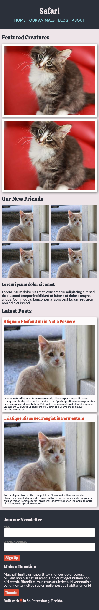
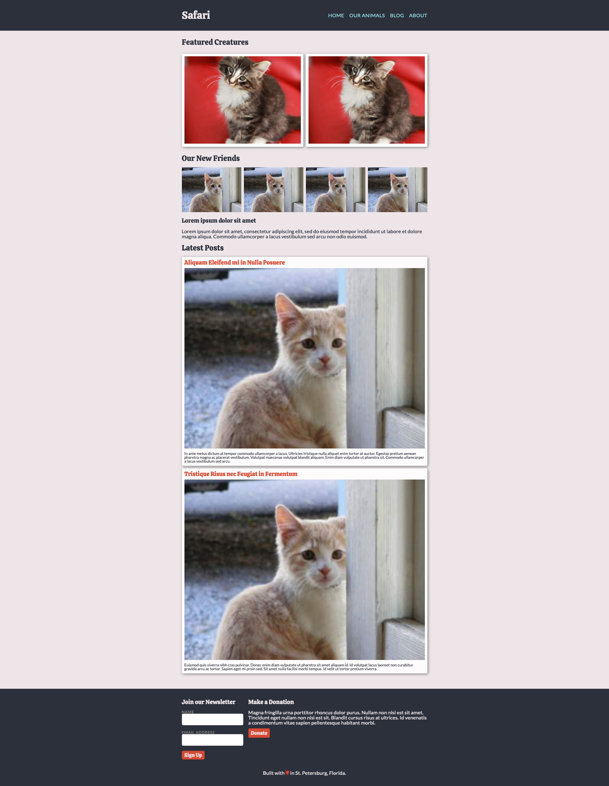

# Building a web site

In this lesson, we will build the `SDG Safari` site. This site has a different
appearance on mobile than a desktop and will demonstrate the following concepts:

- Content First
- Mobile First
- CSS
- Layout with flexbox and grid
- Responsive Design

# Our goal

## Mobile view

## Desktop view

