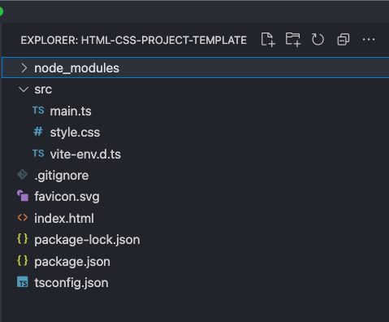

theme: Next, 1

# Generating Your Own Front-End Project Template

---

# [fit] Do we even need a template or tools?

[.autoscale: true ]

- For HTML/CSS projects we don't really need any tools at all.

- We could just have a `.html` and a `.css` file in a directory and open the file itself in our browser.

- Tools give us:
  - Code reloading
  - Optimization
  - Ability to easily add third party code (CSS frameworks, CSS resets, etc.)
  - Automation steps

---

[.autoscale: true ]

# [fit] app-app is dead, long live app-app

For many cohorts, SDG used `app-app` a JavaScript based tool that created template-based projects for students.

[.column]

Benefits:

- Curated environments with just the right tools
- Automatically created a `git` project and sent code to `github`
- Built in steps for deploying

[.column]

Downsides:

- Not an "industry wide tool"
- SDG has to upkeep the app as tools and libraries change versions

---

[.autoscale: true ]

# [fit] Our new approach

Use industry "standard" front-end code bundlers.

[.column]

Benefits:

- Tools are kept up to date
- Faster and easier to install
- Industry "standard"

[.column]

Downsides:

- New tools created every day (not literally, but very close)
- Requires more effort to get setup
- Less automation for steps like creating git setup and github repository

---

# [fit] Tool of choice: vite

- Fast
- Built on latest tools
- Supports all our technologies out of the box
- Easy to customize

## See: [vite's homepage](https://vitejs.dev/)

---

# [fit] Getting started

In the same directory where you create projects:

```shell
npm init vite -- html-css-project-template
```

- Choose **vanilla** as the _framework_
- Choose **vainlla-ts** as the _variant_

---

# [fit] Check out the template it created

```shell
cd html-css-project-template
```

```shell
npm install
```

```shell
git init
```

```shell
git add .
```

```shell
git commit -m "Initial vite template"
```

```shell
code .
```

---

# Project Structure



---

# [fit] Review files

| File                | Purpose                                                                                     |
| ------------------- | ------------------------------------------------------------------------------------------- |
| `index.html`        | Main HTML content                                                                           |
| `favicon.svg`       | "favicon" graphic uses as the website icon                                                  |
| `package.json`      | Project definition file where we list configuration and code dependencies                   |
| `package-lock.json` | Records the **specific** version of dependencies this project uses                          |
| `tsconfig.json`     | Configuration file for TypeScript (see later)                                               |
| `.gitignore`        | Configuration for `git` to ignore files that do not belong in our project history           |
| `src/main.ts`       | Place to put our TypeScript code when we write some - And a file that loads our CSS content |
| `src/style.css`     | Our CSS                                                                                     |
| `src/vite-env.d.ts` | Configuration for Vite itself                                                               |

---

# [fit] Customize!

---

# `index.html`

- Change the default `<title>`
- Remove `<div id="app"></div>`
- Add any default HTML you think you'll want in _EVERY_ template to start. Perhaps a `<p>Hello, World</p>` so something is on screen.

---

# `favicon.svg`

Suggest SDG's badge graphic available [here](https://github.com/suncoast-devs/web/blob/master/static/brand/button.svg?short_path=f36de0e)


---

# `src/main.ts`

Remove all the lines **except** for the following:

```js
import './style.css'
```

---

# `src/style.css`

Use the following starter CSS:

```css
:root {
  font: 16px / 1 sans-serif;
}

html {
  height: 100%;
}

body {
  margin: 0;
  min-height: 100%;
}
```

---

# `package.json`

## [fit] Individual changes (example file on the next slide)

[.column]
Update the `scripts` section to include:

```
"start": "vite",
"predeploy": "npm run build",
"deploy": "netlify deploy --prod --dir=dist",
```

[.column]
Add this section:

```
"prettier": {
  "trailingComma": "es5",
  "tabWidth": 2,
  "semi": false,
  "singleQuote": true,
  "useTabs": false
}
```

---

# `package.json`

```json
{
  "version": "0.0.0",
  "scripts": {
    "start": "vite",
    "predeploy": "npm run build",
    "deploy": "netlify deploy --prod --dir=dist",
    "dev": "vite",
    "build": "tsc && vite build",
    "serve": "vite preview"
  },
  "devDependencies": {
    "typescript": "^4.3.2",
    "vite": "^2.4.2"
  },
  "prettier": {
    "trailingComma": "es5",
    "tabWidth": 2,
    "semi": false,
    "singleQuote": true,
    "useTabs": false
  }
}
```

---

# [fit] Ensure the latest version of `vite` and `typescript`

```shell
npm install --save-dev vite typescript
```

---

# [fit] Capture initial version of our customized template

```shell
git add .
```

```shell
git commit -m "Initial template customization"
```

---

# [fit] Create a github repository for the project

```shell
hub create
```

```shell
git push origin HEAD
```

---

# Congratulations

You have just created your own initial starter project for the `HTML` and `CSS` projects we'll be doing in this course.

You can return to this repository and make any changes you'd like to become your new default template.

Perhaps you'll develop a color palette you like to use in each project. Come back to this template and add that CSS. All **new** projects you create will have that CSS.

---

# More templates!

When we start with `TypeScript` we will use the same template.

We'll create a _separate_ template when we start with **React**

---
