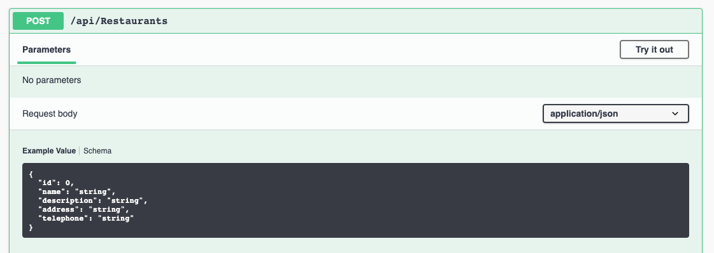

# Implement "Add"

Let's turn our attention to the `NewRestaurant` component and how we will use
the endpoint `POST /api/Restaurants` to create a new restaurant.

## Make the `NewRestaurant` the component we render in the `App.`

Change the `App` component to render the `NewRestaurant` component for now. Once
we get these two pages working, we'll add in `react-router` to be able to switch
between them.

## Track state for each input field

For each input field, we will need to track the data in the input form. Since
there are fields for `Name`, `Description`, `Address`, and `Telephone` we will
need a `state` for all of these.

Typically we would create separate state variables for each of the input fields.
However, all of these are related to a restaurant. Let's look at the JSON we
need to send for creating a new restaurant:



We won't be sending the `id` field since the database will take care of that,
but the rest of the attributes are what we want to generate. This indicates that
we could use a single state variable that was an object with this shape. That
is:

```typescript
const [newRestaurant, setNewRestaurant] = useState<RestaurantType>({
  name: '',
  description: '',
  address: '',
  telephone: '',
})
```

If we can update this state with the values from the input fields, then we could
just `POST` this object to the API.

We will change each `<input>` and `textarea` to include a `value=` property and
an `onChange` property:

```jsx
<input
  type="text"
  className="form-control"
  name="name"
  value={newRestaurant.name}
  onChange={handleName}
/>
```

We set the value to the part of the object corresponding to the name of the
object we are building. We also set a unique method to handle input/textarea
changes.

Let's implement one of the handling methods, `handleAddress`:

```javascript
function handleAddress(event: React.ChangeEvent<HTMLInputElement>) {
  const newAddressText = event.target.value

  const updatedRestaurant = { ...newRestaurant, address: newAddressText }

  setNewRestaurant(updatedRestaurant)
}
```

Here we get the new text for the address from the `value` attribute of the
changed element. Then we construct a new object by first taking the existing
object and _spreading_ it. This approach takes each key/value pair and makes it
a key/value pair in the object we are creating. In essence, this "copies" the
values to the new object. Then we add in the `address` field with its new value.
Adding the new value afterward, we **override** any `address` key/value pair
already spread into the new object. In the end, we have a **copy** of the
existing `newRestaurant` object but with a new value for the `address`

This pattern will repeat for the other form fields:

```typescript
function handleDescription(event: React.ChangeEvent<HTMLInputElement>) {
  const newDescriptionText = event.target.value

  const updatedRestaurant = {
    ...newRestaurant,
    description: newDescriptionText,
  }

  setNewRestaurant(updatedRestaurant)
}
```

However, if you notice, we added a field `name` to each of the inputs that have
the field's name. We were careful to name these after the object's properties.
Thus we can use this to create a **single** handle method that is reusable
amongst all the `onChange` events for string based state:

```typescript
function handleStringFieldChange(
  event: React.ChangeEvent<HTMLInputElement | HTMLTextAreaElement>
) {
  const value = event.target.value
  const fieldName = event.target.name

  const updatedRestaurant = { ...newRestaurant, [fieldName]: value }

  setNewRestaurant(updatedRestaurant)
}
```

> NOTE: If we have an integer state, we would need an equivalent
> `handleIntegerFieldChange` method.

Finally, let's handle the case of submitting the form. Instead of adding an
`onClick` method to the button, we will add an `onSubmit` for the `<form>`. This
event handles all the ways a form may be submitted (e.g., pressing enter in an
input field)

```jsx
<form onSubmit={handleFormSubmit}></form>
```

The implementation of `handleFormSubmit` will use a `react-query` `mutation` to
create the new restaurant.

First, setup a method to submit the new restaurant. Since this method will
receive the restaurant to create it can exist outside of the component
definition

```typescript
async function submitNewRestaurant(restaurantToCreate: RestaurantType) {
  const response = await fetch('/api/Restaurants', {
    method: 'POST',
    headers: { 'content-type': 'application/json' },
    body: JSON.stringify(restaurantToCreate),
  })

  return response.json()
}
```

Then we can setup the `mutation`

```typescript
const createNewRestaurant = useMutation(submitNewRestaurant)
```

Finally, our form submit handler becomes:

```typescript
async function handleFormSubmit(event: React.FormEvent<HTMLFormElement>) {
  event.preventDefault()

  createNewRestaurant.mutate(newRestaurant)
}
```

# Time to add some React Router

> NOTE: If you do not have _React Router_ installed in your template, you will
> need to do this step first:

In your `ClientApp` directory:

```
npm install react-router react-router-dom npm install --save-dev
@types/react-router @types/react-router-dom
```

It is now time to start to route our pages. We'd like the `Restaurants` page to
be at our home path of `/` and the `NewRestaurant` page to be at a path of
`/new`. Then when we add a restaurant, we will redirect the user back to the
home page.

If you need to update `main.tsx`

```jsx
ReactDOM.render(
  <React.StrictMode>
    <Router>
      <QueryClientProvider client={queryClient}>
        <App />
      </QueryClientProvider>
    </Router>
  </React.StrictMode>,
  document.getElementById('root')
)
```

First, we will set up the routes in our App.

```jsx
export function App() {
  ... other code ...

  return (
    ... other code ...
    <Switch>
      <Route exact path="/">
        <Restaurants />
      </Route>
      <Route exact path="/new">
        <NewRestaurant />
      </Route>
    </Switch>
    ... other code ...
  )
}
```

In the `App` component, let us update the button in the header to be a correct
link.

```jsx
<Link to="/new">
  <i className="fa fa-plus"></i> Restaurant
</Link>
```

Returning to our `NewRestaurant` component, we can now have the user redirected
to the home page after submitting their new restaurant.

To do this we change our mutation to call `history.push('/')` after submitting
the API request.

We also add `const history = useHistory()` to use the `history` object from
`react-router`

```javascript
const history = useHistory()
const createNewRestaurant = useMutation(submitNewRestaurant, {
  onSuccess: function () {
    history.push('/')
  },
})
```

Now, if you click on `+ Restaurant`, type in details for a restaurant and click
the submit you will redirect to the home page and see your new restaurant
populated

## Files Updated

<!-- Makes NewRestaurant page function and introduces some basic routing -->
<GithubCommitViewer repo="suncoast-devs/TacoTuesday" commit="47776727f139c359a66b5a3d71db53c2bfe13d1c"/>
