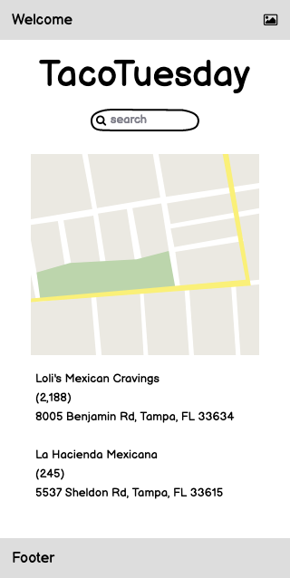

# Getting Started

With any application, we should start by gathering the general use stories for
our application. In this case, we would like to collect all the taco producers
in town in an organized way while allowing users to rank and review them.

As such, our user stories might be something like the following:

- As a user, I should be able to view and search for taco restaurants.
- As a user, I should be able to view the details of a specific restaurant,
  including:
  - Name
  - Description
  - Address and phone number
  - A list of reviews
  - The average rating
- As a user, I should be able to post a new taco restaurant anonymously.
- As a user, I should be able to review an existing restaurant.
- As a user, I should be able to rate a restaurant.

# Generate a wireframe

Based on the user stories, we should generate a rough wireframe of the user
interface that would support these features. We would try to imagine a user
experience that would make a usable application that implements the "Minimum
Viable Product".

For an application we expect to charge users for, this would be the least amount
of features and thus effort for which they would pay us. For an application that
we are building for private or internal use; this would be the least amount of
features that our users would adopt the system in place of whatever system they
are presently using.


> Via
> https://brianpagan.net/2015/lean-startup-mvp-how-to-make-meaningful-products/

Here we see the elements an application requires.

- Functionality: The actual functions of the system must exist and do what they
  claim they do
- Reliable: The system must be reliable. It must stay running, and it must be
  resistant to user input errors, return the data the user expects, and not lose
  existing data during the development process.
- Usable: Users should be able to learn the system and use it quickly. It must
  not be cumbersome, certainly not more cumbersome than the system it replaces.
- Emotional Design: The design of the system must inspire users to want to use
  the application. It must anticipate the user's needs and be consistent in its
  behavior and responses.

These are lofty goals, and we cannot focus the entire time on any one level of
this pyramid. We must iterate through vertical slices as we visit each function
of our application. When working on each part of the system, we want to include
all four aspects in some amount. As we proceed through the features, we will
make discoveries that will allow us to revisit each of these aspects. Through
iteration, certain features and functions become unnecessary, saving us a
tremendous amount of time.

> No code is more simple to develop and executes more efficiently than code you
> never have to write.

## Home Page Wireframe



---

# ERD

From these wireframes, we can collect the details of the entities the system
needs to represent. From the user stories and wireframes, we can discover the
following entities:

```text
Restaurant
----------
Name
Description
Address
Telephone
Average Stars?
Review Count?
```

and

```text
Review
------
Summary
Body
Stars
Creation Timestamp
Restaurant
```

and we would describe the relationships between these two entities as:

```text
Restaurants have many Reviews
Review belongs to one Restaurant
```

## Validate the ERD

Validate that this ERD supports the data on the wireframes we have generated in
the previous step. See if you can identify what entities and potentially what
queries, create the data on each of the pages. What information does the page
need to operate? For instance, a page showing the details of a single restaurant
will require the restaurant ID (which we'll likely get from the URL and React
Router) The main listing page will need a collection of many of the restaurants,
perhaps filtered by a phrase.
