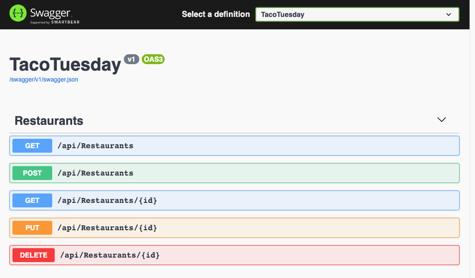

# Creating our initial controller to serve a list of restaurants

Now that we have migrations, a database, and some sample data, let's create a
controller to generate endpoints for: `Create`, `Read`, `Update`, and `Delete`
restaurants. This will give us the `C R U D` style interface we will use from
our front end.

## Using an automation tool to create the initial controller

One of the `dotnet` tools we installed is called `aspnet-codegenerator`. This
tool can generate a controller for us. This controller will do many, but not
all, of the things we need our controller to do.

To use this controller we will run this command line:

```shell
dotnet aspnet-codegenerator controller --model Restaurant -name RestaurantsController --useAsyncActions -api --dataContext DatabaseContext --relativeFolderPath Controllers
```

Here we are telling the `codegenerator` to create a controller named
`RestaurantsController`, that we wish to use `async` controller actions, that we
are generating an `api` style controller (as opposed to one that renders HTML
views), that the model used with this controller is `Restaurant`, our database
context class is named `DatabaseContext` and our controller folder is
`Controllers`

If we were generating a controller for a different model we would change the
`--name` and the `--model` arguments. All the others would remain the same.

When done we will have a `RestaurantsController.cs` file with a controller that
has the following routes:

```csharp
[Route("api/[controller]")]

// GET: api/Restaurants
//
// Returns a list of all your Restaurants
//
[HttpGet]

// GET: api/Restaurants/5
//
// Fetches and returns a specific restaurant by finding it by id. The id is specified in the
// URL. In the sample URL above it is the `5`.  The "{id}" in the [HttpGet("{id}")] is what tells dotnet
// to grab the id from the URL. It is then made available to us as the `id` argument to the method.
//
[HttpGet("{id}")]

// PUT: api/Restaurants/5
//
// Update an individual restaurant with the requested id. The id is specified in the URL
// In the sample URL above it is the `5`. The "{id} in the [HttpPut("{id}")] is what tells dotnet
// to grab the id from the URL. It is then made available to us as the `id` argument to the method.
//
// In addition the `body` of the request is parsed and then made available to us as a Restaurant
// variable named restaurant. The controller matches the keys of the JSON object the client
// supplies to the names of the attributes of our Restaurant POCO class. This represents the
// new values for the record.
//
[HttpPut("{id}")]

// POST: api/Restaurants
//
// Creates a new restaurant in the database.
//
// The `body` of the request is parsed and then made available to us as a Restaurant
// variable named restaurant. The controller matches the keys of the JSON object the client
// supplies to the names of the attributes of our Restaurant POCO class. This represents the
// new values for the record.
//
[HttpPost]


// DELETE: api/Restaurants/5
//
// Deletes an individual restaurant with the requested id. The id is specified in the URL
// In the sample URL above it is the `5`. The "{id} in the [HttpDelete("{id}")] is what tells dotnet
// to grab the id from the URL. It is then made available to us as the `id` argument to the method.
//
[HttpDelete("{id}")]
```

> NOTE: The method implementations are not listed above

If we are running our application we can open up `https://localhost:5001` in our
browser and see an API documentation page:



Here we can see the API endpoints that were generated by the code generator.

**What is that `/api/` before each of the URLs?**

You may have noticed that there is a prefix of `/api` before each URL in our
controller. We have added this for a specific reason. Take a moment and see if
you can think of some good reasons.

The best reason for adding this prefix is to avoid _name collisions_. Soon we
will start to build more and more URLs for our front end. If our front end
**and** our API are both served from the same server we might have an overlap of
URLs and it won't be able to tell if we mean the front end route or potentially
a backend API endpoint. As such we prefix, and reserve, the path `/api/` for
anything to do with our backend API resources.

## Files Updated

<GithubCommitViewer repo="gstark/TacoTuesday" commit="42ab3ba" />
