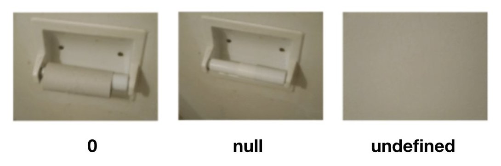

import CodePen from '@handbook/CodePen'

# Types

As you saw when declaring variables, there are different types of values in JavaScript. You may have also noticed that we did not have to tell a variable what kind of value we were assigning. The same syntax is used regardless of the variable type.

Here are some types that are commonly used in JavaScript

|             |                                                                                                                                                                             |
| ----------- | --------------------------------------------------------------------------------------------------------------------------------------------------------------------------- |
| `number`    | A numeric value such as `42`, `3.14`, or `0`                                                                                                                                |
| `string`    | A sequence of characters such as `"Jane"`, `""`, or `"100"` - Notice that `"100"` is different than `100` the former is a sequence of characters and the latter is a number |
| `boolean`   | A value that is either `true` or `false`                                                                                                                                    |
| `null`      | A special keyword denoting a null value.                                                                                                                                    |
| `undefined` | A top-level property whose value is not defined.                                                                                                                            |
| `array`     | Contains a sequence of items in an ordered list. The items can be of any type. For instance `[42, "Jane", 100]`                                                             |
| `object`    | Contains an unordered collection of items identified by a key. For instance `{ name: "Jane", score: 42, rank: 100 }`                                                        |
|             |                                                                                                                                                                             |

Looking at this list you might think that having `null` and `undefined` is redundant. Here is an example of the difference between the two:



## Data Type Conversion

JavaScript is a dynamically typed language. That means you don't have to specify the data type of a variable when you declare it, and data types are converted automatically as needed during script execution. So, for example, you could define a variable as follows:

```js
let answer = 42;
```

And later, you could assign the same variable a string value, for example:

```js
answer = "Thanks for all the fish...";
```

Because JavaScript is dynamically typed, this assignment does not cause an error message.

In expressions involving numeric and string values with the + operator, JavaScript converts numeric values to strings. For example, consider the following statements:

```js
let x = "The answer is " + 42; // "The answer is 42"
let y = 42 + " is the answer"; // "42 is the answer"
```

In statements involving other operators, JavaScript does not convert numeric values to strings. For example:

```js
"37" - 7; // 30
"37" + 7; // "377"
```

## Literals

You use literals to represent values in JavaScript. These are fixed values, not variables, that you _literally_ provide in your script. This section describes the following types of literals:

_Integers_
_String literals_
_Boolean literals_
_Floating-point literals_
_Array literals_
_Object literals_

### Integers

Integers can be expressed in decimal (base 10), hexadecimal (base 16), octal (base 8) and binary (base 2).

A decimal integer literal consists of a sequence of digits without a leading 0 (zero).
A leading 0 (zero) on an integer literal, or a leading 0o (or 0O) indicates it is in octal. Octal integers can include only the digits 0-7.
A leading 0x (or 0X) indicates a hexadecimal integer literal. Hexadecimal integers can include digits (0-9) and the letters a-f and A-F. (The case of a character does not change its value, e.g. 0xa = 0xA = 10 and 0xf = 0xF = 15.)
A leading 0b (or 0B) indicates a binary integer literal. Binary integers can only include the digits 0 and 1.

Some examples of integer literals are:

```plain
0, 117 and -345 (decimal, base 10)
015, 0001 and -0o77 (octal, base 8)
0x1123, 0x00111 and -0xF1A7 (hexadecimal, "hex" or base 16)
0b11, 0b0011 and -0b11 (binary, base 2)
```

### String Literals

A string literal is zero or more characters enclosed in double (") or single (') quotation marks. A string must be delimited by quotation marks of the same type; that is, either both single quotation marks or both double quotation marks. The following are examples of string literals:

```js
"foo";
"bar";
"1234";
"one line \n another line";
"John's cat";
```

Template literals are also available. Template literals are enclosed by the back-tick (\`) (grave accent) character instead of double or single quotes. Inside the backticks we can use `${}` to evaluate statements

```js
let score = 56;
let prompt = `The current score is ${score} and the next score is ${score + 1}`;
// The current score is 56 and the next score is 57
```

### Boolean Literals

The Boolean type has two literal values: `true` and `false`.

### Floating Point Literals

A floating-point literal can have the following parts:

- A decimal integer which can be signed (preceded by "+" or "-"),
- A decimal point ("."),
- A fraction (another decimal number),
- An exponent.
- The exponent part is an "e" or "E" followed by an integer, which can be signed (preceded by "+" or "-"). A floating-point literal must have at least one digit and either a decimal point or "e" (or "E").

For example:

```
3.1415926
-0.123456789
-3.1e12
0.1e-23
```

### Array Literals

An array literal is a list of zero or more expressions, each of which represents an array element, enclosed in square brackets (`[]`). When you create an array using an array literal, it is initialized with the specified values as its elements, and its length is set to the number of arguments specified.

The following example creates the coffees array with three elements and a length of three:

```js
let coffees = ["French Roast", "Colombian", "Kona"];
```

**Extra commas in array literals**

You do not have to specify all elements in an array literal. If you put two commas in a row, the array is created with undefined for the unspecified elements. The following example creates the fish array:

```js
let fish = ["Lion", , "Angel"];
```

This array has two elements with values and one empty element (`fish[0]` is "Lion", `fish[1]` is undefined, and `fish[2]` is "Angel").

If you include a trailing comma at the end of the list of elements, the comma is ignored. In the following example, the length of the array is three.

```
let myList = ['home', , 'school', ]
```

There is no `myList[3]`. All other commas in the list indicate a new element.

### Object Literal

An object literal is a list of zero or more pairs of property names and associated values of an object, enclosed in curly braces (`{}`). Do not use an object literal at the beginning of a statement. This will lead to an error or not behave as you expect, because the `{` will be interpreted as the beginning of a block.

The following is an example of an object literal. The first element of the person object defines a property, name, and assigns to it a new string, "Thomas"; the second element, the age property, is assigned a number, `21`

```js
let person = { name: "Thomas", age: 21 };
```

Object property names can be any string, including the empty string. If the property name would not be a valid JavaScript identifier or number, it must be enclosed in quotes. Property names that are not valid identifiers also cannot be accessed as a dot (`.`) property, but can be accessed and set with the array-like notation("`[]`").

```js
let unusualPropertyNames = {
  '': 'An empty string',
  '!': 'Bang!'
}
unusualPropertyNames.''   // SyntaxError: Unexpected string
unusualPropertyNames['']  // An empty string
unusualPropertyNames.!    // SyntaxError: Unexpected token !
unusualPropertyNames['!'] // Bang!
```

---
