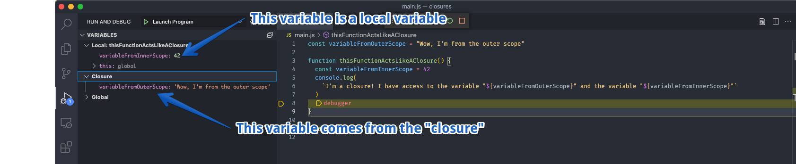

## Closures

> NOTE: "What is a closure in JavaScript?" is often an interview question.

Closures in JavaScript are a way to create a function that has access to the
variables and functions defined in the outer scope.

What does this mean? We can try a few examples.

## Simple example

```javascript
const variableFromOuterScope = "Wow, I'm from the outer scope"

function thisFunctionActsLikeAClosure() {
  const variableFromInnerScope = 42
  console.log(
    `I'm a closure! I have access to the variable "${variableFromOuterScope}" and the variable "${variableFromInnerScope}"`
  )
  // Have the debugger stop the program so we can look around
  debugger
}

thisFunctionActsLikeAClosure()
```

We'll run this program in Visual Studio, and we'll see the following output:



Notice how the debugger shows us all the variables we can see when we reach the
`debugger`statement, and our program paused. The variable
`variableFromInnerScope` is shown in the list of `Local Variables`. However, the
variable `variableFromOuterScope` exists in the section marked `closure`. That
variable was "captured" by the function when it was defined. The act of defining
a function "captures" all the variables visible to it. Capturing the variables
visible when a function is defined is the essence of a closure.

## A more complex example.

We can create a more complex example that will demonstrate that these functions
do "remember" their values.

First, we will create an array of people. Each person will have a name, a
birthday, and a number of milliseconds we should wait before showing their
information. We'll use javaScript's `setTimeout` to do the waiting. Since
`setTimeout` calls a function **later** this will help prove that the function
is really "remembering" its values.

```javascript
const people = [
  {
    name: 'Alan Turing',
    birthDate: 'June 23, 1912',
    delayMilliseconds: 1100,
  },
  {
    name: 'Ada Lovelace',
    birthDate: 'December 10, 1815',
    delayMilliseconds: 1500,
  },
  {
    name: 'Grace Hopper',
    birthDate: 'December 9, 1906',
    delayMilliseconds: 2000,
  },
  {
    name: 'Donald Knuth',
    birthDate: 'January 10, 1938',
    delayMilliseconds: 2500,
  },
]
```

Then we will create a method that accepts a person variable and prints out
details about them.

```javascript
function printPersonInfo(person) {
  console.log(`${person.name} was born on ${person.birthDate}`)
}
```

Finally, we will create a loop that will call the printPersonInfo method for
each person in the array. However, we will call this method from inside a call
to `setTimeout`. `setTimeout` is a function that creates a timer that will call
the supplied function later.

```javascript
people.forEach(function (person) {
  // Inside here we have access to the `person` variable here. The `person` variable is
  // recreated each time through the forEach loop. Since it is an argument to the
  // function, it is a new creation of that variable.

  function timeoutCallback() {
    // We also have access to the `person` variable here. The function timeoutCallback
    // will remember all the variables that existed that it could see. This includes
    // the `person` variable from the forEach loop.

    // When the function executes **later** (via the `setTimeout`) the
    // fact that this is a "closure" (remembers variables from the outer scope) ensures
    // that each time we call printPersonInfo, the variable `person` will be correct.
    debugger
    printPersonInfo(person)
  }

  setTimeout(timeoutCallback, person.delayMilliseconds)
})
```

When we run the program, we'll see something like this:


Notice that there are **TWO** closures defined. The first one is for the closure
created by the `function(person)` defined inside the `forEach` loop. Inside that
closure is just the `printPersonInfo` function. The second closure comes from
inside the `function timeoutCallback`; it has access to the `person` variable
created by the `forEach` loop.

Thus when the code calls `printPersonInfo` for the first time, `person` is
`Alan Turing`, the second time the closure captured `person` being equal to
`Ada Lovelace`, then `Grace Hooper` and finally `Donald Knuth`.

# Closures are both complex, powerful, and simple to use.

Remember that a closure is nothing more than the fact that a function grabs hold
of the definition of the variables, it can see when defined.

We'll be using closures, but we won't be calling it out as a special technique.
It will just be a common technique.

> This [youtube video](https://www.youtube.com/watch?v=ePfe7nFSnAk) also gives a
> good overview of closures.
