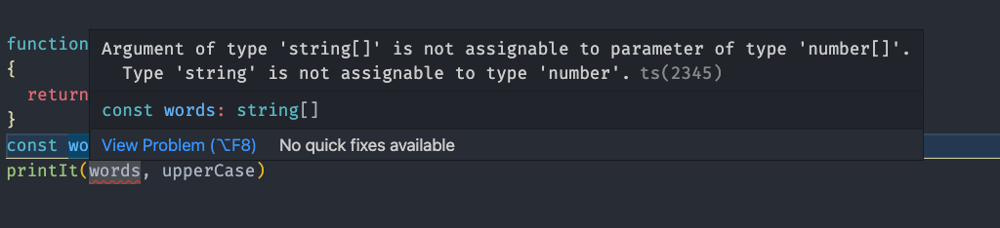

Functions are one of the fundamental building blocks in TypeScript. A function
is a TypeScript procedure - a set of statements that performs a task or
calculates a value. To use a function, you must define it somewhere in the scope
from which you wish to call it.

## Defining functions

A function definition (also called a function declaration or function statement)
consists of the `function` keyword, followed by:

- The name of the function.
- A list of parameters to the function, enclosed in parentheses and separated by
  commas.
- The TypeScript statements that define the function, enclosed in curly
  brackets, `{ }`.

For example, the following code defines a simple function named greet:

```typescript
function greet() {
  console.log('Hello, there programmer!')
}
```

The syntax is:

```typescript
// function keyword
// |
// |     name of the function
// |     |
// |     |    required parenthesis where arguments will go
// |     |    |
// |     |    |  opening scope of the function
// |     |    |  |
// |     |    |  |
// v     v    v  v
function greet() {
  console.log('Hello, there programmer!')
}
```

We can also supply arguments to a function in case it needs information from the
outside world. For example, the following code defines a simple function named
square.

```typescript
function square(valueToSquare: number) {
  return valueToSquare * valueToSquare
}
```

Notice that we **must** supply a value to the `valueToSquare` argument,
otherwise, TypeScript will _assume_ that the variable is of type `any` and,
we'll lose any help the language will provide.

Also, notice that we have not declared the type of data the function
**returns**. This is because TypeScript can also **infer** the type from the
`return` statement.

We can also define the return type on the function declaration here:

```typescript
//                             argument type
//                             |
//                             |        function return type
//                             |        |
//                             |        |
//                             v        v
function square(valueToSquare: number): number {
  return valueToSquare * valueToSquare
}
```

## Calling functions

Defining a function does not execute it. Defining the function simply names the
function and specifies what to do when the function is called. Calling the
function performs the specified actions with the indicated parameters. For
example, if you define the function square, you could call it as follows:

```typescript
square(5)
```

The preceding statement calls the function with an argument of 5. The function
executes its statements and returns the value 25.

What if we attempt to pass a value that is **not** a number, such as:

```typescript
square('a circle')
```

In this case, `TypeScript` will tell us this is an error. However, if we have
not configured our tools to not launch our site, or code, in the case of a
TypeScript error, the code will still **run**. Most of the tools we use will put
this error directly in our path so, we must resolve it.

## Function expressions

While the function declaration above is syntactically a statement, functions can
also be created by a `function expression`. Such a function can be
**anonymous**; it does not have to have a name. For example, the function square
could have been defined as:

```typescript
const square = function (valueToSquare: number) {
  return valueToSquare * valueToSquare
}
const x = square(4) // x gets the value 16
```

## Functions are values of variables

Notice in the example above that we can assign a function to a variable just
like we assign a `number` or a `string` or any other kind of value.

In fact, in TypeScript, functions are values themselves and can be passed to
functions just like any other value.

However, like any other argument in TypeScript, we should supply a type! Since
our argument, `func` will be a function that receives a number and returns a
number, we define that type like:

```
(value: number) => number
```

The declaration uses the "arrow" style to define the type.

So our function declaration is:

```typescript
function printIt(numbers: number[], func: (value: number) => number) {
```

Sometimes the type declaration can become quite complex. In these cases, we can
define a new type of our own and give it a name!

```typescript
type PrintItFunction = (value: number) => number
```

and then use that in our declaration:

```typescript
function printIt(numbers: number[], func: PrintItFunction) {
```

```typescript
type PrintItFunction = (value: number) => number

function printIt(numbers: number[], func: PrintItFunction) {
  for (let index = 0; index < numbers.length; index++) {
    const value = numbers[index]
    const result = func(value)

    console.log(`After the function we turned ${value} into ${result}`)
  }
}

function square(valueToSquare: number) {
  return valueToSquare * valueToSquare
}

function double(valueToDouble: number) {
  return valueToDouble * 2
}

const numbers = [1, 2, 3, 4, 5]
printIt(numbers, square)
// After the function we turned 1 into 1
// After the function we turned 2 into 4
// After the function we turned 3 into 9
// After the function we turned 4 into 16
// After the function we turned 5 into 25
printIt(numbers, double)
// After the function we turned 1 into 2
// After the function we turned 2 into 4
// After the function we turned 3 into 6
// After the function we turned 4 into 8
// After the function we turned 5 into 10
```

## Here is where TypeScript shines!

What if we define a new function that doesn't fit the pattern our `printIt`
function expects.

```typescript
function upperCase(stringToUpperCase: string) {
  return stringToUpperCase.toUpperCase()
}

const words = ['hello', 'there']
printIt(words, upperCase)
```

The TypeScript system would immediately tell us that `words` aren't an array of
numbers and cannot be sent to `printIt`!



If we "fix" this error by using our `numbers` variable, we'll see that
TypeScript then notifies us that the `upperCase` doesn't follow the style of the
`function` we are expecting!


## Advanced Topic

TypeScript's ability to be flexible with types **would** allow us to handle
either case here. We do this by creating something called a "generic" type.

The definition of `printIt` could become:

```typescript
function printIt<ValueType>(
  values: ValueType[],
  func: (value: ValueType) => ValueType
) {
  for (let index = 0; index < values.length; index++) {
    const value = values[index]
    const result = func(value)

    console.log(`After the function we turned ${value} into ${result}`)
  }
}
```

In this case, the `<ValueType>` after the `printIt` but before the arguments
says that `printIt` will work with a generic type of data and, we will call that
type `ValueType`. Further on, we say that `values` must be an array of whatever
that type is. Also, the argument `func` must be a function that takes that type
and returns that type. As long as the `values` argument and the `func` agree on
the types, `printIt` will work fine.

[TypeScript generics](https://www.typescriptlang.org/docs/handbook/2/generics.html)
are a powerful language feature and place a great deal of power and flexibility
in the hands of the developer. This is an advanced topic and not one that we
will use often in the course.

## Functions as Arguments

Passing functions as arguments to other functions is a very powerful pattern in
TypeScript. We will be using this ability quite a bit in other lessons.

Allowing functions to be treated as values for variables and to be passed as
arguments is one of the things that makes TypeScript a **functional**-style
language.

## Scope

Variables defined inside a function cannot be accessed from anywhere outside the
function because the variable is defined only in the scope of the function.
However, a function can access all variables and functions defined inside the
scope in which it is defined. In other words, a function defined in the global
scope can access all variables defined in the global scope. A function defined
inside another function can also access all variables defined in its parent
function and any other variable to which the parent function has access.

Example:

```typescript
const PI = 3.14
const numbers = [1, 2, 4, 8, 16]

function pies() {
  // Inside this function we can "see" the variables `PI` and `numbers`
  // because we are *INSIDE* the scope where they were defined
  for (let index = 0; index < numbers.length; index++) {
    // Inside this function we can see the variable index, number, and area.
    const number = numbers[index]

    const area = PI * number * number

    console.log(`The area of a circle with radius ${number} is ${area}`)
  }

  // Here we *cannot* see the variable `area` since we are *OUTSIDE* the scope
  // where it was defined.
}
```

## Arrow functions

An arrow function expression has a shorter syntax compared to function
expressions and is always anonymous.

Two factors influenced the introduction of arrow functions: shorter functions
and non-binding of this.

**Shorter functions**

In some functional patterns, shorter functions are welcome. Compare:

```typescript
let elements = ['Hydrogen', 'Helium', 'Lithium', 'Beryllium']

// prettier-ignore
let elementLengths1 = elements.map(function(element) { return element.length; })

console.log(elementLengths1) // logs [8, 6, 7, 9]

let elementLengths2 = elements.map(element => element.length)

console.log(elementLengths2) // logs [8, 6, 7, 9]
```

The code for `elementLengths2` is shorter and has less code that we refer to as
_ceremony_, that is, syntax that isn't necessary.

There are some other considerations where arrow functions are better, and we
will cover those in another lesson.

---
