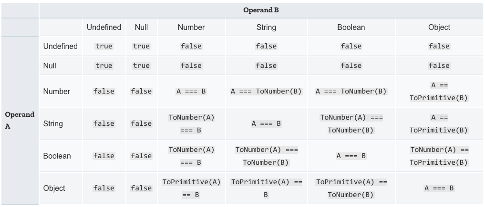

theme: Next, 1

# [fit] JavaScript

---

# [fit] What is it?

---

# Purpose

- Initially to make web pages "interactive".
- Is the lingua franca of the front-end web, the default programming language.
- Has extended to the server side via implementations like Node.js
- Showing up in more places like embedded environments.

---

# History

- Created around 1995.
- JavaScript is not Java.
- Became a standard in 1997.

---

# Lineage

- Draws from Java, C, Scheme.
- Some syntax will look familiar since Java and C also inspire C#.

---

# Also statement based

Like C# a JavaScript program is composed of a sequence of statements.

Like a C# program these statements can be ended with a semicolon, `;`. However these are _optional_ in JavaScript and we will code without them.

Comments are the same as in C#, single lines with `//` and multiple lines with `/*` and `*/`.

---

# Typed language

[.autoscale: true]

JavaScript also has `types`, some of which will be familiar.

- `number`
- `string`
- `boolean`
- `array`
- `object`
- `null`
- `undefined`

---

# Dynamically typed

Variables are not bound to their value type.

Unlike `C#`, once assigned a type, like a `number` the variable can change to accept a `string`, or a `boolean`

JavaScript can also automatically convert values from one type to another.

It is also more loose about how it _compares_ values.

---

# Literal values

[.autoscale: true]

Like `C#` we can declare literal values.

- Numbers: `0`, `117` and `-345` but also `3.1415` and `-42.123`
- Strings: `"This is a sentence"` `'This is a sentence'` \`This is a sentence\`
- Boolean: `true` and `false`
- Arrays: `["French Roast", "Colombian", "Kona"]` and `["Shuttle", 42, true, "Thing"]`
- Objects: `{name: "Sandy", enrolled: true}`

---

# Variables

Must start with a letter (upper or lower), an underscore, or dollar sign. After the first character variable names may also have digits in the name.

Standard to use `camelCase` for our variable names.

---

# Variables

**Four** ways to declare a variable

| Method            | Description                                                                             |
| ----------------- | --------------------------------------------------------------------------------------- |
| `var`             | Declares a variable function or globally scoped, optionally initializing it to a value. |
| `let`             | Declares a block-scoped, local variable, optionally initializing it to a value.         |
| `const`           | Declares a block-scoped, read-only named constant.                                      |
| undeclared global | Without var, let, or const, we create a global variable                                 |
|                   |                                                                                         |

---

# Our style

`undeclared global` variables are highly discouraged as they can often lead to unexpected behavior.

In our coding we will always use `var`, `let`, or `const`.

In fact, in modern JavaScript, and at SDG, we will restrict our usage to `let` and `const`.

When looking at code on the web, e.g. StackOverflow, and blog posts, you will still see a lot of `var`.

---

# Const

`const` variables are assigned a value on the same statement where they are declared.

They can also not be re-assigned later in the code.

```javascript
const answer = 42
```

Not allowed, will be an error:

```javascript
answer = answer + 1
```

---

# Let

`let` variables **do not** need to be assigned a value on the same statement they are declared.

They **can** be re-assigned later in the code.

```javascript
let score = 98
```

```javascript
score = score + 1
```

---

# Scope

`let` and `const` are considered `block` scope.

That is they are valid and accessible inside the current block. A block is:

- A pair of `{ }` which we will see for functions and statements such as `if`, `while`, etc.
- The source file they are in if there is no current block.

---

# Undefined variables

After declaring a variable but before assigning it a value, the variable will contain a special, but confusing, value known as `undefined`

```javascript
let name // name contains 'undefined'

name = 'Jane' // name now contains the value 'Jane'
```

---

# Good variable hygiene

Follow these rules and you'll do well:

- Only use `const` and `let`.
- Use `const` unless you have a **good** reason to use `let`
- Always initialize a variable unless you have a **good** reason not to.
- Avoid assigning a **different** type to a variable once created.

---

# Dynamically typed

That means you don't have to specify the data type of a variable when you declare it.

JavaScript doesn't care what type of value a variable has, unlike `C#`

---

# Valid code

```javascript
let answer = 42
```

And later, you could assign the same variable a string value, for example:

```javascript
answer = 'Thanks for all the fish...'
```

---

# Conversions

JavaScript is far more forgiving when converting types.

Valid in `JavaScript` but not allowed in a language like `C#`

```javascript
let x = 'The answer is ' + 42 // "The answer is 42"
let y = 42 + ' is the answer' // "42 is the answer"
```

---

# Amazing right?

# ... not so fast!

---

# Doesn't work as you might expect

In statements involving other operators, JavaScript does not convert numeric values to strings. For example:

```javascript
'37' - 7 // 30
'37' + 7 // "377"
```

---

# String interpolation

```javascript
const score = 98
const answer = 42

const message = `Congratulations, ${answer} is correct. You have ${score} points`
```

---

# Objects

Similar to other languages as a combination of state and behavior.

In JavaScript, an object is a standalone entity, with properties and type. Compare it with a cup, for example. A cup is an object, with properties. A cup has a color, a design, weight, a material it is made of, etc. The same way, JavaScript objects can have properties, which define their characteristics.

---

# Object Properties

A JavaScript object has properties associated with it.

A property of an object can be explained as a variable that is attached to the object.

Object properties are basically the same as ordinary JavaScript variables, except for the attachment to objects.

The properties of an object define the characteristics of the object.

---

# Object Properties

You access the properties of an object with a simple dot-notation:

```javascript
objectName.propertyName
```

---

# Object Properties

[.autoscale: true]

[.column]

Like all JavaScript variables, both the object name (which could be a normal variable) and property name are case sensitive.

You can define a property by assigning it a value.

For example, let's create an object named myCar and give it properties named make, model, and year as follows:

[.column]

```javascript
const myCar = new Object()
myCar.make = 'Ford'
myCar.model = 'Mustang'
myCar.year = 1969
```

---

# Object Initializer

The previous example could also be written using an object initializer, which is a comma-delimited list of zero or more pairs of property names and associated values of an object, enclosed in curly braces ({}):

```javascript
const myCar = {
  make: 'Ford',
  model: 'Mustang',
  year: 1969,
}
```

---

# Object unassigned properties

> Unassigned properties of an object are `undefined` (and not `null`).

```javascript
myCar.color // undefined
```

---

# Accessing properties using bracket notation (and by string)

[.column]

Properties of JavaScript objects can also be accessed or set using a bracket notation.

So, for example, you could access the properties of the `myCar` object as follows:

[.column]

```javascript
myCar['make'] = 'Ford'
myCar['model'] = 'Mustang'
myCar['year'] = 1969
```

---

# Why?

An object property name can be any valid JavaScript string, or anything that can be converted to a string, including the empty string.

> However, any property name that is not a valid JavaScript identifier (for example, a property name that has a space or a hyphen, or that starts with a number) can only be accessed using the square bracket notation.

---

# Objects

**LOTS** more in the handbook! Please consider reading the entire `Intro to JavaScript` and trying out the code for yourself.

---

# Arrays

JavaScript also has an array type. JavaScript arrays are more flexible than C#'s and are more akin to `List<>` in their flexibility. JavaScript arrays also differ from `C#` arrays in that they can store values of different types.

There are three ways to declare an array:

```javascript
let array = new Array(element0, element1, ..., elementN);
let array = Array(element0, element1, ..., elementN);
let array = [element0, element1, ..., elementN];
```

---

# Arrays

The `new Array` and `Array()` styles are confusing since they have a second form that creates an array with a sequence of empty elements

```javascript
let arrayWithSevenEmptyElements = new Array(7)
let arrayWithSevenEmptyElements = Array(7)
```

For this reason we typically use the `literal` form.

---

# Array literals

```javascript
let people = ['Betty', 'Wilma', 'Fred', 'Barny']
let scores = [100, 42, 50, 98]
let collection = ['Betty', 98, 'Fred', 12, 42]
```

---

# Populating an array

We can also use the `[]` operator to assign values to specific elements of an array.

```javascript
let employees = []
employees[0] = 'Casey Jones'
employees[1] = 'Phil Lesh'
employees[2] = 'August West'
```

---

# Populating an array

We can set elements of an array even if they are not next to each other. JavaScript will fill in the elements inbetween with empty items

[.column]

```javascript
let employees = []
employees[0] = 'Casey Jones'
employees[12] = 'Phil Lesh'
employees[42] = 'August West'
```

[.column]

```javascript
[
  'Casey Jones',
  <11 empty items>,
  'Phil Lesh',
  <29 empty items>,
  'August West'
]
```

---

# Iterating arrays

A common operation is to iterate over the values of an array, processing each one in some way. The simplest way to do this is as follows:

```javascript
let colors = ['red', 'green', 'blue']
for (let index = 0; index < colors.length; index++) {
  console.log(colors[index])
}
```

---

# Iterating arrays

The `forEach()` method provides another way of iterating over an array:

```javascript
let colors = ['red', 'green', 'blue']
colors.forEach(function (color) {
  console.log(color)
})
```

---

# Iterating arrays with arrow functions

Alternatively, You can shorten the code for the forEach parameter with Arrow
Functions:

```javascript
let colors = ['red', 'green', 'blue']
colors.forEach(color => console.log(color))
```

---

# More about iterating

For more details on how to manipulate arrays, including adding and removing elements, see the [quick reference guide](/lessons/misc-quick-reference/js-arrays) on arrays.

---

# Control flow

Control flow in JavaScript is nearly identical to `C#` in that our code is comprised of a sequential set of statements that comprises a block of code:

```javascript
{
  statement_1
  statement_2
  .
  .
  .
  statement_n
}
```

---

# If

We can control the flow of the code with a conditional statement:

```javascript
if (condition) {
  statement_1
} else {
  statement_2
}
```

This works exactly as `C#` except for the different style in how the braces and `else` are formatted.

---

# Comparisons

The same boolean comparisons are present in `JavaScript`, `<`, `>`, `<=`, `>=`, and `==`.

```javascript
const answer = 42
const score = 98

if (answer < 43) {
  // statement
}

if (score > 97) {
  // statement
}

if (score == 98) {
}
```

---


---

# `===`

---

# `==` doesn't work like you might expect

It doesn't mean `is exactly` as we've seen in a language like `C#`

It means `is this thing kinda like the other thing`?

It first sees if the values can be converted to a _common type_ and then be compared

---

# WAT

```javascript
const answer = 42
const message = '42'

if (answer == message) {
  // Yup! this will be *TRUE*
}
```

---

# == rules



^ Nobody wants to memorize these
^ I haven't memorized them

---

# So what do we do?

## Enter the threequal (`===`)

---

# In JavaScript

|       |                                |
| ----- | ------------------------------ |
| `==`  | _Abstract Equality Comparison_ |
| `===` | _Strict Equality Comparison_   |

---

# `===` is usually what we want

In **most** cases `===` is what you want when comparing values.

There are some exceptions and we'll discuss them along the way.

---

# Want more?

See [this article](https://developer.mozilla.org/en-US/docs/Web/JavaScript/Equality_comparisons_and_sameness)

---

# For loop

```javascript
for(let index = 0; index < 20; index++) {
  console.log(`The index is ${index})
}
```

---

# Switch

```javascript
switch (expression) {
  case label_1:
    statements_1
    [break]
  case label_2:
    statements_2
    [break]
    ...
  default:
    statements_def
    [break]
}
```

### This should seem familiar

---

# Functions

In JavaScript named groups of code that perform a specific behavior are called `functions`. (whereas in `C#` we called them `methods`)

Also these `functions` do not need to be in `classes`.

In fact the idea of `class`es came to JavaScript quite late.

---

# Example

The following code defines a simple function named square:

```javascript
// Function keyword
// |
// |        name of method
// |        |
// |        |      list of arguments
// |        |      |
// |        |      |
// v        v      v
function square(number) {
  return number * number
}
```

---

# Things to notice

```javascript
function square(number) {
  return number * number
}
```

- No variable types for arguments
- No return type declaration

---

# Duck typing

> If it quacks like a duck, and it walks like a duck, it must be a duck

Our `square` method will work for any variable type that has `*` that behaves the way we like.

---

> With great power, comes great responsibility.

---

# Calling functions

```javascript
const answer = square(5)
```

---

# If there is one way, more ways is better!

---

# [fit] Function Expressions

---

## Function expressions

While the function declaration above is syntactically a statement, functions can also be created by a `function expression`.

```javascript
const square = function (number) {
  return number * number
}

const answer = square(4) // answer gets the value 16
```

---

# Functions are just another kind of type!

We say that `functions` in JavaScript are a type just like numbers, strings and booleans.

We can assign them names and pass them as arguments.

---

[.column]

```javascript
function printIt(array, func) {
  for (let index = 0; index < array.length; index++) {
    const value = array[index]
    const result = func(value)

    console.log(`Function turned ${value} into ${result}`)
  }
}

const square = function (number) {
  return number * number
}

const double = function (number) {
  return number * 2
}
```

[.column]

```javascript
const numbers = [1, 2, 3, 4, 5]
printIt(numbers, square)
// Function turned 1 into 1
// Function turned 2 into 4
// Function turned 3 into 9
// Function turned 4 into 16
// Function turned 5 into 25
printIt(numbers, double)
// Function turned 1 into 2
// Function turned 2 into 4
// Function turned 3 into 6
// Function turned 4 into 8
// Function turned 5 into 10
```

---

# Powerful

Passing functions as arguments to other functions is a very powerful pattern in JavaScript. We will be using this ability quite a bit in other lessons.

Allowing functions to be treated as values for variables and to be passed as arguments is one of the things that makes JavaScript a **functional**-style language.

---

## Scope again

Variables defined inside a function cannot be accessed from anywhere outside the function, because the variable is defined only in the scope of the function.

However, a function can access all variables and functions defined inside the scope in which it is defined.

A function defined inside another function can also access all variables defined in its parent function and any other variable to which the parent function has access.

---

```javascript
const PI = 3.14
const numbers = [1, 2, 4, 8, 16]

function pies() {
  // Inside this function we can "see" the variables `PI` and `numbers`
  // because we are *INSIDE* the scope where they were defined
  for (let index = 0; index < numbers.length; index++) {
    const number = numbers[index]

    const area = PI * number * number

    console.log(`The area of a circle with radius ${number} is ${area}`)
  }

  // Here we *cannot* see the variable `area` since we are *OUTSIDE* the scope
  // where it was defined.
}
```
