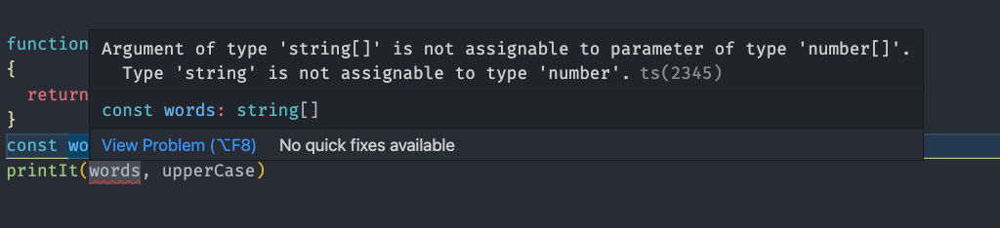
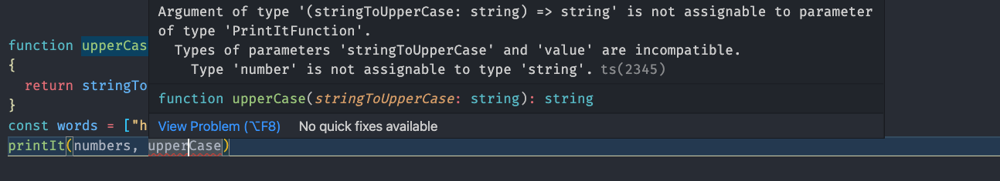
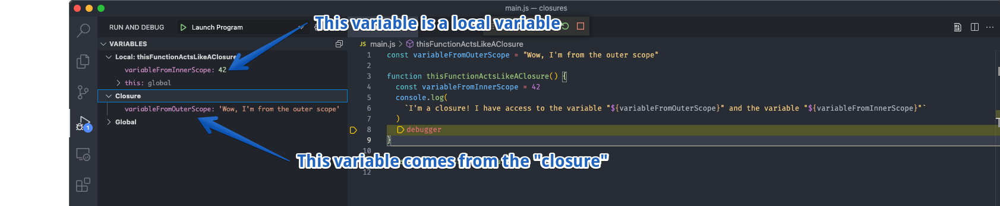
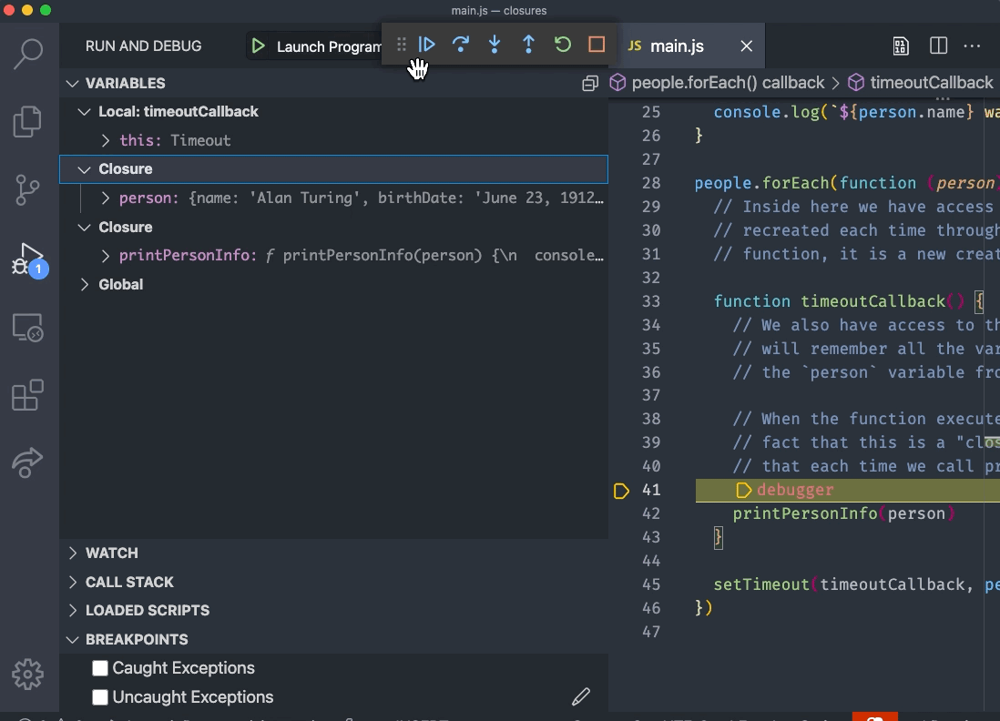

theme: Next, 1

# [fit] JavaScript / TypeScript

---

# [fit] What is it? (JavaScript)

---

# Purpose

- Initially to make web pages "interactive".
- Is the lingua franca of the front-end web, the default programming language.
- Has extended to the server-side via implementations like Node.js
- Showing up in more places like embedded environments.

---

# History

- Created around 1995.
- JavaScript is not Java.
- Became a standard in 1997.

---

# Lineage

- Draws from Java, C, Scheme.
- Some syntax will look familiar since Java and C also inspire C#.

---

# Also statement based

Like C# a TypeScript program is composed of a sequence of statements.

Like a C# program, these statements may end with a semicolon, `;`. However, these are _optional_ in TypeScript, and we will code without them.

Comments are the same as in C#, single lines with `//` and multiple lines with `/*` and `*/`.

---

# Typed language

[.autoscale: true]

JavaScript also has `types`, some of which will be familiar.

- `number`
- `string`
- `boolean`
- `array`
- `object`
- `null`
- `undefined`

---

# But JavaScript is loosely typed!

```js
let score = 42

// WHAT? This ok in JavaScript!?
score = 'Mary'
```

---


^ https://medium.com/vuejs-tips/vue-js-tip-1-with-great-power-comes-great-reactivity-c807d0403d6

---

# Where are loose types helpful?

JavaScript will allow us to easily mix types

```js
const arrayOfNumbersAndStrings = [
  42,
  'answer',
  'life',
  'universe',
  'everything',
]

const people = [
  { name: 'Susan' },
  { name: 'Mary', partTime: true },
  { name: 'Frank', salary: 42 },
]
```

---

# JavaScript had a bad rap for being _too_ flexible, leading to bad code

And there is a lot of it...

---

# ECMAScript

> It is a JavaScript standard meant to ensure the interoperability of web pages across different web browsers.

### Starting in `2015` we've been numbering them by year. (you may still see version numbers used)

---

# ECMAScript has been adding features making JavaScript better!

ECMAScript improvements has displaced _alternative_ languages like CoffeeScript that would _compile to_ JavaScript.

While JavaScript has been getting better, it still lacked a good way of managing data types.

---

# Calling for types in JavaScript ... Enter TypeScript

Developed at Microsoft. First released around 2012, started becoming very popular in the last few years.

Around 2018 the language and the tooling started becoming good enough for mass adoption.

---

# See: [this artcile](https://2020.stateofjs.com/en-US/technologies/javascript-flavors/)

---

# [fit] So why is TypeScript getting popular?

- Rise of the JavaScript Framework + Library

  - React
  - Angular
  - Svelte
  - Vue

- These allow us to organize and build LARGE front end applications

---

# More code, more problems

Large applications split among many developers are difficult to manage.

---

[.autoscale: true]

# Can types help?

> TypeScript adds additional syntax to JavaScript to support a tighter integration with your editor. Catch errors early in your editor.

<br/>

> TypeScript code converts to JavaScript which runs anywhere JavaScript runs: In a browser, on Node.js or Deno and in your apps.

<br/>

> TypeScript understands JavaScript and uses type inference to give you great tooling without additional code.

---

# How?

TypeScript is a _SUPER SET_ of JavaScript

- Everything that is JavaScript is also TypeScript (well, almost, and the parts that are not aren't important to us now)

- TypeScript compiles down to JavaScript that our browser can understand (mostly by removing all the extra syntax we'll see in a moment)

- Projects can adopt TypeScript gradually

---

# [fit] TypeScript adds a _flexible_ type system

- We can declare types for all our variables

- We can declare our own types!

---

# Can create our own types!

During this lecture, and in our work, we'll create our own types!

---

# See some examples

---

# Literal values

[.autoscale: true]

Like `C#` we can declare literal values.

- Numbers: `0`, `117` and `-345` but also `3.1415` and `-42.123`
- Strings: `"This is a sentence"` `'This is a sentence'` \`This is a sentence\`
- Boolean: `true` and `false`
- Arrays: `["French Roast", "Columbian", "Kona"]` and `["Shuttle", 42, true, "Thing"]`
- Objects: `{name: "Sandy", enrolled: true}`

---

# Variables

Must start with a letter (upper or lower), an underscore, or a dollar sign. Variable names may also have digits in the name after the first character.

Standard to use `camelCase` for our variable names.

---

# Variables

**Four** ways to declare a variable

| Method            | Description                                                                                   |
| ----------------- | --------------------------------------------------------------------------------------------- |
| `var`             | Declares a variable to be function or globally scoped, optionally initializing it to a value. |
| `let`             | Declares a block-scoped, local variable, optionally initializing it to a value.               |
| `const`           | Declares a block-scoped, read-only named constant.                                            |
| undeclared global | Without var, let, or const, we create a global variable                                       |
|                   |                                                                                               |

---

# Our style

`undeclared global` variables are highly discouraged as they can often lead to unexpected behavior.

We will always use `let` or `const` in our coding.

When looking at code on the web, e.g., StackOverflow, and blog posts, you will still see `var`.

---

# Const

`const` variables are assigned a value on the same statement where they are declared.

They can also not be re-assigned later in the code.

```typescript
const answer = 42
```

Not allowed, will be an error:

```typescript
answer = answer + 1
```

---

# Let

`let` variables **do not** need to be assigned a value on the same statement they are declared.

They **can** be re-assigned later in the code.

```typescript
let score = 98
```

```typescript
score = score + 1
```

---

# Scope

`let` and `const` are considered `block` scope.

That is, they are valid and accessible inside the current block. A block is:

- A pair of `{ }` which we will see for functions and statements such as `if`, `while`, `switch`, and others.
- The source file they are in if there is no current block.

---

# So, what about types?

- Shouldn't we be declaring types for our variables?
- Like `C#`, TypeScript has type inference.

So the following code declares variables that are of type `number`!

```typescript
const answer = 42
let score = 98
```

---

# TypeScript inference is quite good!

```typescript
const name = 'Mary'
const students = ['Mary', 'Steven', 'Paulo', 'Sophia']
const scores = [98, 100, 55, 100]
```

- `name` is a string
- `students` is an array of strings
- `scores` is an array of numbers

We can see this over in Visual Studio if we have a TypeScript file!

---

# Mix and Match

What about an array that has different types of elements?

Unlike `C#`, TypeScript can handle that just fine, and in a very nice way.


---

# Mix and Match

```typescript
const differentKindsOfThings = [42, 'Ice Cream', 100, 'Tacos']
```

          The variable differentKindsOfThings
          will have the type

          (string | number)[]

The `|` is a `union` of types; it means **or**.

`differentKindsOfThings` is an array of elements that can be **either** a `string` **or** a `number`.

---

# Declaring types explicitly

```typescript
const name: string = 'Mary'

const students: string[] = ['Mary', 'Steven', 'Paulo', 'Sophia']

const scores: number[] = [98, 100, 55, 100]

const differentKindsOfThings: (string | number)[] = [
  42,
  'Ice Cream',
  100,
  'Tacos',
]
```

---

# Declaring types explicitly

Once we introduce the idea of TypeScript objects we'll discuss why specifying an explict type is useful.

---

# Undefined variables

After declaring a variable but before assigning it a value, the variable will contain a special but confusing, value known as `undefined`

The type of the variable will also be `any` which means it will accept a value of **any** kind.

```typescript
let name // name contains 'undefined', and is of `any` type

name = 'Jane' // name now contains the value 'Jane'
```

---

## Avoid `undefined` and `any` in your code!

In fact, we can turn on code checking tools to make sure we avoid them!

---

## Bad form

```typescript
let name
// name contains 'undefined' and is of type `any`

name = 'Jane'
// name now contains the value 'Jane', but `name` is still an `any` type.
```

---

## Better form

```typescript
let name: string
// name contains 'undefined' and should be of type `string`

name = 'Jane'
// name now contains the value 'Jane'
```

---

## Best form

```typescript
const name = 'Jane'
// name contains the value 'Jane' and we avoid any issue with `undefined`
```

---

# Good variable hygiene

Follow these rules, and you'll do well:

- Only use `const` and `let`.
- Use `const` unless you have a **good** reason to use `let`
- Always initialize a variable unless you have a **good** reason not to.

---

# Conversions

TypeScript is far more forgiving when converting types.

Valid in `TypeScript` but not allowed in a language like `C#`

```typescript
const x = 'The answer is ' + 42 // "The answer is 42"
const y = 42 + ' is the answer' // "42 is the answer"
```

---

# Amazing, right?

# ... not so fast!

---

# Doesn't work as you might expect

In statements involving other operators, TypeScript does not convert numeric values to strings. For example:

```typescript
let x: string

x = '37' - 7 // 30 and notes an error
x = '37' + 7 // "377" does not note any error
```

---

# String interpolation

```typescript
const score = 98
const answer = 42

const message = `Congratulations, ${answer} is correct. You have ${score} points`
```

---

# Objects

Similar to other languages objects are a combination of state and behavior.

In TypeScript, an object is a standalone entity with properties and type. Compare it with a cup, for example. A cup is an object with properties. A cup has a color, a design, weight, and a material. In the same way, TypeScript objects can have properties, which define their characteristics.

---

# Object Properties

A TypeScript object has properties associated with it.

A property of an object is a variable that is attached to the object.

Object properties are the same as ordinary TypeScript variables, except for the attachment to objects.

The properties of an object define the characteristics of the object.

---

# Object Properties

You access the properties of an object with a simple dot-notation:

```typescript
objectName.propertyName
```

---

# Object Properties

[.autoscale: true]

[.column]

Like all TypeScript variables, both the object name (which could be a standard variable) and property name are case-sensitive.

You can define a property by assigning it a value.

For example, let's create an object named myCar and give it properties named make, model, and year as follows:

[.column]

```typescript
const myCar = {
  make: 'Ford',
  model: 'Mustang',
  year: 1969,
}
```

---

# Object Initializer

The previous example uses an object initializer, which is a comma-delimited list of zero or more pairs of property names and associated values of an object, enclosed in curly braces ({}):

---

# Accessing properties using bracket notation (and by string)

[.column]

Properties of TypeScript objects can also be accessed or set using a bracket notation.

So, for example, you could access the properties of the `myCar` object as follows:

[.column]

```typescript
myCar['make'] = 'Ford'
myCar['model'] = 'Mustang'
myCar['year'] = 1969

console.log(myCar['make'])
```

---

# Why?

An object property name can be any valid TypeScript string or anything convertible into a string, including the empty string.

> However, any property name that is not a valid TypeScript identifier (for example, a property name with space or hyphens, or that starts with a number) can only use the square bracket notation.

---

# Better form (best practice)

```typescript
myCar.make = 'Ford'
myCar.model = 'Mustang'
myCar.year = 1969

console.log(myCar.make)
```

---

# Make a second car

```typescript
const theirCar = {
  make: 'Jeep',
  model: 'Wrangler',
  year: 2021,
}
```

This car has the same `type` as the `myCar` variable, but only through coincidence.

---

# Make another car

```typescript
const otherCar = {
  make: 'Honda',
  modal: 'Fit',
  year: 2020,
}
```

Anyone see a problem?

---

# Typo!

```typescript
const otherCar = {
  make: 'Honda',
  modal: 'Fit',
  year: 2020,
}
```

I make **many** typos and similar errors. Maybe TypeScript can help me?

---

# [fit] Using types to find issues in our code

We can teach TypeScript about a new specific type and give it a name of our choice.

```typescript
type Car = {
  make: string
  model: string
  year: number
}
```

---

# Using the type

[.column]

```typescript
type Car = {
  make: string
  model: string
  year: number
}

const myCar: Car = {
  make: 'Ford',
  model: 'Mustang',
  year: 1969,
}
```

[.column]

```typescript
const theirCar: Car = {
  make: 'Jeep',
  model: 'Wrangler',
  year: 2021,
}

const otherCar: Car = {
  make: 'Honda',
  modal: 'Fit',
  year: 2020,
}
```

# [fit] The `modal` error will be called out

---

# [fit] Making a new object from an existing one

[.column]

Let's take our car example again:

```typescript
const myCar = {
  make: 'Ford',
  model: 'Mustang',
  year: 1969,
}
```

[.column]

Make a new car, but with a different year.

```typescript
const myOtherCar = {
  make: myCar.make,
  model: myCar.model,
  year: 1971,
}
```

---

# [fit] Fortunately, TypeScript allows for a shortcut

- "expands" all the keys and values.
- This is known as the `spread` operator and is noted as `...`

```typescript
const myOtherCar = {
  ...myCar,
  year: 1971,
}
```

> P.S. Up-to-date versions of JavaScript have this too...

---

# Arrays

TypeScript also has an array type. TypeScript arrays are more flexible than C#'s and are more akin to `List<>` in their flexibility. TypeScript arrays also differ from `C#` arrays as TypeScript arrays can store values of different types.

There are three ways to declare an array:

```typescript
const array = new Array(element0, element1, ..., elementN);
const array = Array(element0, element1, ..., elementN);
const array = [element0, element1, ..., elementN];
```

---

# [fit] `Array` and `new Array` are problematic

- `const array = new Array('hello', 42)` will define an array of `string` and convert the `42` to a string.
- `const array = new Array(42, 'hello')` will be a TypeScript error.
- These are not recommended approaches for creating arrays.

---

# Array literals

```typescript
const people = ['Betty', 'Wilma', 'Fred', 'Barny']
const scores = [100, 42, 50, 98]
const collection = ['Betty', 98, 'Fred', 12, 42]
```

Even though the arrays contain different types, TypeScript will create the correct kind of array.

---

# Populating an array

We can also use the `[]` operator to assign values to specific elements of an array.

```typescript
const employees = []
employees[0] = 'Rivest, Ron'
employees[1] = 'Shamir, Adi'
employees[2] = 'Adleman, Leonard'
```

> However, `employees` will be an array of `any`!

---

# This is better

```typescript
const employees: string[] = []
employees[0] = 'Rivest, Ron'
employees[1] = 'Shamir, Adi'
employees[2] = 'Adleman, Leonard'
```

---

# This is better yet

```typescript
const employees = ['Rivest, Ron', 'Shamir, Adi', 'Adleman, Leonard']
```

---

# Wait, what about const?

`const` only refers to the **variable**, not it's contents.

It only prevents us from doing

```typescript
employees = ['Peter', 'Paul', 'Mary']
```

This is totally valid:

```typescript
employees.push('Peter')
employees.push('Paul')
employees.push('Mary')
```

---

# [fit] Can you make an unchangable array?

- Yes, use `ReadOnlyArray<>`

```typescript
const cantChangeTheseValues: ReadonlyArray<number> = [42, 100, 52]

cantChangeTheseValues[0] = 1
```

---

# [fit] Editor/Compile time versus Runtime

Editor is screaming at us, browser might show errors, but...

    !!!
    THE     CODE        STILL           RUNS
    !!!

TypeScript transforms down to JavaScript so while it will complain and warn, it won't _STOP_ you.

> We can turn on some project configurations to _not_ allow our code to run until it is free of these kinds of warnings

---


---

# Iterating arrays

A common operation is to iterate over the values of an array, processing each one in some way. The simplest way to do this is as follows:

```typescript
let colors = ['red', 'green', 'blue']
for (let index = 0; index < colors.length; index++) {
  console.log(colors[index])
}
```

---

# Iterating arrays

The `forEach()` method provides another way of iterating over an array:

```typescript
let colors = ['red', 'green', 'blue']
colors.forEach(function (color) {
  console.log(color)
})
```

---

# [fit] Iterating arrays with arrow functions

Alternatively, You can shorten the code for the forEach parameter with Arrow Functions:

```typescript
let colors = ['red', 'green', 'blue']
colors.forEach(color => console.log(color))
```

> Looks similar to C#, eh? -- more about this tomorrow...

---

# More about iterating

For more details on how to manipulate arrays, including adding and removing elements, see the [quick reference guide](https://handbook.suncoast.io/lessons/misc-quick-reference/js-arrays) on arrays.

---

# Control flow

Control flow in TypeScript is nearly identical to `C#` in that our code consists of a sequential set of statements that comprises a block of code:

```typescript
{
  statement_1
  statement_2
  .
  .
  .
  statement_n
}
```

---

# If

We can control the flow of the code with a conditional statement:

```typescript
if (condition) {
  statement_1
} else {
  statement_2
}
```

This works exactly as `C#` except for the different style in how the braces and `else` are formatted.

---

# Comparisons

The same boolean comparisons are present in `TypeScript`, `<`, `>`, `<=`, `>=`, and `==`.

```typescript
const answer = 42
const score = 98

if (answer < 43) {
  // statement
}

if (score > 97) {
  // statement
}

if (score == 98) {
}
```

---


---

# `===`

---

# `==` doesn't work as you might expect

It doesn't mean `is exactly` as we've seen in a language like `C#`

It means `is this thing kinda like the other thing`?

It first sees if the values can be converted to a _common type_ and then performs the comparison.

---

# WAT

```typescript
const answer = 42
const message = '42'

if (answer == message) {
  // Yup! this will be *TRUE*
  //
  // However, TypeScript will complain at us!
}
```

---

# == rules


^ Nobody wants to memorize these
^ I haven't memorized them

---

# So, what do we do?

## Enter the threequal (`===`)

---

# In TypeScript

|       |                                |
| ----- | ------------------------------ |
| `==`  | _Abstract Equality Comparison_ |
| `===` | _Strict Equality Comparison_   |

---

# `===` is typically what we want

In **most** cases `===` is what you want when comparing values.

There are some exceptions, but they are **very** rare.

---

# Want more?

See [this article](https://developer.mozilla.org/en-US/docs/Web/JavaScript/Equality_comparisons_and_sameness)

---

# For loop

```typescript
for(let index = 0; index < 20; index++) {
  console.log(`The index is ${index})
}
```

---

# Switch

```typescript
switch (expression) {
  case label_1:
    statements_1
    [break]
  case label_2:
    statements_2
    [break]
    ...
  default:
    statements_def
    [break]
}
```

### This should seem familiar

---

# Functions

In TypeScript, named groups of code that perform a specific behavior are called `functions` (whereas in `C#` we called them `methods`).

Also, these `functions` do not need to be in `classes`.

---

# Example

The following code defines a simple function named greet:

```typescript
// function keyword
// |
// |     name of the function
// |     |
// |     |    required parenthesis where arguments will go
// |     |    |
// |     |    |  opening scope of the function
// |     |    |  |
// |     |    |  |
// v     v    v  v
function greet() {
  console.log('Hello there programmer!')
}
```

---

# Add arguments

For example, the following code defines a simple function named
square.

```typescript
//                             argument type
//                             |
//                             |        function return type (optional)
//                             |        |
//                             |        |
//                             v        v
function square(valueToSquare: number): number {
  return valueToSquare * valueToSquare
}
```

---

# Calling functions

```typescript
const answer = square(5)
```

---

# If there is one way, more ways are better!

---

# [fit] Function Expressions

---

## Function expressions

While the function declaration above is syntactically a statement, functions can also use a `function expression` style.

```typescript
const square = function (valueToSquare: number) {
  return valueToSquare * valueToSquare
}

const answer = square(4) // answer gets the value 16
```

---

# [fit] Functions are just another kind of type!

We say that `functions` in TypeScript are a type just like numbers, strings and booleans.

We can assign them names and pass them as arguments.

---

```typescript
type PrintItFunction = (value: number) => number

function printIt(numbers: number[], func: PrintItFunction) {
  for (let index = 0; index < numbers.length; index++) {
    const value = numbers[index]
    const result = func(value)

    console.log(`Turned ${value} into ${result}`)
  }
}
```

---

```typescript
function square(valueToSquare: number) {
  return valueToSquare \* valueToSquare
}

function double(valueToDouble: number) {
  return valueToDouble * 2
}

const numbers = [1, 2, 3, 4, 5]
printIt(numbers, square)
// Turned 1 into 1
// Turned 2 into 4
// Turned 3 into 9
// Turned 4 into 16
// Turned 5 into 25
printIt(numbers, double)
// Turned 1 into 2
// Turned 2 into 4
// Turned 3 into 6
// Turned 4 into 8
// Turned 5 into 10
```

---

## Here is where TypeScript shines!

What if we define a new function that doesn't fit the pattern our `printIt` function expects.

```typescript
function upperCase(stringToUpperCase: string) {
  return stringToUpperCase.toUpperCase()
}

const words = ['hello', 'there']
printIt(words, upperCase)
```

---

The TypeScript system would immediately tell us that `words` isn't an array of numbers and cannot be sent to `printIt`!



---

If we "fix" this error by using our `numbers` variable, we'll see that TypeScript then notifies us that the `upperCase` doesn't follow the style of the `function` we are expecting!



---

# Powerful

Passing functions as arguments to other functions is a very powerful pattern in TypeScript. We will be using this ability quite a bit in other lessons.

Functions treated as values for variables and passed as arguments are two things that make TypeScript a **functional**-style language.

---

## Scope again

We cannot access variables defined inside a function from anywhere outside the function because the variable is defined only in the function's scope.

However, a function can access all variables and functions defined inside its scope.

A function defined inside another function can also access all variables defined in its parent function and any other variable to which it has access.

---

```typescript
const PI = 3.14
const numbers = [1, 2, 4, 8, 16]

function pies() {
  // Inside this function we can "see" the variables `PI` and `numbers`
  // because we are *INSIDE* the scope where they were defined
  for (let index = 0; index < numbers.length; index++) {
    const number = numbers[index]

    const area = PI * number * number

    console.log(`The area of a circle with radius ${number} is ${area}`)
  }

  // Here, we *cannot* see the variable `area` since we are *OUTSIDE* the scope
  // where it was defined.
}
```

---

# Closures!

Taking the above example another step, we'll introduce the concept of `closures`.

> NOTE: This is often an interview question.

---

# A Closure

Closures in TypeScript are a way to create a function that has access to the variables and functions defined in the outer scope.

What does this mean? We can try a few examples.

---

## Simple example

```typescript
const variableFromOuterScope = "Wow, I'm from the outer scope"

function thisFunctionActsLikeAClosure() {
  const variableFromInnerScope = 42
  console.log(
    `I'm a closure! I have access to the variable "${variableFromOuterScope}" and the variable "${variableFromInnerScope}"`
  )
  // Have the debugger stop the program so we can look around
  debugger
}

thisFunctionActsLikeAClosure()
```

---

We'll run this program in Visual Studio, and we'll see the following output.

---



---

[.autoscale: true]

# Notice

- The debugger is showing us all the variables we can see when we reach the debugger statement and our program paused.
- The variable `variableFromInnerScope` is shown in the list of `Local Variables`.
- The variable `variableFromOuterScope` is listed in the section marked `closure`.
- This is because that variable was "captured" by the function when it was defined.

---

## A more complex example.

We can create a more complex example to demonstrate that these functions do "remember" their values.

---

# Doing work later but still having access to variables

- Create an array of people. Each person will have a name, a birthday, and a number of milliseconds we should wait before showing their information.
- Use TypeScript's `setTimeout` to do the waiting.
- Since `setTimeout` calls a function **later**, this will help prove that the function is really "remembering" its values.

---

```typescript
type Person = {
  name: string
  birthDate: string
  delayMilliseconds: number
}

const people: Person[] = [
  {
    name: 'Alan Turing',
    birthDate: 'June 23, 1912',
    delayMilliseconds: 1100,
  },
  {
    name: 'Ada Lovelace',
    birthDate: 'December 10, 1815',
    delayMilliseconds: 1500,
  },
  {
    name: 'Grace Hopper',
    birthDate: 'December 9, 1906',
    delayMilliseconds: 2000,
  },
  {
    name: 'Donald Knuth',
    birthDate: 'January 10, 1938',
    delayMilliseconds: 2500,
  },
]
```

---

# printPersonInfo

Then we will create a method that accepts a person variable and prints out details about them.

```typescript
function printPersonInfo(person: Person) {
  console.log(`${person.name} was born on ${person.birthDate}`)
}
```

---

# Create a loop and use `setTimeout`

- Create a loop that will call the printPersonInfo method for each person in the array.
- Call this method from inside a call to `setTimeout`.
- `setTimeout` creates a timer that will call the supplied function at a later time.
- Put a `debugger` statement inside the function so we can see what is happening.

---

```typescript
people.forEach(function (person: Person) {
  // Inside here we have access to the `person` variable. The `person` variable is
  // recreated each time through the forEach loop. Since it is an argument to the
  // function, it is a new creation of that variable.

  function timeoutCallback() {
    // We also have access to the `person` variable here. The function timeoutCallback
    // will remember all the variables that existed that it could see. This includes
    // the `person` variable from the forEach loop.

    // When the function executes **later** (via the `setTimeout`) the
    // fact that this is a "closure" (remembers variables from the outer scope) ensures
    // that each time we call printPersonInfo, the variable `person` will be correct.
    debugger
    printPersonInfo(person)
  }

  setTimeout(timeoutCallback, person.delayMilliseconds)
})
```

---

[.autoscale: true]

- **TWO** closures defined.
- One created by the `function(person)` defined inside the `forEach` loop.
- Second closure comes from inside the `function timeoutCallback`
- Has access to the `person` variable created by the `forEach` loop.
- When code calls `printPersonInfo` for the first time, `person` is
  `Alan Turing`
- The second time, the closure captures `person` being equal to `Ada Lovelace`
- Then `Grace Hopper`
- Finally `Donald Knuth`.



---

# Complex, powerful, and simple

- Closures are when a function grabs hold of the definition of the variables it can see when defined.

- We'll be using closures, but we won't be calling it out as a special technique.

# [fit] This [youtube video](https://www.youtube.com/watch?v=ePfe7nFSnAk) also gives a good overview of closures.

---


