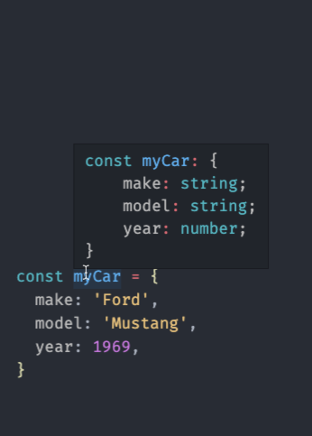
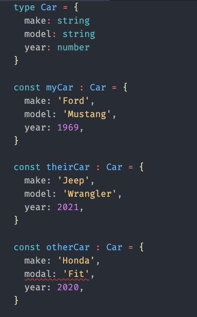
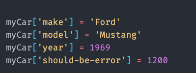

# Overview

Objects in TypeScript, just as in other languages like `C#`, can be compared to
objects in real life. The concept of objects in TypeScript can be understood
with real life, tangible objects.

In TypeScript, an object is a standalone entity, with properties and type.
Compare it with a cup, for example. A cup is an object, with properties. A cup
has a color, a design, weight, a material it is made of, etc. The same way,
TypeScript objects can have properties, which define their characteristics.

# Properties

A TypeScript object has properties associated with it. A property of an object
can be explained as a variable that is attached to the object. Object properties
are basically the same as ordinary TypeScript variables, except for the
attachment to objects. The properties of an object define the characteristics of
the object. You access the properties of an object with a simple dot-notation:

```typescript
objectName.propertyName
```

Like all TypeScript variables, both the object name (which could be a normal
variable) and property name are case sensitive. You can define a property by
assigning it a value. For example, let's create an object named myCar and give
it properties named make, model, and year as follows:

```typescript
// This code will have errors in TypeScript
const myCar = new Object()
myCar.make = 'Ford'
myCar.model = 'Mustang'
myCar.year = 1969
```

In TypeScript however, we will receive errors that `make`, `model`, and `year`
are not properties of `Object` since the default `Object` type does not know
about them.

A better way to write the above example is with an object initializer, which is
a comma-delimited list of zero or more pairs of property names and associated
values of an object, enclosed in curly braces ({}):

```typescript
const myCar = {
  make: 'Ford',
  model: 'Mustang',
  year: 1969,
}
```

TypeScript will see that the `myCar` variable is an object with two string
properties named `make` and `model`, and one number property named `year`.



We could continue to make new cars and as long as we kept the same initial
properties they would all be the same **type**

```typescript
const theirCar = {
  make: 'Jeep',
  model: 'Wrangler',
  year: 2021,
}
```

However, this object would **not** be the same type.

```typescript
const otherCar = {
  make: 'Honda',
  modal: 'Fit',
  year: 2020,
}
```

Do you see the problem? The property name for `model` has a **typo**!

# Using types to find issues in our code

Having defined types is a great way to ensure that we do not make these kinds of
errors in our code. A small typo like this could take us hours of time to find!
Imagine if our code base was tens of thousands of lines. It might be even longer
to find the issue show up.

## Define a `type`

We can teach TypeScript about a new specific type and give it a name of our
choice.

```typescript
type Car = {
  make: string
  model: string
  year: number
}
```

Now that we have our type:

```typescript
type Car = {
  make: string
  model: string
  year: number
}

const myCar: Car = {
  make: 'Ford',
  model: 'Mustang',
  year: 1969,
}

const theirCar: Car = {
  make: 'Jeep',
  model: 'Wrangler',
  year: 2021,
}

const otherCar: Car = {
  make: 'Honda',
  modal: 'Fit',
  year: 2020,
}
```

With this definition we can clearly see our error:



# Accessing properties using bracket notation (and by string)

Properties of TypeScript objects can also be accessed or set using a bracket
notation. So, for example, you could access the properties of the `myCar` object
as follows:

```typescript
myCar['make'] = 'Ford'
myCar['model'] = 'Mustang'
myCar['year'] = 1969
```

An object property name can be any valid TypeScript string, or anything that can
be converted to a string, including the empty string.

**However, any property name that is not a valid TypeScript identifier (for
example, a property name that has a space or a hyphen, or that starts with a
number) can only be accessed using the square bracket notation.**

This notation is also very useful when property names are to be dynamically
determined (when the property name is not determined until runtime). Examples
are as follows:

An object property name can be any valid TypeScript string, or anything that can
be converted to a string, including the empty string. However, any property name
that is not a valid TypeScript identifier (for example, a property name that has
a space or a hyphen, or that starts with a number) can only be accessed using
the square bracket notation. This notation is also very useful when property
names are to be dynamically determined (when the property name is not determined
until runtime).

## Warning about the `[]` notation in TypeScript

TypeScript does not check our object type when using this operator, so be
cautious when using it.



# Using a variable to indicate a property name

Let's say we had, in a string variable, the name of a property we wish to set on
an object. However, instead of the case above where we set the value of an
existing object, (e.g. `myCar[propertyName] = 'Mustang'`) we wanted to create a
new object and use the variable to indicate what property to set.

We could do something like this:

```typescript
const propertyName = 'model'

const myOtherCar = {
  [propertyName] = 'Mustang'
}
```

In this case, `myOtherCar` would be `{ model: 'Mustang'}`.

While this doesn't seem particularly powerful, when combined with the technique
below we get a fairly powerful pair of features we'll be using later.

# Making a new object from an existing one

Let's take our car example again:

```typescript
const myCar = {
  make: 'Ford',
  model: 'Mustang',
  year: 1969,
}
```

If we wanted to make another instance of this object, but with a different
`year`, we could do something like this:

```typescript
const myOtherCar = {
  make: myCar.make,
  model: myCar.model,
  year: 1971,
}
```

And now we would have a new object, independent of the first, with a different
year. However, you could imagine that if we had many properties it would be
cumbersome to repeat all the keys and values. Fortunately, TypeScript allows for
a shortcut to "expand" all the keys and values. This is known as the `spread`
operator and is noted as `...`

So let's write this again using the spread operator:

```typescript
const myOtherCar = {
  ...myCar,
  year: 1971,
}
```

Much better, we've saved one line of code, however, it now doesn't matter how
many property/value paris `myCar` has since they are all now part of
`myOtherCar` since this is effectively what TypeScript is doing for us:

```typescript
const myOtherCar = {
  ...myCar,
  year: 1971,
}

// is the same as:

const myOtherCar = {
  make: myCar.make,
  model: myCar.model,
  year: myCar.year,

  year: 1971,
}
```

You'll notice that the `year` from `myCar` is added to the object. However our
code outside of the `...myCar` introduces a value for `year` again. Since this
comes **after** the spread operator, our value of `1971` overrides the one from
`year: myCar.year`

> NOTE: The order is important!

If we wrote the code like this:

```typescript
const myOtherCar = {
  year: 1971,

  ...myCar,
}

// is the same as:

const myOtherCar = {
  year: 1971,

  make: myCar.make,
  model: myCar.model,
  year: myCar.year,
}
```

In this case, our property/value pair of `year: 1971` would be lost since the
`...` spread would reintroduce the value from `myCar`

# Resources

For more details on objects, see
[this article](https://developer.mozilla.org/en-US/docs/Web/JavaScript/Guide/Working_with_Objects)
or this [quick reference guide](/lessons/misc-quick-reference/js-objects)
