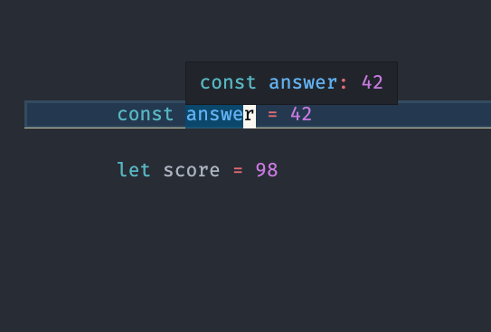

Like in most modern programming languages, in TypeScript we store information in
`variables.` Variables are placeholders with meaningful names that we use to
store a value so that we can refer to it later.

# Variable Naming Rules

The names of variables, called identifiers, conform to certain rules.

A TypeScript identifier must start with a letter, underscore (`_`), or dollar
sign (`$`); subsequent characters can also be digits (`0-9`). Because TypeScript
is case sensitive, letters include the characters "`A`" through "`Z`"
(uppercase) and the characters "`a`" through "`z`" (lowercase). Some examples of
legal names are `Number_hits`, `temp99`, `$credit`, and `_name`.

There are four ways we can assign a variable in TypeScript

|                   |                                                                                 |
| ----------------- | ------------------------------------------------------------------------------- |
| `var`             | Declares a variable, optionally initializing it to a value.                     |
| `let`             | Declares a block-scoped, local variable, optionally initializing it to a value. |
| `const`           | Declares a block-scoped, read-only named constant.                              |
| undeclared global | Without var, let, or const, we create a global variable                         |
|                   |                                                                                 |

`undeclared global` variables are highly discouraged as they can often lead to
unexpected behavior. In our coding we will always use `var`, `let`, or `const.`
In fact, in modern TypeScript we will restrict our usage to `let` and `const.`

`const` variables are assigned a value on the same statement where they are
declared. They can also not be re-assigned at a later date.

> You should default to using const when creating variables. This will help you
> keep your variables, values and data more organized and reliable.

```typescript
const answer = 42
```

The value of this variable cannot be changed.

`let` versus `var` -- These are both ways to declare variables which can be
changed. The difference between these two ways of declaring a variable have to
do with `scope.` We haven't discussed `scope` yet, so for now we will limit
ourselves to using the `let` style of declaring variables.

```typescript
let score = 98
```

The value of the `score` variable can be changed at a later time. That is, we
can increment it, decrement it, or change it to any other value we like.

# Wait, what about `types` in `TypeScript`

We are programming in a language named `TypeScript` so shouldn't we be declaring
variable types?

Luckily for us, TypeScript, like C#, has
[type inference](https://www.typescriptlang.org/docs/handbook/type-inference.html).
This means that if we assign a value for a variable when we declare it,
TypeScript will make an inference, or guess, at the type for the variable.

So the following code declares variables that are of type `number`!

```typescript
const answer = 42
let score = 98
```

If you define these variables in a `.ts` file in Visual Studio Code, you can
hover over the variable and see the inferred type.



TypeScript can infer quite a bit about a variable if we give it a good default
value.

```typescript
const name = 'Mary'
const students = ['Mary', 'Steven', 'Paulo', 'Sophia']
const scores = [98, 100, 55, 100]
```

The variable `name` will have a type of `string` while `students` will have the
type `string[]` and `scores` the type `number[]`.

The type `string[]` indicates that the variable is an array with every element
being a `string`. Similarly, `number[]` indicates the variable is an array with
every element being a `number`.

What about an array that has different types of elements? Unlike `C#`,
TypeScript can handle that just fine, and in a very nice way.

```typescript
const differentKindsOfThings = [42, 'Ice Cream', 100, 'Tacos']
```

The variable `differentKindsOfThings` will have the type `(string | number)[]`.
The `|` is a `union` of types. This means that `differentKindsOfThings` is an
array of elements that can be **either** a `string` or a `number`.

# Declaring types specifically

Type inference is powerful and frees us from having to type additional syntax.
However, we cannot use type inference everywhere in our code. For instance, when
declaring functions we'll need to provide types for our arguments.

Also, some developers do not prefer to rely on their editor's features to show
them the type of a variable and prefer to be `explicit` instead of `implict`
with typing.

To declare the variables again we can use a syntax that includes the variable
types explicitly.

```typescript
const name: string = 'Mary'

const students: string[] = ['Mary', 'Steven', 'Paulo', 'Sophia']

const scores: number[] = [98, 100, 55, 100]

const differentKindsOfThings: (string | number)[] = [
  42,
  'Ice Cream',
  100,
  'Tacos',
]
```

This syntax isn't significantly different as it only uses `: TYPE` after the
variable name declaration. We'll use type inference most of the time when
writing code in the handbook and our projects.

Once we introduce the idea of TypeScript objects we'll discuss why specifying an
explict type is useful.

# Without assigned values

When declaring a variable with `let` we do not have to specify a value. After
declaring a variable but before assigning it a value, the variable will contain
a special value known as `undefined`.

The `undefined` value is different than our experience with `null`. While `null`
implies that the variable has **no value**, `undefined` implies that we have
never defined a value at all. Generally, `undefined` should be avoided in our
code as it leads to bugs.

Also since we did not provide a type for this variable, TypeScript will assign
the special type `any`. This variable will now accept **any** type of value. The
`any` type can lead to bugs in our software that would be avoided if we applied
a type.

## `undefined` and `any` should be avoided in our code

Since we are just starting with learning TypeScript we'll focus on a code style
that prevents the need for the `undefined` value and the `any` type.

In fact, we can turn on code checking tools to make sure we avoid them!

## Bad form

```typescript
let name
// name contains 'undefined' and is of type `any`

name = 'Jane'
// name now contains the value 'Jane', but `name` is still an `any` type.
```

## Better form

```typescript
let name: string
// name contains 'undefined' and should be of type `string`

name = 'Jane'
// name now contains the value 'Jane'
```

## Best form

```typescript
const name = 'Jane' // name contains the value 'Jane' and we avoid any issue with `undefined`
```

Most of the time we are able to declare a variable and assign a value at the
same time. However, it is sometimes useful to declare the variable and assign
its value later. Once we introduce conditions and functions we will see cases of
this.

# More Types

## Basic Types

As you saw when declaring variables, there are different types of values in
TypeScript.

Here are our first few types that are in TypeScript, we will build on this later

|             |                                                                                                                                                                             |     |
| ----------- | --------------------------------------------------------------------------------------------------------------------------------------------------------------------------- | --- |
| `number`    | A numeric value such as `42`, `3.14`, or `0`                                                                                                                                |
| `string`    | A sequence of characters such as `"Jane"`, `""`, or `"100"` - Notice that `"100"` is different than `100` the former is a sequence of characters and the latter is a number |
| `null`      | A special keyword denoting a null value.                                                                                                                                    |
| `undefined` | A top-level property whose value is not defined.                                                                                                                            |

Looking at this list you might think that having `null` and `undefined` is
redundant. Here is an example of the difference between the two:


## Data Type Conversion

TypeScript is a dynamically typed language. That means you don't have to specify
the data type of a variable when you declare it, and data types are converted
automatically as needed during script execution. So, for example, you could
define a variable as follows:

```typescript
let answer = 42
```

And later, you could try to assign the same variable a string value, for
example:

```typescript
answer = 'Thanks for all the fish...'
```

<div style="border: 5px solid #F33; border-radius: 0.5rem; padding: 1rem; text-align: center; font-weight: bold;">
The following is a key point about the relationship between TypeScript and JavaScript
</div>

Here is where `TypeScript`'s relationship to `JavaScript` shows. While our
`TypeScript` system will notify us this is an _error_, the code will still
execute!

Because TypeScript is
[transpiled](https://en.wikipedia.org/wiki/Source-to-source_compiler) to the
JavaScript language our browsers (and other tools) know how to execute, it will
not _prevent_ this code from executing when we reach the JavaScript execution
stage.

<hr/>
<hr/>
<hr/>

In expressions involving numeric and string values with the + operator,
TypeScript converts numeric values to strings. For example, consider the
following statements:

```typescript
let x = 'The answer is ' + 42 // "The answer is 42"
let y = 42 + ' is the answer' // "42 is the answer"
```

In statements involving other operators, TypeScript does not convert numeric
values to strings. For example:

```typescript
let x: string

x = '37' - 7 // 30 and notes that this is an error, assigning a number to a string
```

```typescript
x = '37' + 7 // "377" and no error since we are converting the `7` to a string first.
```

## Literals

You use literals to represent values in TypeScript. These are fixed values, not
variables, that you _literally_ provide in your script. This section describes
the following types of literals:

_Integers_ _Floating-point literals_ _String literals_ _Boolean literals_

### Integers

Integers can be expressed in decimal (base 10), hexadecimal (base 16), octal
(base 8) and binary (base 2).

A decimal integer literal consists of a sequence of digits without a leading 0
(zero). A leading 0 (zero) on an integer literal, or a leading 0o (or 0O)
indicates it is in octal. Octal integers can include only the digits 0-7. A
leading 0x (or 0X) indicates a hexadecimal integer literal. Hexadecimal integers
can include digits (0-9) and the letters a-f and A-F. (The case of a character
does not change its value, e.g. 0xa = 0xA = 10 and 0xf = 0xF = 15.) A leading 0b
(or 0B) indicates a binary integer literal. Binary integers can only include the
digits 0 and 1.

Some examples of integer literals are:

```plain
0, 117 and -345 (decimal, base 10)
015, 0001 and -0o77 (octal, base 8)
0x1123, 0x00111 and -0xF1A7 (hexadecimal, "hex" or base 16)
0b11, 0b0011 and -0b11 (binary, base 2)
```

### Floating Point Literals

A floating-point literal can have the following parts:

- A decimal integer which can be signed (preceded by "+" or "-"),
- A decimal point ("."),
- A fraction (another decimal number),
- An exponent.
- The exponent part is an "e" or "E" followed by an integer, which can be signed
  (preceded by "+" or "-"). A floating-point literal must have at least one
  digit and either a decimal point or "e" (or "E").

For example:

```
3.1415926
-0.123456789
-3.1e12
0.1e-23
```

### String Literals

A string literal is zero or more characters enclosed in double (") or single (')
quotation marks. A string must be delimited by quotation marks of the same type;
that is, either both single quotation marks or both double quotation marks. The
following are examples of string literals:

```typescript
'foo'
'bar'
'1234'
'one line \n another line'
"John's cat"
```

Template literals are also available. Template literals are enclosed by the
back-tick (\`) (grave accent) character instead of double or single quotes.
Inside the backticks we can use `${}` to evaluate statements

```typescript
const score = 56
const prompt = `The current score is ${score} and the next score is ${
  score + 1
}`
// The current score is 56 and the next score is 57
```

### Boolean Literals

The Boolean type has two literal values: `true` and `false`.

```typescript
const typeScriptIsAwesome = true
const learningTypeScriptIsHard = false
```

---

Now that we have data, we need ways to manipulate the variables
