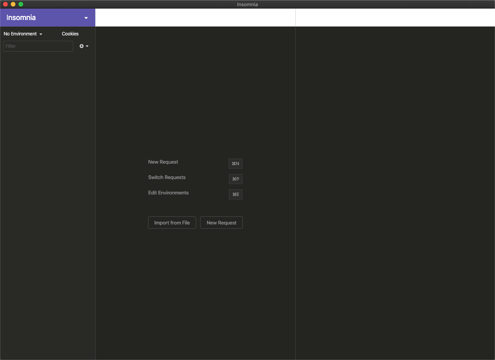
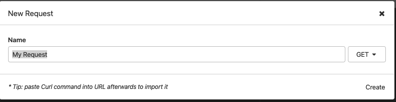
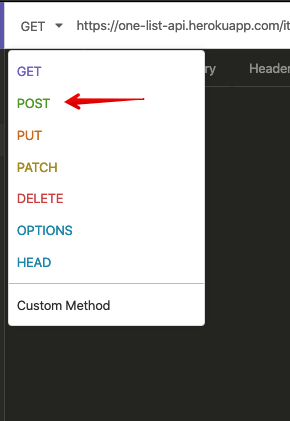
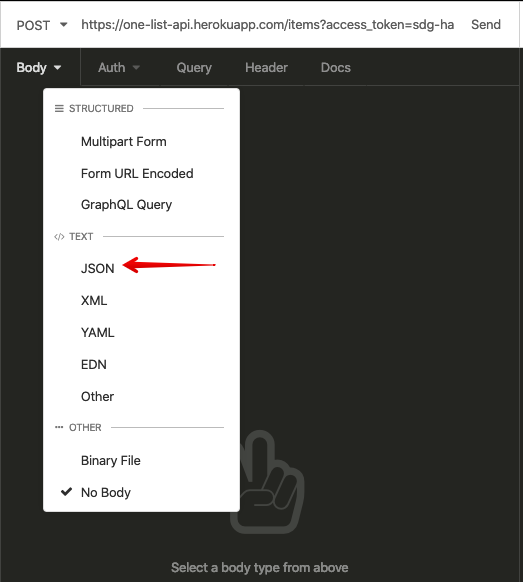
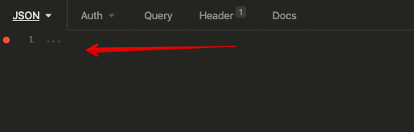
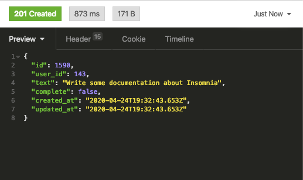

To see how to use a desktop API tool, lets use `Insomnia`. You may have
installed this during the setup lesson. If not, follow those instructions and
return here.

## Insomnia

Insomnia is a tool to work with HTTP based APIs. We will use it to look at the
`One List API` we previously used the `httpie` command for.

The home screen of Insomnia looks like:

We can begin by creating a `New Request`

Notice that it asks for us to name the request, we'll give it "One List API".

Now we can define the various parts of the request.

We can specify the `VERB` (defaults to `GET`) and give it the URL of our first
API request. Lets get the list of TODO items for a new list. I'll use
`sdg-handbook` as my list name, you should try using your own!

## Get list of items

I'll put in `https://one-list-api.herokuapp.com/items?access_token=sdg-handbook`
as my URL and leave the `GET` option in place.

When I click on the `Send` button I'll get a response from the API. You will see
on the right hand side the response code of `200` and the body of the response,
an empty `JSON` array

This indicates our list doesn't have any items yet.

## Add an item

Let's change our request to send the API an item.

Remembering the documentation (or checking
[the docs](https://one-list-api.herokuapp.com) as a reference) we see we need to
change our verb to `POST`

Next we tell the API we are sending JSON by selecting a BODY type:

and once we do we get an input area to type in our JSON request.

And fill in the request body with the details of an item.

Once we hit `Send` we can see the API response.

Notice in this case the http code is `201 Created`

## Other tabs in the response area

The other tabs, `Header` and `Cookie`, will be important as we start to use the
`Headers` for things like user authentication for APIs and Cookies for storing
session state. Those will be covered in other lessons, but know for now that
these are nicely visible in Insomnia.

## Make a few other items

Go ahead and change the request `body` to make some more items in your todo list
now.

## Going back to a previous request

Insomnia is keeping track of the previous requests we have made. If you click on
the dropdown in the upper right, you will see a history of your other requests.

We can use this to go back to our `GET` request to see all the items in our
list.

This will bring up that request and we can `send` it again. This time seeing all
the entries the API has for us:

## Reading one item, updating, and deleting

Try using the Insomia tool to create a request to fetch a single item, update an
item, and delete an item. Become familiar with sending requests and seeing how
to fill in a URL, a body and seeing the results of your API requests.
