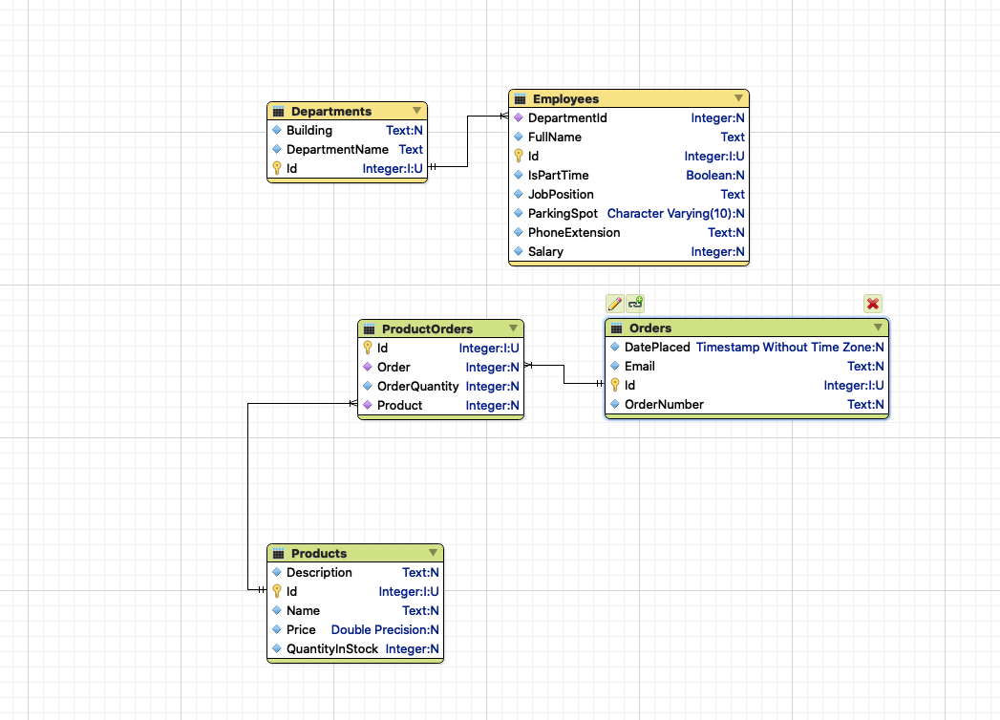

Knowing how to join tables together and use `WHERE` clauses is an essential
aspect of learning to effectively use SQL.

Let's build up some guides to the process using an example.

# Starting with an example

Let's say you have the following task:

```
Find all the quantities on order number `X529` for the `Flowbee` product.
```

## Our ERD

We'll start with this [ERD](/lessons/sql-erd)



## Gather up all the tools (tables) we need

The first thing we need to do is gather up the tables that will be involved in
this task. This is similar to gathering all the tools we need for a home
improvement project, the hammer, the screwdriver, the tape measure, etc. Or
gathering up all the kitchen utensils we need for making a recipe, the blender,
the pots and pans, the baking sheet, etc.

Here we know we have an order number, and we see the `OrderNumber` column on
`Orders` so likely that table will be involved.

We see the name of a product so the `Name` field on `Products` indicates that
the `Products` table will be involved.

We also see that order quantities are on the `ProductOrders` table so we'll see
that the `ProductOrders` table will be involved.

## Join those tables together

Now we need to `JOIN` all those tables together!

Every join of multiple tables always **STARTS** with a table that we will make
our `FROM` table. Since `OrderQuantity` is the value we want, it makes sense to
start with the table that attribute is located on.

```sql
SELECT "ProductOrders"."OrderQuantity"
FROM "ProductOrders";
```

Next up, we see we join over to the `Orders` and the `Products`. It doesn't
matter here much which order we do this in, so let's join over to the `Orders`
table next. When we do this, we need to identify the column on each side that
we'll want to make equal. We'll compare the `OrderId` from the `ProductOrders`
table and the `Id` column from `Orders` since they are the columns that make the
relationship work.

```sql
SELECT "ProductOrders"."OrderQuantity"
FROM "ProductOrders"
JOIN "Orders" ON "ProductOrders"."OrderId" = "Orders"."Id";
```

Great! Now let's also JOIN over to the `Products` so that table is in the game!

```sql
SELECT "ProductOrders"."OrderQuantity"
FROM "ProductOrders"
JOIN "Orders" ON "ProductOrders"."OrderId" = "Orders"."Id"
JOIN "Products" ON "ProductOrders"."ProductId" = "Products"."Id";
```

Perfect! All of the tables are in the mixture.

## Limit (WHERE) the rows that will be considered when joining/selecting

Next up, we should look to _limit_ the data based on the details of the problem
we are trying to solve. We noted that the `Product` `Name` needs to be limited
to those for a `Flowbee`, so lets use that detail.

In order to limit the results we add a `WHERE` clause and specify the
table/column to use and the value to compare to.

```sql
SELECT "ProductOrders"."OrderQuantity"
FROM "ProductOrders"
JOIN "Orders" ON "ProductOrders"."OrderId" = "Orders"."Id"
JOIN "Products" ON "ProductOrders"."ProductId" = "Products"."Id"
WHERE "Products"."Name" = 'Flowbee';
```

Now we will only see `ProductOrders` that are for a `Flowbee`. However, we also
only care about a specific order, the one with an `OrderNumber` of `X529`. We
can add another condition by adding an `AND` clause to the `WHERE`.

```sql
SELECT "ProductOrders"."OrderQuantity"
FROM "ProductOrders"
JOIN "Orders" ON "ProductOrders"."OrderId" = "Orders"."Id"
JOIN "Products" ON "ProductOrders"."ProductId" = "Products"."Id"
WHERE "Products"."Name" = 'Flowbee'
  AND "Orders"."OrderNumber" = `X529`;
```

With this, we have linked together all three tables via `JOIN` statements.
Further, we have limited which `Orders` and which `Products` are involved in the
joined data. We will only see the `OrderQuantity` from `ProductOrders` for order
`X529` and only for products that are a `Flowbee`.

# General process

1. Identify all the columns that you need in the RESULTS.
2. Identify all the columns that you need to FILTER BY.
3. Use those to identify all the tables that will be involved in the query.
4. Choose one table to start with this decision, will vary depending on what you
   are selecting from. Realistically you can start with any table, but one that
   is more "in the middle" of the ERD diagram will be better.
5. `JOIN` each of the other tables together based on how their relationships are
   established.
6. Add `WHERE` clauses such that you filter the data based on the conditions the
   problem presents.
7. Add fields to your `SELECT` based on the data you need, and use table names
   and column names from the tables you have joined together.
