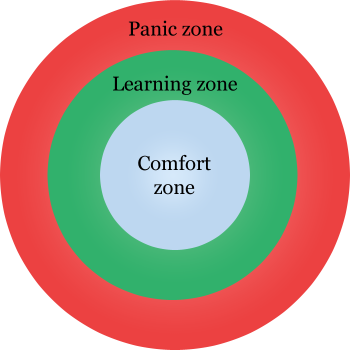

## Fixed vs. Growth Mindset

You are about to enter a time of intense mindset growth. Being aware of fixed
mindsets and growth mindsets helps prepare you to focus on growth.

Many students enter this program believing they are a "growth mindset" kind of
person. Who wouldn't want to be open to growth? However, it may have been a
while since you had to study as much as you will during your time here. Or
perhaps you come from a job, industry, or environment where asking for help is
considered a sign of weakness, or asking for help might lead to you being fired.

In this class, _YOU WILL NEED TO ASK FOR HELP_ -- You will be asking for help
continuously. You will be lost and confused more than you will be sure of
yourself and certain this is by design. We have you for a short period of time,
and we need to expose you to a vast array of knowledge. To do that, we need
_you_ to be in a growth mindset.

Read
[Fixed vs. Growth: The Two Basic Mindsets That Shape Our Lives](http://www.brainpickings.org/2014/01/29/carol-dweck-mindset/)
and watch
[Growth Mindset vs. Fixed Mindset](https://www.youtube.com/watch?v=M1CHPnZfFmU)

Success in our program will require you to focus on a growth mindset. During the
course, check in with yourself to see if you are experiencing a fixed mindset.

## Getting Out of Your Comfort Zone

Surprise! You are already out of your comfort zone! You've signed up for this
class which is a huge step. You have left your comfort zone which is the
universe of things you are already comfortable doing without "breaking a sweat"
or even thinking about it.

You are about to enter the "learning zone" where you are doing something new or
unfamiliar. In this case, you are learning Full Stack Web Development!

Outside of the "learning zone" is the dreaded _"PANIC ZONE"_. These are
activities or subjects that are uncomfortable and are typically avoided. Perhaps
for you, this is public speaking or skydiving. We can also get into the panic
zone when we feel we are at the bottom of a learning curve with a huge mountain
of knowledge ahead of us.

For the duration of this class, we will be keeping you right on that edge
between the learning zone and the panic zone. "Why do you do this?" you may be
asking. Since this class is a focused, intense, and time-limited course, we need
to keep you at your peak receptiveness to knowledge. This happens just before
you begin to tip into the panic zone.

One role and responsibility of the staff is to keep you from drifting too far
into the panic zone.

One role and responsibility of the student is to communicate with the staff when
they feel themselves lingering on the panic side of the panic/learning boundary.

> "File:Panic Learning and Comfort Zones.png" by MissLunaRose12 is licensed
> under CC BY-SA 4.0

## Realize Your Learning Style

The tech field is ever-growing and ever-changing. Developers are considered
lifelong learners, and learning is a particular skill to hone. During the
course, this skill is sharpened to help you on the route to success.
Understanding how you learn helps put any developer, both new and veteran, on a
path to success.

There are many different models of how people learn. One such model is the
[VARK](http://vark-learn.com/introduction-to-vark/). VARK breaks down how people
tend to learn and teach.

[Take the VARK questionnaire](http://vark-learn.com/the-vark-questionnaire/) to
see how you learn best.

Take your time while taking this short quiz. After a few questions, you start to
see a pattern of how you prefer to communicate. Use the results not as concrete
life-changing facts but rather as self-reflection to help you consume, apply and
eventually share new information.

## Taking Care of Yourself

You are about to embark on a journey of personal and professional growth. There
will be highs and lows.
[Self Care](https://www.getselfhelp.co.uk/docs/Steps%20to%20Wellbeing.pdf) is
important!
