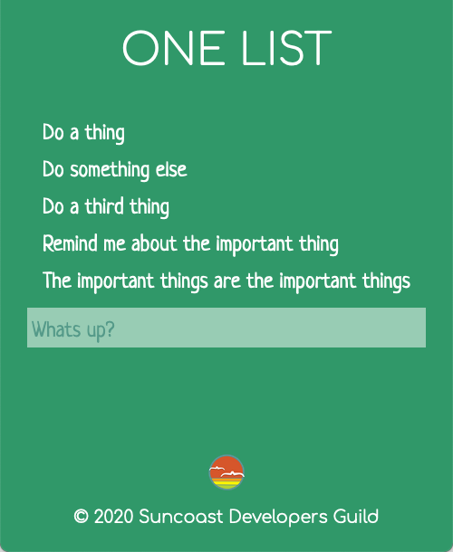

theme: Next,1

# React Hooks: `useEffect`

---

`useState` covers the basics of adding a piece of state and providing a means of updating it.

The class lifecycle methods `componentDidMount` and `componentDidUpdate` provide a way to _invoke code as a side effect of a component mounting or updating_.

So, in order for hooks to replace class-based components, we need a way to listen to state value changes and invoke code as a side-effect...

---

# Enter `useEffect`


---

# `useEffect` for **side** effects

---

We are looking for a way to replace each of these class based lifecycle methods:

- componentDidUpdate
- componentDidMount
- componentWillReceiveProps

---

We could do this if we had a method that behaved like this:

> Setup a callback function that will run whenever a list of variables changes value.

---

# Returning to our Counter

```javascript
import React, { useState, useEffect } from 'react'

function Counter() {
  const [count, setCount] = useState(0)

  function handleClickButton() {
    setCount(count + 1)
  }

  return (
    <div>
      <p>
        Count: {count} <button onClick={incrementCount} />
      </p>
    </div>
  )
}
```

---

# Let us setup some code that runs whenever the count changes!

```js
function theCountChanged() {
  console.log(`Wow, the count changed and is now ${count}`)
}
```

- But we want this called when the count changes!

---

# Enter useEffect!

- Accepts _TWO_ arguments.
  - The first is the function to call
  - The second is an _array_ of values to watch for changes

```javascript
function theCountChanged() {
  console.log(`Wow, the count changed and is now ${count}`)
}

const listOfDataToWatchForChanges = [count]

useEffect(theCountChanged, listOfDataToWatchForChanges)
```

---

# Simplify

- Using our rule:

> Whenever we define a variable and use it once, we can replace the variable usage with the value

```js
useEffect(
  function theCountChanged() {
    console.log(`Wow, the count changed and is now ${count}`)
  },
  [counter]
)
```

---

# Simplify

- Since `theCountChanged` is now an anonymous inline function we can remove the name.

```js
useEffect(
  function () {
    console.log(`Wow, the count changed and is now ${count}`)
  },
  [counter]
)
```

---

# Notice the _effect_ function runs the first time too!

- This is because `useEffect` will always run _at least_ once!
- The first time, it serves the purpose of our `componentDidMount` lifecycle
- Future calls are for `componentDidUpdate` or `componentWillReceiveProps` since the "watch" array could also contain props!

---

[.autoscale: true]

# [fit] Use the `useEffect` to run code _once_ at mount

If we need to do something just once when the component first mounts we can **provide an empty change list** and `useEffect` will only run once.

```js
useEffect(function () {
  console.log(`This runs once when the component first mounts`)
}, [])
```

Since there is no watch array, there is nothing for `useEffect` to ever see.

> NOTE: We can have multiple `useEffect`!

---

# Putting `useEffect` and `useState` to use

## Build an app to use the `OneList API`

---

# One List Refresher

[.autoscale: true]

- [API Documentation](https://one-list-api.herokuapp.com)

Base URL: `https://one-list-api.herokuapp.com`

| Action         | URL                                        | Body                                                        |
| -------------- | ------------------------------------------ | ----------------------------------------------------------- |
| Get all items  | `/items?access_token=illustriousvoyage`    | None                                                        |
| Create item    | `/items?access_token=illustriousvoyage`    | `{ "item": { "text": "Learn about Regular Expressions" } }` |
| Get one item   | `/items/42?access_token=illustriousvoyage` | None                                                        |
| Update an item | `/items/42?access_token=illustriousvoyage` | { "item": { "text": "Learn about useEffect" } }`            |
| Delete an item | `/items/42?access_token=illustriousvoyage` | None                                                        |

---

# As always, we start with static HTML and CSS

---

```jsx
import React from 'react'
import logo from './images/sdg-logo.png'

export function App() {
  return (
    <div className="app">
      <header>
        <h1>One List</h1>
      </header>
      <main>
        <ul>
          <li>Do a thing</li>
          <li>Do something else</li>
          <li>Do a third thing</li>
          <li>Remind me about the important thing</li>
          <li>The important things are the important things</li>
        </ul>
        <form>
          <input type="text" placeholder="Whats up?" />
        </form>
      </main>
      <footer>
        <p>
          
        </p>
        <p>&copy; 2020 Suncoast Developers Guild</p>
      </footer>
    </div>
  )
}
```

---

```scss
@import url('https://fonts.googleapis.com/css2?family=Comfortaa:wght@300&family=Neucha&display=swap');

:root {
  font: 24px / 1 sans-serif;
}

html {
  height: 100%;
}

body {
  margin: 0;
  padding: 0;
  color: #fff;
  font-family: 'Comfortaa';
  background-color: #309869;
}

.app {
  align-items: center;
  display: flex;
  flex-direction: column;
  min-height: 100vh;
}

h1 {
  font-weight: 300;
  text-transform: uppercase;
}

main {
  flex: 1;
}

input {
  border: none;
  padding: 0.3em 0.2em 0;
  width: 100%;
  color: #074863;
  font-size: 1em;
  line-height: 1.5em;
  background-color: #fff;
  opacity: 0.5;
}

input:focus {
  outline: 0;
  background-color: #fff;
  opacity: 1;
}

a:link,
a:visited {
  line-height: 1rem;
  text-decoration: none;
  color: #fff;
  font-size: 0.6rem;
}

ul {
  padding: 0;
  list-style: none;
  cursor: pointer;

  li {
    display: flex;
    justify-content: space-between;

    margin: 0.7em;

    &.completed {
      text-decoration: line-through;
      opacity: 0.5;
    }
  }
}

ul,
input {
  font-family: 'Neucha', cursive;
}

ul li,
form {
  align-items: flex-start;
  display: flex;
}

header,
main,
footer {
  max-width: 30em;
}

footer {
  margin-bottom: 0.5em;
  font-size: 0.8em;
  text-align: center;

  img {
    vertical-align: middle;
    // animation: spin infinite 10s linear;
  }
}

@keyframes spin {
  from {
    transform: rotate(0deg);
  }
  to {
    transform: rotate(360deg);
  }
}
```

---



---

# Step 2: Convert static JSX to JSX derived from state

---

[.column]

```jsx
const [todoItems, setTodoItems] = useState([
  { id: 1, text: 'Do a thing', complete: false },
  { id: 2, text: 'Do something else', complete: false },
  { id: 3, text: 'Do a third thing', complete: false },
  { id: 4, text: 'Remind me about the important thing', complete: false },
  {
    id: 5,
    text: 'The important things are the important things',
    complete: false,
  },
])
```

[.column]

```jsx
<ul>
  {todoItems.map(function (todoItem) {
    return <li key={todoItem.id}>{todoItem.text}</li>
  })}
</ul>
```

---

# Step 3 - Try changing some data

Change text, add items, remove items, change completed state

> Notice we need a little logic on our `li` so we can change the class based on complete

---

```jsx
<ul>
  {todoItems.map(function (todoItem) {
    return (
      <li key={todoItem.id} className={todoItem.complete ? 'completed' : ''}>
        {todoItem.text}
      </li>
    )
  })}
</ul>
```

---

# Step 4 - Actions

- Hook this up to the API and load data when the component first mounts
- Time for `useEffect`

```js
useEffect(function () {
  console.log('this runs when the component first mounts')
}, [])
```

---

# Update to load from the API

- This time, we will use `axios` to see how it improves on `fetch`

> NOTE: We need to add the library!

---

# Adding a library

- From the terminal and the same place we run `npm start` we can add a library to our project with:

```shell
npm install axios
```

> This is very similar to our C# equivalent of `dotnet package add`

---

# Update our `useEffect`

```js
useEffect(async function () {
  const response = await axios.get(
    'https://one-list-api.herokuapp.com/items?access_token=cohort42'
  )

  if (response.status === 200) {
    console.log(response.data)
  }
}, [])
```

> NICE!

---

# Thanks axios

- No `headers`
- No `await response.json`
- Axios knows we are getting back JSON data and provides `response.data`

---

# Step 5 - Update state

- Make our default state an empty array again
- Inside the `useEffect`, call `setTodoItems`

```js
const [todoItems, setTodoItems] = useState([])

useEffect(async function () {
  const response = await axios.get(
    'https://one-list-api.herokuapp.com/items?access_token=cohort42'
  )

  if (response.status === 200) {
    console.log(response.data)

    setTodoItems(response.data)
  }
}, [])
```

---

# Beyond `useEffect` - more practice with React

---

# Make the input field function correctly!

- Let the user type and track their item in state
- Add a state: `newTodoText`
- Add a `value` and `onChange` to the input

---

```js
const [newTodoText, setNewTodoText] = useState('')
```

```jsx
<input
  type="text"
  placeholder="Whats up?"
  value={newTodoText}
  onChange={function (event) {
    setNewTodoText(event.target.value)
  }}
/>
```

---

# When the user presses enter!

- Since this `input` is inside a `form` we will get an `onSubmit` for the form!

```js
function handleCreateNewTodoItem(event) {
  // Don't do the normal form submit (which would cause the page to refresh)
  // since we are going to do our own thing
  event.preventDefault()

  console.log(`Time to create a todo: ${newTodoText}`)
}
```

```jsx
<form onSubmit={handleCreateNewTodoItem}>
```

---

# Update `handleCreateNewTodoItem` to submit

```js
async function handleCreateNewTodoItem(event) {
  // Don't do the normal form submit (which would cause the page to refresh)
  // since we are going to do our own thing
  event.preventDefault()

  const response = await axios.post(
    'https://one-list-api.herokuapp.com/items?access_token=cohort42',
    { item: { text: newTodoText } }
  )

  if (response.status === 200) {
    console.log(response.data)
  }
}
```

---

# We get back an updated item, but how do we update the state?

- We have two choices:
  - Append the item
  - Reload the entire list and replace it!

> We can look at both options

---

# Append the item

Once we have the item we can build a new list of todos with that one appended.

```js
const newTodo = response.data
// Create a new array by *spreading* the old list and putting our new item at the end. Use [newTodo, ...todoItems] to *prepend* the new item
const newTodoItems = [...todoItems, newTodo]

setTodoItems(newTodoItems)
```

---

# Replace the list

Replacing the list can be straightforward when we are not sure how to manipulate the state.

```js
const refreshTodoResponse = await axios.get(
  'https://one-list-api.herokuapp.com/items?access_token=cohort42'
)

setTodoItems(refreshTodoResponse.data)
```

---

# One bug: Our new todo item input should clear

Add this to the end of `handleCreateNewTodoItem`

```js
setNewTodoText('')
```

---

# Click to mark an item as completed

> Now we are giving the items some behavior, so it might be time to refactor those into a component!

---

```jsx
export function TodoItem(props) {
  return <li className={props.complete ? 'completed' : ''}>{props.text}</li>
}
```

```jsx
<ul>
  {todoItems.map(function (todoItem) {
    return (
      <TodoItem
        key={todoItem.id}
        id={todoItem.id}
        complete={todoItem.complete}
        text={todoItem.text}
      />
    )
  })}
</ul>
```

---

# [fit] We can now add a click handler on the `li` inside the `TodoItem` component

```jsx
export function TodoItem(props) {
  function toggleCompleteStatus() {
    console.log('Clicked!')
  }

  return (
    <li
      className={props.complete ? 'completed' : ''}
      onClick={toggleCompleteStatus}
    >
      {props.text}
    </li>
  )
}
```

---

# What logic do we need in that code?

[.column]

We want to send a `PUT` request to the API that looks like this if the item is _NOT_ complete:

```json
{
  "item": {
    "complete": true
  }
}
```

[.column]

We want to send a `PUT` request to the API that looks like this if the item _is_ complete:

```json
{
  "item": {
    "complete": false
  }
}
```

---

# Try an `if/else`

```js
async function toggleCompleteStatus() {
  if (props.complete) {
    const response = await axios.put(
      `https://one-list-api.herokuapp.com/items/${props.id}?access_token=cohort42`,
      { item: { complete: false } }
    )

    if (response.status === 201) {
      console.log(response.data)
    }
  } else {
    const response = await axios.put(
      `https://one-list-api.herokuapp.com/items/${props.id}?access_token=cohort42`,
      { item: { complete: true } }
    )

    if (response.status === 201) {
      console.log(response.data)
    }
  }
}
```

---

# Look at the similarity in the branches!

The only difference is that if the `props.complete` is true, we send `false` -- and if it is `true` we send `false`

Simplify:

```js
async function toggleCompleteStatus() {
  const response = await axios.put(
    `https://one-list-api.herokuapp.com/items/${props.id}?access_token=cohort42`,
    { item: { complete: !props.complete } }
  )

  if (response.status === 201) {
    console.log(response.data)
  }
}
```

---

# Except we do not have a way to reload the list

## STATE: DOWN, EVENTS: UP

---

[.autoscale: true]

# Refactor the App a little

Extract the code used in the `useEffect` to make a function we can share.

```js
async function loadAllTodoItems() {
  const response = await axios.get(
    'https://one-list-api.herokuapp.com/items?access_token=cohort42'
  )

  if (response.status === 200) {
    setTodoItems(response.data)
  }
}

useEffect(loadAllTodoItems, [])
```

Now we have a function we can share with the `TodoItem` via props

---

# [fit] Add it to the props supplied to the `TodoItem`

```jsx
<TodoItem
  key={todoItem.id}
  id={todoItem.id}
  complete={todoItem.complete}
  text={todoItem.text}
  reloadItems={loadAllTodoItems}
/>
```

---

# Use it after we finish with the API

```js
async function toggleCompleteStatus() {
  await axios.put(
    `https://one-list-api.herokuapp.com/items/${props.id}?access_token=cohort42`,
    { item: { complete: !props.complete } }
  )

  props.reloadItems()
}
```

---

# We can use this to cleanup `handleCreateNewTodoItem`

```js
async function handleCreateNewTodoItem(event) {
  // Don't do the normal form submit (which would cause the page to refresh)
  // since we are going to do our own thing
  event.preventDefault()

  await axios.post(
    'https://one-list-api.herokuapp.com/items?access_token=cohort42',
    { item: { complete: !complete } }
  )

  loadAllTodoItems()

  setNewTodoText('')
}
```

---

# props, props, props, props

We keep seeing `props.` in our `TodoItem` component

Refactor using destructuring!

---

```jsx
export function TodoItem(props) {
  const { id, text, complete, reloadItems } = props

  async function toggleCompleteStatus() {
    await axios.put(
      `https://one-list-api.herokuapp.com/items/${id}?access_token=cohort42`,
      { item: { complete: !complete } }
    )

    reloadItems()
  }

  return (
    <li className={complete ? 'completed' : ''} onClick={toggleCompleteStatus}>
      {text}
    </li>
  )
}
```

---

# We can improve this code

- We can also _destructure_ right inside the function definition.

- So:

```js
export function TodoItem(props) {
  const { id, text, complete, reloadItems } = props
```

can become:

```js
export function TodoItem({ id, text, complete, reloadItems }) {
```

Furthermore, this looks like our function takes _arguments_ -- but it is really _destructuring_ props!

---

```jsx
export function TodoItem({ id, text, complete, reloadItems }) {
  async function toggleCompleteStatus() {
    await axios.put(
      `https://one-list-api.herokuapp.com/items/${id}?access_token=cohort42`,
      { item: { complete: !complete } }
    )

    reloadItems()
  }

  return (
    <li className={complete ? 'completed' : ''} onClick={toggleCompleteStatus}>
      {text}
    </li>
  )
}
```

---

# Extract it to a file in the `components/` directory

---
