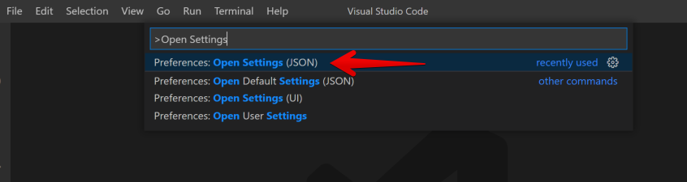

Developers debate about which code editing environment is better. Here at SDG,
we require using Visual Studio Code. VS Code is a extendable lightweight editor
that is still full featured and supports useful plugins.

## Installation

<OperatingSystemSwitch allowedOperatingSystems={['Mac']}>

Visit [https://code.visualstudio.com/](https://code.visualstudio.com/) and
download the installer.

- This will download a `ZIP` file.
- Find the download (did you download it to your desktop or your download
  folder?)
- Double click the zip file
- This will make a new file "Visual Studio Code"
- **IMPORTANT STEP** -- Drag this file to your `Applications` folder (it should
  be right there in the finder "sidebar")
- Open your `Applications` folder and double click the Visual Studio to launch
  it the first time

## Adding command line option

Launch `VS Code`. Once launched use the key combination COMMAND + SHIFT + P.
This will launch a search window. Type `install code` and then click on the
option titled `Shell Command: Install code command in PATH`

</OperatingSystemSwitch>

<OperatingSystemSwitch allowedOperatingSystems={['Windows']}>

Visit [https://code.visualstudio.com/](https://code.visualstudio.com/) and
download the installer.

- This will download a `EXE` file.
- Find the download (did you download it to your desktop or your download
  folder?)
- Double click the exe file
- Accept the agreement
- Use the default for "Select Destination Folder" -- Press `Next`
- Use the default for "Select Start Menu Folder" -- Press `Next`
- Use the default for "Select Additional Tasks" -- Press `Next`
- Click `Install`
- Ensure the `Launch Visual Studio Code` checkbox is selected and press `Finish`

</OperatingSystemSwitch>

## Enable Extensions

VS Code has a large number of optional extensions that increase the capabilities
of the editor. We have chosen a few that we feel improve the workflow during the
course. We recommend running the following commands to install these extensions
into your Visual Studio Code

### General Extensions:

In any terminal (and any directory) run the following:

```shell
code --install-extension 2gua.rainbow-brackets
code --install-extension streetsidesoftware.code-spell-checker
code --install-extension meganrogge.template-string-converter
```

### C#/.NET Extensions:

In any terminal (and any directory) run the following:

```shell
code --install-extension ms-dotnettools.csharp
code --install-extension austincummings.razor-plus
code --install-extension jchannon.csharpextensions
code --install-extension jorgeserrano.vscode-csharp-snippets
```

### Front End Extensions:

In any terminal (and any directory) run the following:

```shell
code --install-extension dbaeumer.vscode-eslint
code --install-extension ecmel.vscode-html-css
code --install-extension esbenp.prettier-vscode
code --install-extension skyran.js-jsx-snippets
code --install-extension xabikos.ReactSnippets
code --install-extension Zignd.html-css-class-completion
code --install-extension formulahendry.auto-rename-tag
```

## Configure Visual Studio Code

In VS Code go to the "View" menu and select the menu item "Control Panel". Then
type `Open Settings JSON` and select option that does _NOT_ mention "Default" or
"Workspace"



This will open an editor window.

If this file contains:

```
{
}
```

or

```
{}
```

You may proceed with the next step. If it contains anything else **STOP** and
ask for assistance.

**Replace** the contents of this file with:

```json
{
  "editor.formatOnSave": true,
  "editor.tabSize": 2,
  "javascript.implicitProjectConfig.checkJs": true,
  "files.eol": "\n",
  "editor.defaultFormatter": "esbenp.prettier-vscode",
  "git.enableSmartCommit": true,
  "csharp.referencesCodeLens.enabled": false,
  "[csharp]": {
    "editor.insertSpaces": true,
    "editor.tabSize": 4,
    "editor.defaultFormatter": "ms-dotnettools.csharp"
  }
}
```

Save this file and close the tab.
