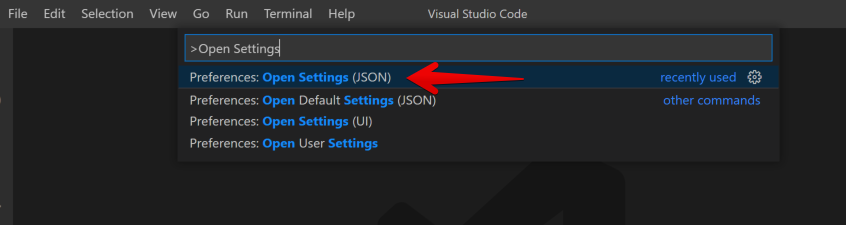
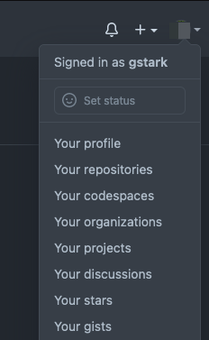
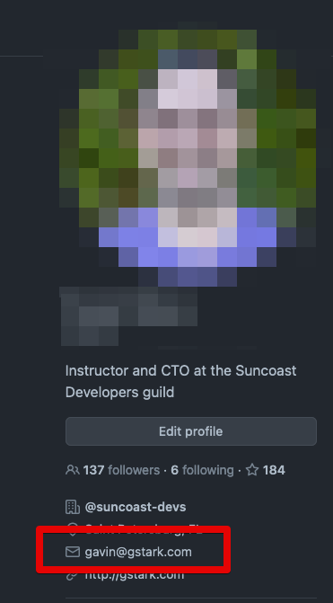

# Common Setup

The tools in this section are required to be setup for any of the units in the
program. These will be setup on your first day of class.

<SectionSeparator />

# Slack

Slack will be our main form of communication. You will communicate with your
instructors and SDG staff via Slack. You will get notifications of homework,
links to resources, and be able to ask for help from peers and staff via Slack.

Download it to you computer; if you have a smart phone, I _highly_ recommend
installing the app.

## Installation

Open your browser and [download the desktop client](https://slack.com/downloads)
for your platform.

Open your phone's application store and install the mobile application and sign
in at least once.

## Setup

You should have received an invitation to several Slack _Teams_

SDG maintains two main Slack Teams:

- `sdg-sa` is for students and alumni _only_
- `suncoast-devs` is a general Tampa Bay community team that includes over 1,300
  members.

<SectionSeparator />

# Github

Your github account is where you will be storing all of the work you do in these
lessons and assignments. It will become part of your _portfolio_ or work and
document your journey of learning.

It is also how you will be tracking your assignments and turning in your
homework.

## Creating a github account

Start by following the `Sign Up` link on
[github's home page](https://github.com).

**Choosing a username** - We recommend using a version of your given name. This
would be a version of the name you would put at the top of the resume you'd send
a prospective employer. You might be tempted to select a username like
`kewldev98` but remember that a hiring manager **WILL** seek out your github
page and you want it to have a professional feel.

## Uploading a profile photo

**Use a good headshot photo** - Use the best photo you have of you that shows
your face. We recommend this because you want other developers, hiring managers,
and companies to start recognizing you. Use your best photo. If you need a
professional photo let us know and we can help.

## Setup Your GitHub Token

> THIS IS A CRITICAL STEP

To setup `hub` we will need an API token from GitHub.

Follow the
[Creating a personal access token](https://docs.github.com/en/free-pro-team@latest/github/authenticating-to-github/creating-a-personal-access-token)
guide to generate a new token. Give your token a helpful name such as "Token for
using my laptop". Select the `repo` checkbox before creating the token.

Copy the token you create.

We'll use this the _first_ time we have to login to github

> NOTE: This is the _ONLY_ time this token will be displayed. To ensure its
> safety copy it to a secure location such as a password manager.

<SectionSeparator />

# Nexus

We use [nexus](https://nexus.suncoast.io) as our student information site. You
will see your attendance record, homework assignments, lecture videos, as well
as homework completion status.

To sign up, visit, [https://nexus.suncoast.io](https://nexus.suncoast.io) and
connect with your github login.

You will also see instructions to connect `Slack` with `Nexus`. If you choose to
you will receive notifications when homework is assigned as well as when your
assignments have been checked by your instructors.

<SectionSeparator />

# Command Line

<OperatingSystemSwitch allowedOperatingSystems={['Mac']}>

If your Mac is setup for `Light Mode` then the default color scheme for
`Terminal` is black text on a white background. This can be difficult to use for
long periods of time. If your Mac is setup for `Dark Mode` then the default
color scheme for `Terminal` is light text on a grey background.

If you are using `Light Mode`, consider changing your default profile to `Pro`
which will give you light text on a dark background. Your instructors, and your
eyes, will thank you.

These are our recommended profiles for Terminal:

- Pro
- Homebrew
- TheOne

To change your default profile, start `Terminal` and select `Preferences` from
the _Terminal_ menu. Click on `Profiles` then on `Pro` (or any other profile you
want) and then click the `Default` button.


> NOTE: if you choose a profile that is bright and colorful, but difficult for
> your instructor or fellow classmates to read, you will be making it more
> challenging to receive assistance.

</OperatingSystemSwitch>

<OperatingSystemSwitch allowedOperatingSystems={['Windows']}>

As a developer on the Windows platform, one of our main tools is `Powershell`.
`Powershell` is the command line interface (or shell) we use to run commands and
interact with our computer. Using the shell seems difficult at first, but with
practice, this becomes a much more efficient way of using our computers.

### PowerShell

To open `Powershell`, open your `start` menu or type \(Win + R\), then type
`Powershell`, this searches your system and gives you the option to start it,
just like any other program.

## PRO TIP

Since we are going to run this often you may consider pinning it to your screen
by right-clicking the icon in the Task Bar and selecting "Pin to taskbar"

</OperatingSystemSwitch>

<SectionSeparator />

# Code Folder

During this course we are going to be creating many projects. Each of these will
have their own directory. Thus we should attempt to organize these in some
manner.

## Choosing a place to keep your projects.

We feel there are a few choices on where to keep your projects

1. In a folder named `sdg` or `code` or `projects` in your _home directory_.
   Your _home directory_ is where your PowerShell or terminal will start from.
   This makes your code directory just a step away.
2. In a folder named `sdg` or `code` or `projects` in your `Documents`
   directory. This is one directory below your _home folder_ so it is still
   nearby.
3. In a folder named `sdg` or `code` or `projects` on your `Desktop`. This too
   is only one directory below your _home folder_ so it is still nearby.

Skip to the section below matching your desired structure.

## Creating a folder in your home directory.

Choose what you want to call this directory and use the following commands to
create it.

> NOTE: In this example I'm choosing to call my project directory `sdg`

```shell
cd ~

mkdir sdg
```

## Creating a folder in your Documents directory.

Choose what you want to call this directory and use the following commands to
create it.

> NOTE: In this example I'm choosing to call my project directory `sdg`

```shell
cd ~

cd Documents

mkdir sdg
```

## Creating a folder in your Desktop directory.

Choose what you want to call this directory and use the following commands to
create it.

> NOTE: In this example I'm choosing to call my project directory `sdg`

```shell
cd ~

cd Desktop

mkdir sdg
```

<SectionSeparator />

# Tool Installation

<OperatingSystemSwitch allowedOperatingSystems={['Mac']}>

## Homebrew

Homebrew is a tool for installing other programs and tools. We will use it to
install many of the development tools we need during this program.

## Pre Setup

Open a Terminal and run:

```shell
xcode-select --install
```

This will install the Apple developer tools we need for many of the steps that
follow.

## Installation

Open a Terminal and run:

```shell
/bin/bash -c "$(curl -fsSL https://raw.githubusercontent.com/Homebrew/install/master/install.sh)"
```

When this command runs it may ask for a _password_. This is the same password
you use to login to your Mac, or unlock the screen.

> NOTE: When you type your password it won't output anything, you'll be typing
> without any feedback. If you get the password wrong the installation process
> will let you know and you can try again.

## Follow up

```shell
for BREW in /opt/homebrew /usr/local; do
  if [[ -f "${BREW}/bin/brew" ]]; then
    HOMEBREW_PREFIX=${BREW}
  fi
done
for PROFILE in "$HOME/.bash_profile" "$HOME/.zprofile" "$HOME/.profile"; do
  if [[ -f $PROFILE ]]; then
    "${HOMEBREW_PREFIX}/bin/brew" shellenv >> ${PROFILE}
    eval "$(${HOMEBREW_PREFIX}/bin/brew shellenv)"
  fi
done
```

<!-- If the computer says `Run these two commands in your terminal`, please follow the instructions it provides you. -->

</OperatingSystemSwitch>

<OperatingSystemSwitch allowedOperatingSystems={['Windows']}>

## Scoop

Scoop is a tool to automatically install programs via the command line. This
simplifies the process of installing many of the tools we need by avoiding the
steps of visiting the website, downloading the installer and then running the
installer.

## Set Execution Policy

```shell
Set-ExecutionPolicy RemoteSigned -scope CurrentUser -Force
```

## Run the Installer

```shell
iwr -useb get.scoop.sh | iex
```

## Install the `extras`

```shell
scoop install git
scoop bucket add extras
scoop bucket add versions
```

## Install vcredist

This installation will take time and may prompt you for "User Account Control"
permissions during the installation.

```shell
scoop install vcredist
```

```shell
scoop install extras/vcredist2019
```

</OperatingSystemSwitch>

<OperatingSystemSwitch allowedOperatingSystems={['Windows']}>

### Windows Terminal

Windows Terminal is a better tool for running PowerShell. It uses a better color
scheme for text and errors. It also supports multiple tabbed windows. We
recommend this in place of running PowerShell directly.

If you do choose to use Windows Terminal, any place that says to start a
PowerShell you may start a new Windows Terminal tab. You may also want to _pin_
this to your task bar.

> NOTE: We _highly_ recommend you use Windows Terminal instead of PowerShell. It
> is much more user friendly.

#### Installation

```shell
scoop install windows-terminal
```

</OperatingSystemSwitch>

<SectionSeparator />

# Node

Node is a runtime for JavaScript. This means that with node, we can run
JavaScript on our machines without having to be in a browser.

When working with HTML, CSS, and JavaScript we will find many of the tools
require, or are written in, JavaScript with node.

## Installation

<OperatingSystemSwitch allowedOperatingSystems={['Mac']}>

```shell
brew install nodejs
```

</OperatingSystemSwitch>

<OperatingSystemSwitch allowedOperatingSystems={['Windows']}>

```shell
scoop install nodejs
```

## Build tools

Start a **PowerShell As Administrator**

```shell
npm install --global windows-build-tools
```

> NOTE: This may take a long time to complete.

**CLOSE THIS POWERSHELL WHEN COMPLETE**

</OperatingSystemSwitch>

## SDG helper tools

Install this tool which includes some helpful add-on functionality we use at
SDG.

```shell
npm install --global suncoast-devs/cli
```

<SectionSeparator />

# Visual Studio Code

Developers debate about which code editing environment is better. Here at SDG,
we require using Visual Studio Code. VS Code is a extendable lightweight editor
that is still full featured and supports useful plugins.

## Installation

<OperatingSystemSwitch allowedOperatingSystems={['Mac']}>

Visit [https://code.visualstudio.com/](https://code.visualstudio.com/) and
download the installer.

- This will download a `ZIP` file.
- Find the download (did you download it to your desktop or your download
  folder?)
- Double click the zip file
- This will make a new file "Visual Studio Code"
- **IMPORTANT STEP** -- Drag this file to your `Applications` folder (it should
  be right there in the finder "sidebar")
- Open your `Applications` folder and double click the Visual Studio to launch
  it the first time

## Adding command line option

Launch `VS Code`. Once launched use the key combination COMMAND + SHIFT + P.
This will launch a search window. Type `install code` and then click on the
option titled `Shell Command: Install code command in PATH`

</OperatingSystemSwitch>

<OperatingSystemSwitch allowedOperatingSystems={['Windows']}>

Visit [https://code.visualstudio.com/](https://code.visualstudio.com/) and
download the installer.

- This will download a `EXE` file.
- Find the download (did you download it to your desktop or your download
  folder?)
- Double click the exe file
- Accept the agreement
- Use the default for "Select Destination Folder" -- Press `Next`
- Use the default for "Select Start Menu Folder" -- Press `Next`
- Use the default for "Select Additional Tasks" -- Press `Next`
- Click `Install`
- Ensure the `Launch Visual Studio Code` checkbox is selected and press `Finish`
- Once launched, uncheck the option "Show welcome page on startup" and close the
  welcome window

</OperatingSystemSwitch>

## Enable Extensions

VS Code has a large number of optional extensions that increase the capabilities
of the editor. We have chosen a few that we feel improve the workflow during the
course. We recommend running the following commands to install these extensions
into your Visual Studio Code.

### General Extensions:

In any terminal (and any directory) run the following:

```shell
code --install-extension 2gua.rainbow-brackets
code --install-extension streetsidesoftware.code-spell-checker
code --install-extension meganrogge.template-string-converter
```

To read about these extensions:

- [Rainbow Brackets](https://marketplace.visualstudio.com/items?itemName=2gua.rainbow-brackets)
- [Code Spell Checker](https://marketplace.visualstudio.com/items?itemName=streetsidesoftware.code-spell-checker)
- [Template String Converter](https://marketplace.visualstudio.com/items?itemName=meganrogge.template-string-converter)

### C#/.NET Extensions:

In any terminal (and any directory) run the following:

```shell
code --install-extension ms-dotnettools.csharp
code --install-extension jchannon.csharpextensions
code --install-extension jorgeserrano.vscode-csharp-snippets
```

To read about these extensions:

- [MS DotNet Tools](https://marketplace.visualstudio.com/items?itemName=ms-dotnettools.csharp)
- [C# Extensions](https://marketplace.visualstudio.com/items?itemName=jchannon.csharpextensions)
- [C# Snippets](https://marketplace.visualstudio.com/items?itemName=jorgeserrano.vscode-csharp-snippets)

### Front End Extensions:

In any terminal (and any directory) run the following:

```shell
code --install-extension dbaeumer.vscode-eslint
code --install-extension ecmel.vscode-html-css
code --install-extension esbenp.prettier-vscode
code --install-extension Zignd.html-css-class-completion
code --install-extension formulahendry.auto-rename-tag
```

To read about these extensions:

- [VSCode ESLint](https://marketplace.visualstudio.com/items?itemName=dbaeumer.vscode-eslint)
- [HTML CSS](https://marketplace.visualstudio.com/items?itemName=ecmel.vscode-html-css)
- [Prettier](https://marketplace.visualstudio.com/items?itemName=esbenp.prettier-vscode)
- [CSS Class Completion](https://marketplace.visualstudio.com/items?itemName=Zignd.html-css-class-completion)
- [Auto Rename Tag](https://marketplace.visualstudio.com/items?itemName=formulahendry.auto-rename-tag)

## Configure Visual Studio Code

In VS Code go to the "View" menu and select the menu item "Command Pallete".
Then type `Open Settings JSON` and select option that does _NOT_ mention
"Default" or "Workspace"



This will open an editor window.

If this file contains `{}` (it may be on two lines) you may proceed with the
next step. If it contains anything else **STOP and ask for assistance**.

**Replace** the contents of this file with:

```json
{
  "editor.formatOnSave": true,
  "editor.tabSize": 2,
  "js/ts.implicitProjectConfig.checkJs": true,
  "files.eol": "\n",
  "editor.defaultFormatter": "esbenp.prettier-vscode",
  "git.enableSmartCommit": true,
  "csharp.referencesCodeLens.enabled": false,
  "workbench.startupEditor": "none",
  "[csharp]": {
    "editor.insertSpaces": true,
    "editor.tabSize": 4,
    "editor.defaultFormatter": "ms-dotnettools.csharp"
  }
}
```

Then save the file and close the tab.

<SectionSeparator />

# Git

Git is a distributed source control system. This allows us to easily work and
collaborate, on many different projects.

Git is how we will be managing our files and sharing code with each other. Git
is a complex tool and it will seem rough at first. However, with practice, you
will become familiar with the commands and options.

## Pre Installation

First, make sure you have a [GitHub](http://github.com/) account.

## Installation

<OperatingSystemSwitch allowedOperatingSystems={['Mac']}>

```shell
brew install git
```

</OperatingSystemSwitch>

<OperatingSystemSwitch allowedOperatingSystems={['Windows']}>

```shell
scoop install git
```

</OperatingSystemSwitch>

## Default branch name

When working in `git` as a source control resource we work in `branches` of
code. Branches are a series of changes to code for a particular purpose. The
default branch for a new git project has been `master`. SDG believes
master-slave is an oppressive metaphor and we empathize with those hurt by the
use of that term.

Git allows for a mechanism to change the default name of this branch. We suggest
changing this to something like `trunk` (to continue to the tree metaphor) or
`main` (since the first two letters match and help with auto-complete if you are
used to typing `master`)

Read more from
[the IETF](https://tools.ietf.org/id/draft-knodel-terminology-00.html),
[the git project](https://github.blog/2020-07-27-highlights-from-git-2-28/#introducing-init-defaultbranch),
and from
[the software conservatory](https://sfconservancy.org/news/2020/jun/23/gitbranchname/)

```shell
git config --global init.defaultBranch trunk
```

## Tell Git your Name

Every line of code you save with `git` will be attributed to you. `git` will
need to know the name to associate with the code. You _should_ use your real
name here, not a pseudonym or a `1337 haxor` name.

> NOTE: In the following command, instead of
> `"Replace This Example With Your Full Name"` use your full name, e.g., "Jane Q
> Public" or "John Q Public".

Example:

```shell
git config --global user.name "Replace This Example With Your Full Name"
```

Example:

```shell
git config --global user.name "Example: Grace Hopper"
```

or

```shell
git config --global user.name "Example: Ada Lovelace"
```

## Tell Git your E-Mail Address

> -- IMPORTANT NOTE -- STOP AND READ --
>
> In the following command, instead of
> `email-address-you-used-at-github@example.com` use the **same email address
> you gave to GitHub**. Github uses this to make sure it can generate this
> awesome "activity" chart for you. 

To find the email address you used at github, go to this menu and choose "Your
Profile"



Once you do, you'll see your profile page that includes the email address you
used for registration on github. (highlighted in RED)



Command to run WITH YOUR PERSONAL EMAIL ADDRESS:

```shell
git config --global user.email "email-address-you-used-at-github@example.com"
```

Examples:

```shell
git config --global user.email "grace-hopper@example.com"
```

```shell
git config --global user.email "ada-lovelace@example.com"
```

## Tell Git your Github username

Replace GITHUBNAME here with your github _LOGIN / USER_ name. You can get this
from the Github API by clicking on your user icon in the upper right hand
corner. It will say "Signed in as GITHUBUSERNAME"

```shell
git config --global github.user GITHUBNAME
```

## Ensure git uses VS Code for it's editor

```shell
git config --global core.editor "code --wait"
```

## Tell Git + Hub to use `HTTPS`

We need to set up Git and GitHub to use the `https` protocol. Enter the
following in your shell (`Powershell`):

```shell
git config --global hub.protocol https
```

<OperatingSystemSwitch allowedOperatingSystems={['Windows']}>

## Tell git to automatically push the current branch by default

This configuration tells git to push the current branch when we do `git push` without any branch name.

```shell
git config --global push.default current
```

## Tell git how to handle line endings

The way Windows and Mac handle the end of a line of code differ. The following
setup will help configure git to handle this difference.

```shell
git config --global core.autocrlf true
```

</OperatingSystemSwitch>

<SectionSeparator />

# hub

Hub is a command line helper for github. It allows for easy github manipulation
from our terminal.

From your terminal, run the following commands (current directory does not
matter):

## Installation

<OperatingSystemSwitch allowedOperatingSystems={['Mac']}>

```shell
brew install hub
```

</OperatingSystemSwitch>

<OperatingSystemSwitch allowedOperatingSystems={['Windows']}>

```shell
scoop install hub
```

</OperatingSystemSwitch>

## Post Installation

Start a new Powershell and enter the command:

```shell
hub api user --flat
```

This will ask for your `github.com username`, supply your username or email
address. Enter your github token as your password. **NOTE** You will _NOT_ see
your password displayed back to you.

hub outputs a lot of text. If you get a "wall of text" similar to the output
below, then you have setup `hub` correctly. Otherwise you may see an error
message.

```shell
.login	my-github-user-name
.id	42
...
...
... [snip - removed to save space]
...
...
.created_at	2008-03-09T00:14:09Z
.updated_at	2021-07-12T14:12:38Z
```
