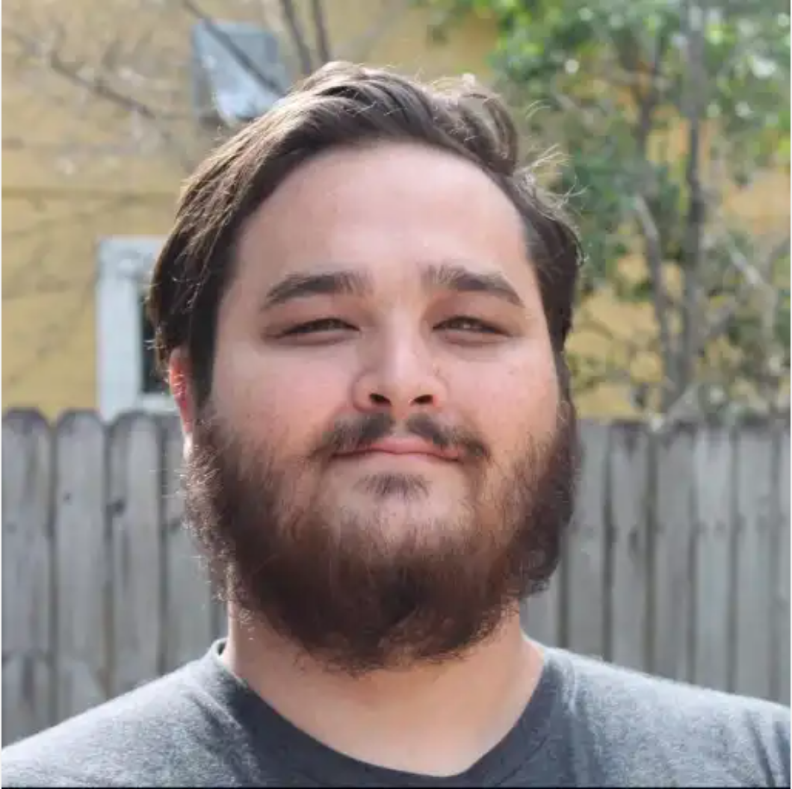
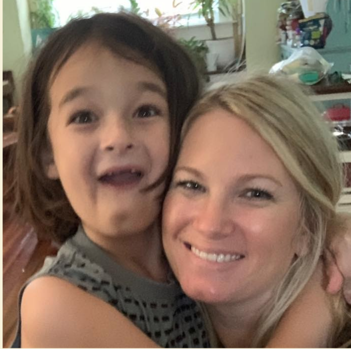

theme: Fira, 3

# Welcome

# [fit] **Cohort 21**!

---

# Let's meet the team!

---

# Jason Perry

# **CEO**

---

# Gavin Stark

# **Instructor**

---

# Jordan Bryan

# **Academic Mentor**

---

# Katie Perry

# **Operations Manager**

---

# Our Mission

> Our mission is to provide those seeking an education in software development with the technical and soft skills they need to pursue rewarding careers as programmers. We also seek to promote a sense of community among local technology organizations, supporting members in a way that strengthens our community and promotes the common good.

---

# Our Vision

> We develop more than just software; we develop a community of problem solvers and critical thinkers. Suncoast Developers Guild will have a positive impact on the life and career of every software developer in Tampa Bay, from the novice learner to the master of their craft.

---

# [fit] We provide a collaborative,

# [fit] open, and supportive

# [fit] environment to foster

# [fit] your success.

---

# Evaluation

Pass or fail grading system for Assignments and Projects

Completion of the program depends on a demonstrated proficiency of the curriculum as determined by your instructor

Evaluation on a biweekly basis

- If the evaluation shows that a trainee is not performing well, instructors may meet with the trainee to discuss their progress, and determine steps to improve performance.

---

# Absences and Tardies

We understand that issues arise; life happens. Keeping communication open with staff will allow us to make appropriate adjustments needed to keep you on track.

---

# Absences and Tardies

[.column]

## Don’t be tardy!

- A tardy is defined as 5 minutes late
- If you are determined to have **two (2) tardies in one (1) week**, it will be counted as an absence
- If you miss more than **six (6) lectures**, or tally more than **six (6) absences**, you may not be eligible for completion of the program

---

# Absences and Tardies

[.column]

## Come to training every day

- It is required
- Being absent makes it hard to keep up
- If you know that you need to be absent, provide advance written notice via Slack or email

---

# Assignments

- Each day at the end of lecture you will receive an assignment.
- Mon, Tue, Wed assignments are due the next morning
- Thursday assignment is due Monday morning. More of a project.
- Assignments have difficulty levels
  - Explorer Mode
  - Adventure Mode
  - Epic Mode

---

# Assignment Guidance

- Read entire assignment
- Make a plan. Collaborate with fellow students.
- PEDAC (will discuss this week)
- Start working on assignment _BEFORE_ review.
- Come to review with _questions_.

---

# Assignment Guidance

- Googling is ok! Using the handbook is great!
- Copying code is ok.
  - As long as you **understand** the code.
  - Is ok to copy code and come ask instructor, TA, fellow student to understand it.
- Turn in what you have before you go to bed.
- Don't stay up all night. Sleep > Fighting Homework

---

# Cheating

- Solutions to assignments are not hard to find.
- If you copy code (without understanding) from the internet or fellow students you are cheating _yourself_.
- We will intervene if we believe you are copying without understanding.

- See [https://sdg.codes/great-artists-steal](https://sdg.codes/great-artists-steal)

---

# Code of Conduct

Suncoast Developers Guild is dedicated to providing a harassment-free educational experience for everyone, regardless of gender, sexual orientation, disability, physical appearance, body size, race, or religion.

If you are being harassed, notice that someone else is being harassed, or have any other concerns, please contact a member of the staff immediately.

---

# Completion Requirements

**In order to complete the program a trainee must successfully:**

- Meet the absences and tardy policy
- Satisfactorily pass eighty percent of assignments/projects
- Adhere to the Code of Conduct.

---

[.autoscale: true]

# Program Hours

[.column]

## Mon through Thu

- 9:00am - 12:00pm Lecture
- 1:00pm - 5:00pm Lab
- 5:00pm - ??? Assignment and read handbook for the next day

[.column]

## Friday

- 9:00am - 12:00pm Lab
- 1:00pm - 3:00pm Career Support and Guest Lectures

---

# Lecture

**Zoom**

- Used for lecture

**Best Practices:**

- Mute your Microphone
- Use Headphones
- Keep your Camera on

---

# Lab Time

**Slack**

- Slack Calls
- Join classmates to work together
- Ask your peers or staff for help

---

# Slack

[.column]

- Announcements & Event reminders
- File & idea sharing
- Impromptu communication
- Quick question & casual discussion

[.column]

- Help with code from the team at-large
- After hours assistance from peers
- Continues alumni communication
- Helpful links, tools & tips

---

# Slack Profile

**Setting up your Slack Profile:**

- Use your First and last name for your display name
- Upload a Professional photo - ask us if not sure
- Download the app to your desktop and phone
- Pro-tip: On desktop, right click icon in dock, go to options and check keep in dock and open at login.

---

# Slack Teams

[.column]
**SDG Students & Alumni**
[sdg-sa.slack.com](https://sdg-sa.slack.com)

- Questions about code and code challenges
- Sharing articles about tech, jobs
- Events and announcements

[.column]
**SDG Community**
[https://sdg.codes/community-slack](https://sdg.codes/community-slack)

- Local community of developers, designers, software engineers, and programmers

---

# Diverse Experiences

[.column]
Coding Experience:

- 0 experience
- Tried learning on their own
- Coded in past

Different Industries

Knowledge and comfort levels

- Ask for help
- Work together and support each other

---

# Top Tips

- Over communicate
- Collaborate
- Ask questions
- Ask for help
- Put in the effort

---

# Have Questions?

- We are here for you!

- This is going to be a long and challenging journey

- We will support you every step of the way

- Is there anything else you would like to know as we start day 1?
