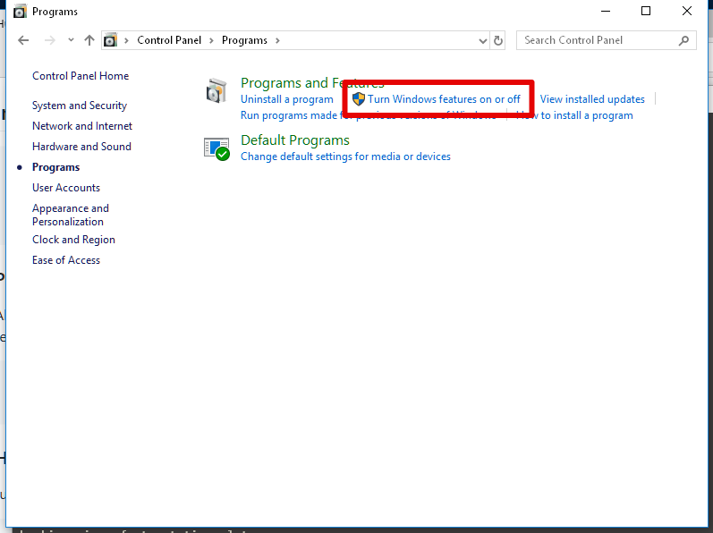
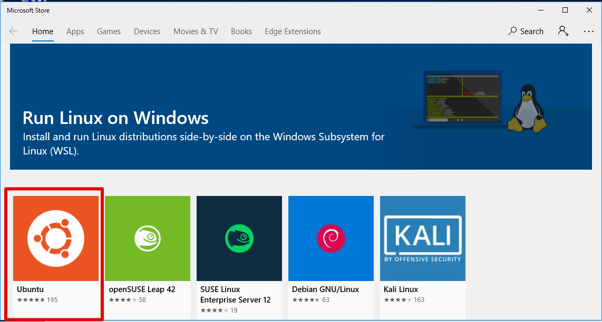
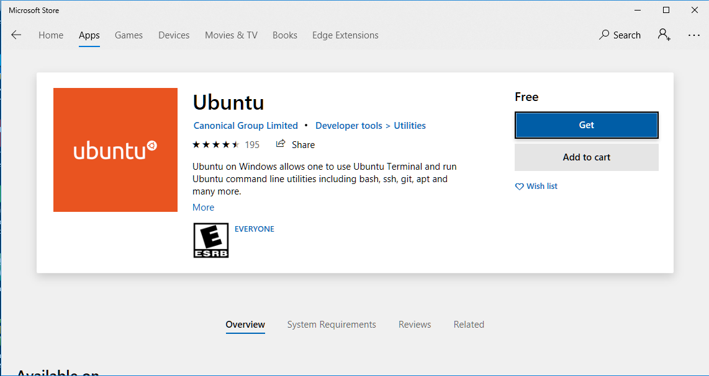
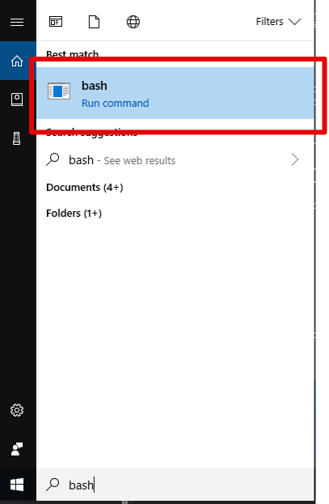

# Installing the Linux Subsystem for Windows

The `Linux Subsystem for Windows` allows us to run all of the open source tools we would normally run on an OS X or Linux environment directly on your Windows 10 machine.

The requirements are:
- Windows 10
- 64-Bit version of Windows 10


## Step 0 - Install/Enable Windows Subsystem for Linux

- If you are comfortable in PowerShell, run this command

```sh
Enable-WindowsOptionalFeature -Online -FeatureName Microsoft-Windows-Subsystem-Linux
```

- If this succeeds, proceed to step 3
- Otherwise, continue to step 1

## Step 1 - Enable Developer Options

- Run `Settings` from the `Type here to search` bar
- Then select `Update & Security`


- Then select 'For Developers'


- Then select `Developer Mode` by clicking the radio button

- Close the window

## Step 2 - Install the Linux Subsystem

- Run `Control Panel` from the `Type here to search` bar
- Then select `Programs`


- Then select `Turn features on/off`



- Scroll down and turn ON the checkbox for `Widnows Subsystem for Linux`


- Click OK
- Close the window

## Step 3 - Install Ubuntu

- Open a browser and navigate to `https://aka.ms/wslstore`


- Click on the `Ubuntu` logo



- Click on the `Get` button and then on `Install` once the button changes from `Get` to `Install`



## Step 4 - Run a bash shell



- If it asks you to create a username and a password, choose a short username with no spaces and a new password

## Step 5 - Install `chruby`

```sh
cd
sudo apt install make
wget -O chruby-0.3.9.tar.gz https://github.com/postmodern/chruby/archive/v0.3.9.tar.gz
tar -xzvf chruby-0.3.9.tar.gz
cd chruby-0.3.9/
sudo make install
sudo ./scripts/setup.sh
```

## Step 6 - Install `ruby-install`

```sh
cd
wget -O ruby-install-0.7.0.tar.gz https://github.com/postmodern/ruby-install/archive/v0.7.0.tar.gz
tar -xzvf ruby-install-0.7.0.tar.gz
cd ruby-install-0.7.0/
sudo make install
```

## Step 7 - Install Ruby 2.5.3

```sh
cd
ruby-install ruby-2.5.3
```

## Step 8 - Make Ruby 2.5.3 your default

```sh
cd
echo 'ruby-2.5.3' > ~/.ruby-version
echo 'chruby ruby-2.5.3' | tee -a ~/.profile
```

## Step 9 - Validate Ruby install

- Close your `bash` window
- Start a new `bash` window
- Type `ruby -v`
- The output should include `2.5.3`

